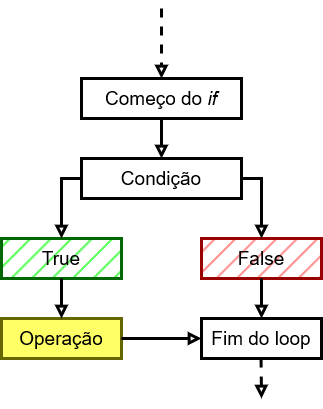
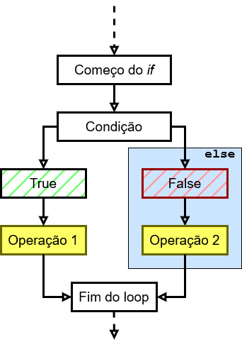
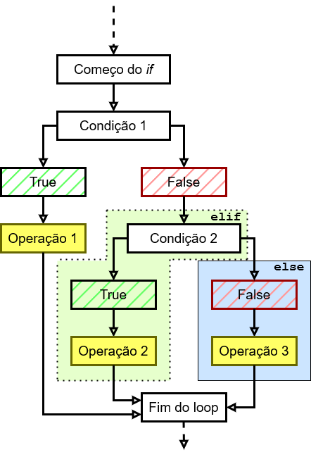
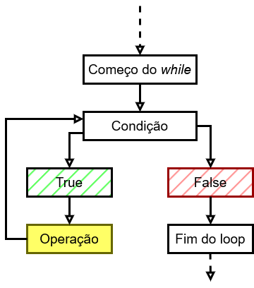
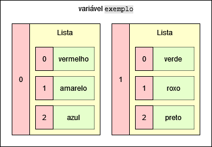
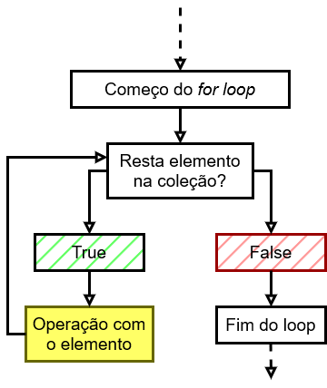
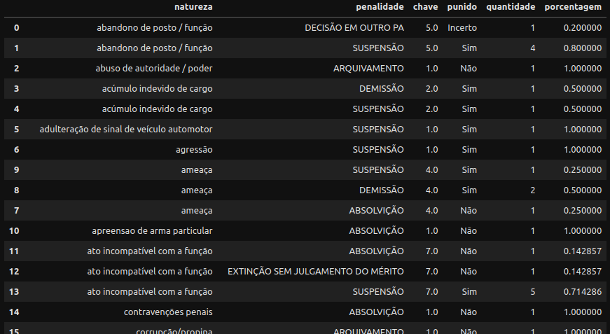
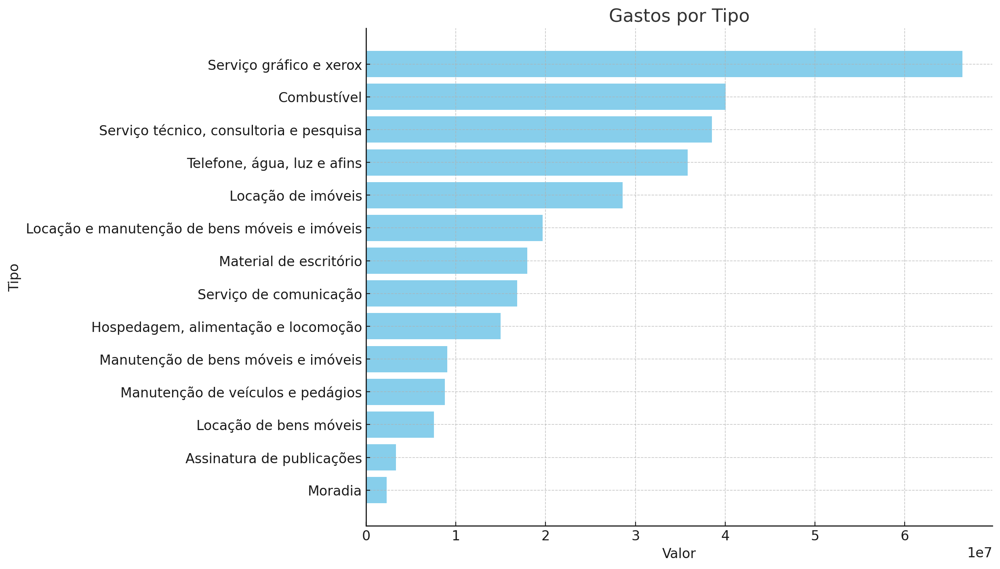


As aulas aqui apresentadas intregam o módulo "Introdução à linguagem Python" do MBA em Jornalismo de Dados, do IDP. Mais informações [aqui](https://www.idp.edu.br/techschool/mba-jornalismo-de-dados/).


<!-- ++ -->

__Variável__ é um nome que faz referência a um valor e fica temporariamente salvo na memória do computador. Funciona como um apelido que damos a um determinado dado. Sempre que chamarmos o apelido &mdash;a variável&mdash;, o dado será evocado.

A atribuição é simples: 

```
variavel = dado
```

Vejamos um uso real:

```py
vlr_dolar = 4.95
```

O valor `4.95` está agora salvo na memória do meu computador. Para obter o valor, eu chamo `vlr_dolar`. Assim:

```py
print(vlr_dolar)
```
```textfile 
4.95
```

Uma variável serve, entre outros, para que não precisemos repetir a digitação ou operação para obter o valor. Vamos pegar como exemplo este verso de "A flor e a náusea", de Carlos Drummond de Andrade:

> É feia. Mas é uma flor. Furou o asfalto, o tédio, o nojo e o ódio.

Essa frase não precisa mais ser digitada se for atribuída à uma variável:

```py
frase = "É feia. Mas é uma flor. Furou o asfalto, o tédio, o nojo e o ódio."
print(frase)
```
```textfile
É feia. Mas é uma flor. Furou o asfalto, o tédio, o nojo e o ódio.
```


Mas lembre-se: a variável perde seu valor quando:

1. o script é finalizado; ou
2. o valor é alterado.


Sim, alterado. É possível mudar o valor de uma variável já existente &mdash;afinal, ela chama "variável". Para isso, basta atribuir novo valor:

```py
print(vlr_dolar) # até aqui, o valor de `vlr_dolar` é 4.95...
vlr_dolar = 4.91 # ...e aqui, altero o valor da variável para 4.91
print(vlr_dolar) # agora a variável apresenta o novo valor
```
```textfile
4.95
4.91
```

Há algumas regras para criar variáveis:

- não pode começar com número ou símbolo, mas pode ter número e underscore (`_`) no meio ou no fim;

```py
idade1 = 42 # correto, pois números são permitidos tanto no meio quanto no fim
1idade = 42 # incorreto, pois números não podem estar no início da variável
```

- não pode conter pontos e demais sinais gráficos, e acentos são desaconselháveis;

```py
idade_1 = 42 # correto, pois underscore é permitido
idade.1 = 42 # incorreto, pois não se pode usar ponto na variável
```

- maiúsculas e minúsculas são diferentes;

```py
nome = "Pedro" # variável com `n` minúsculo
Nome = "José" # variável com `n` maiúsculo
print(Nome)
```
```textfile
José
```

- não pode ser palavra-chave de Python.

<table>
<tbody>
<tr>
<td style="text-align:center"><code>and</code></td>
<td style="text-align:center"><code>as</code></td>
<td style="text-align:center"><code>assert</code></td>
<td style="text-align:center"><code>break</code></td>
<td style="text-align:center"><code>class</code></td>
<td style="text-align:center"><code>continue</code></td>
<td style="text-align:center"><code>def</code></td>
</tr>
<tr>
<td style="text-align:center"><code>del</code></td>
<td style="text-align:center"><code>elif</code></td>
<td style="text-align:center"><code>else</code></td>
<td style="text-align:center"><code>except</code></td>
<td style="text-align:center"><code>exec</code></td>
<td style="text-align:center"><code>finally</code></td>
<td style="text-align:center"><code>for</code></td>
</tr>
<tr>
<td style="text-align:center"><code>from</code></td>
<td style="text-align:center"><code>global</code></td>
<td style="text-align:center"><code>if</code></td>
<td style="text-align:center"><code>import</code></td>
<td style="text-align:center"><code>in</code></td>
<td style="text-align:center"><code>is</code></td>
<td style="text-align:center"><code>lambda</code></td>
</tr>
<tr>
<td style="text-align:center"><code>nonlocal</code></td>
<td style="text-align:center"><code>not</code></td>
<td style="text-align:center"><code>or</code></td>
<td style="text-align:center"><code>pass</code></td>
<td style="text-align:center"><code>raise</code></td>
<td style="text-align:center"><code>return</code></td>
<td style="text-align:center"><code>try</code></td>
</tr>
<tr>
<td style="text-align:center"><code>while</code></td>
<td style="text-align:center"><code>with</code></td>
<td style="text-align:center"><code>yield</code></td>
<td style="text-align:center"><code>True</code></td>
<td style="text-align:center"><code>False</code></td>
<td style="text-align:center"><code>None</code></td>
</tr>
</tbody>
</table>

---
__Neste capítulo vimos:__

- função `print(x)`
  - imprime em tela o valor de `x`
  - documentação: [https://docs.python.org/pt-br/3/library/functions.html#print](https://docs.python.org/pt-br/3/library/functions.html#print)

__Mais sobre os tópicos da aula:__

- [txt; inglês] [Variables in Python](https://realpython.com/python-variables/), em Real Python


<!-- ++ -->

Repare que, quando trabalhamos com variáveis, às vezes usamos valores com aspas, e outras vezes sem aspas. Exemplos:

```py
pi = 3.1416
linguagem = "Python"
```

Isso porque os valores são de tipos diferentes: o primeiro pertence ao tipo numérico `float` (ponto flutuante, decimal), enquanto o segundo pertence ao tipo não-numérico `string` (texto). Em Python, cada tipo tem suas particularidades.

### Tipos numéricos

- Integer (`int`)
  - números inteiros
  - não usa aspas
  - conversão com `int()`

```py
numero = 32
print(numero)
print(type(numero))
```
```textfile
32
<class 'int'>
```

```py
numero = "123"
print(numero)
print(type(numero))
numero = int(numero) # conversão para `int`
print(numero)
print(type(numero))
```
```textfile
123
<class 'str'>
123
<class 'int'>
```

- Float (`float`)
    - números decimais; números com ponto flutuante; notação científica
    - não usa aspas
    - conversão com `float()`

```py
numero = 32.0
print(numero)
print(type(numero))
```
```textfile
32.0
<class 'float'>
```
```py
numero = 0.000000000000000000000000000001
print(numero)
print(type(numero))
```
```textfile
1e-30
<class 'float'>
```

- Complex (`complex`)
    - números complexos, com \\(\sqrt{-1}\\) em parte da equação
    - em Python, número imaginário representado pela letra `j`
    - não usa aspas

```py
from cmath import sqrt # veremos módulos nas próximas aulas

numero = sqrt(-1)
print(numero)
print(type(numero))
```
```textfile
1j
<class 'complex'>
```

### Tipo não-numérico

- String (`str`)
    - texto; sequência de caracteres alfanuméricos; letra
    - aparecem entre aspas duplas (") ou simples (')
    - conversão com `str()`

```py
txt = "Brasil registra 94 mortes por dengue; Belo Horizonte decreta emergência"
print(txt)
print(type(txt))
```
```textfile
Brasil registra 94 mortes por dengue; Belo Horizonte decreta emergência
<class 'str'>
```

```py
txt = 65.1
print(txt)
print(type(txt))
txt = str(txt) # conversão para `str`
print(txt)
print(type(txt))
```
```textfile
65.1
<class 'float'>
65.1
<class 'str'>
```


Fique atento! Se colocamos `"` ou `'` (aspas usadas em `str`) num valor numérico (digamos, `int`), o número deixa de ser número e se transforma em texto. Uma mudança que parece pequena muda completamente o tipo do dado.

```py
print(1234)
print(type(1234))
print('1234')
print(type('1234'))
```
```textfile
1234
<class 'int'>
1234
<class 'str'>
```

```py
print(12 + 34)
print('12' + '34')
```
```textfile
46
1234
```




Notem que, em linhas acima, eu ora usei aspas duplas, ora usei aspas simples. Os dois tipos de aspas valem, mas cuidado:

```py
# Aqui, aspas duplas indicam que o dado é `str`, e as aspas simples indicam grifo
print("Estou usando 'aspas simples' dentro de aspas duplas") 
```
```textfile
Estou usando 'aspas simples' dentro de aspas duplas
```
```py
# Aqui, aspas simples indicam que o dado é `str`, e as aspas duplas indicam grifo
print('Estou usando "aspas duplas" dentro de aspas simples')
```
```textfile
Estou usando "aspas duplas" dentro de aspas simples
```
```py
print('O que acontece se, dentro de 'aspas simples', eu usar aspas simples?')
```
```textfile
  Cell In[15], line 1
    print('O que acontece se, dentro de 'aspas simples', eu usar aspas simples?')
          ^
SyntaxError: invalid syntax. Perhaps you forgot a comma?
```
```py
print("O mesmo acontece com "aspas duplas" dentro de aspas duplas?")
```
```textfile
  Cell In[16], line 1
    print("O mesmo acontece com "aspas duplas" dentro de aspas duplas?")
          ^
SyntaxError: invalid syntax. Perhaps you forgot a comma?
```

Nos dois erros acima, o sistema não entende se as aspas servem para indicar `str` ou se são grifo. Temos `SyntaxError`, erro de sintaxe. Isso ocorre porque a máquina entende que os dados se encerram no fechamento de aspas e não sabe o que fazer com o restante da informação:

1. No primeiro erro, a máquina computou `'O que acontece se, dentro de '` e não soube o que fazer com o resto;
2. No segundo exemplo, a máquina computou `"O mesmo acontece com "` e não soube o que fazer com o resto.

Uma opção é usar escape (`\`) nas aspas internas. Escape funciona para eu avisar a máquina: "interprete de maneira literal, como aspas; não considere como fim de um texto".

```py
print('E agora? Consigo usar \'aspas simples\' dentro de aspas simples?')
```
```textfile
E agora? Consigo usar 'aspas simples' dentro de aspas simples?
```
```py
print("E \"aspas duplas\" dentro de aspas duplas?")
```
```textfile
E "aspas duplas" dentro de aspas duplas?
```


### Tipo lógico

- Boolean (`bool`)
    - comporta apenas dois valores: `True` (verdadeiro) e `False` (falso)
    - nos "bastidores", funciona como número, sendo `0` para `False` e `1` para `True`
    - assim como números, não usa aspas

```py
vdd_ou_falso = True
print(vdd_ou_falso)
print(type(vdd_ou_falso))
```
```textfile
True
<class 'bool'>
```
```py
vdd_ou_falso = False
print(vdd_ou_falso)
print(type(vdd_ou_falso))
```
```textfile
False
<class 'bool'>
```
```py
# veremos operações em breve, mas adianto aqui os 
# operadores `>` e `<` para mostrar um uso de `bool`
idade_rodolfo = 43
idade_pedro = 6
print(idade_pedro > idade_rodolfo) # `>` indica `maior que`
```
```textfile
False
```
```py
print(idade_pedro < idade_rodolfo) # `<` indica `menor que`
```
```textfile
True
```
```py
# Como se comportam como números, sendo True = 1
print(True + True)
```
```textfile
2
```

---
__Neste capítulo vimos:__

- a função `int(x)`
  - converte o valor de `x` para `int`
  - se não há como converter (exemplo: `int("palavra")`), retorna erro
  - documentação: [https://docs.python.org/pt-br/3/library/functions.html#int](https://docs.python.org/pt-br/3/library/functions.html#int)

- a função `float(x)`
  - converte o valor de `x` para `float`
  - se não há como converter (exemplo: `float("palavra")`), retorna erro
  - documentação: [https://docs.python.org/pt-br/3/library/functions.html#float](https://docs.python.org/pt-br/3/library/functions.html#float)
  
- a função `str(x)`
  - converte o valor de `x` para `str`
  - documentação: [https://docs.python.org/pt-br/3/library/functions.html#func-str](https://docs.python.org/pt-br/3/library/functions.html#func-str)

- a função `type(x)`
  - mostra o tipo de dado do objeto `x`
  - documentação: [https://docs.python.org/pt-br/3/library/functions.html#type](https://docs.python.org/pt-br/3/library/functions.html#type)

__Mais sobre os tópicos da aula:__

- [vid] [Conhecendo tipos de dados](https://www.youtube.com/watch?v=EosATvOIHEs), em Programação Dinâmica
- [vid] [Tipos de dados](https://www.youtube.com/watch?v=g6QJCal2_7w), em Procópio na Rede
- [txt; inglês] [Basic data types in Python](https://realpython.com/python-data-types/), em Real Python


<!-- ++ -->

Agora que sabemos o que são variáveis e conhecemos os tipos básicos, podemos fazer cálculos ou comparar duas ou mais variáveis. Para isso realizações operações aritméticas, relacionais ou lógicas.

### Aritméticas

Que tal fazer matemática usando variáveis? É para isso que servem as operações aritméticas. Por exemplo, descobrir o salário mínimo por dia útil...

```py
sal_minimo = 1412
dias_uteis = 22
print(sal_minimo / dias_uteis)
```
```textfile
64.18181818181818
```

...ou então, calcular a área de um círculo de \\(n\\) metros de raio, cuja fórmula é \\(A=\pi r^2\\).

```py
raio = input("Digite o valor do raio: ")
pi = 3.14159
area = pi * (float(raio)**2)
print(area)
```
```textfile
Digite o valor do raio: 12.5
490.87343749999997
```

No primeiro exemplo, eu dividi o salário mínimo (`sal_minimo`) pela quantidade de dias úteis (`dias_uteis`) em um mês. Para isso, usei o símbolo de divisão (`/`).

No segundo exemplo, elevei ao quadrado o raio (`raio`) convertido para `float` (`float()`) usando o símbolo de exponenciação (`**`) e, a ele, multipliquei o valor de pi (`pi`) com o símbolo de multiplicação (`*`).

Abaixo estão os operadores aritméticos em Python (e nos exemplos, considere `x = 5` e `y = 2`):

| operador | significado | entrada | saída |
| :-: | :-: | :-: | :-: |
| `+` | adição | `x + y` | `7` |
| `-` | subtração | `x - y` | `3` |
| `*` | multiplicação | `x * y` | `10` |
| `/` | divisão | `x / y` | `2.5` |
| `**` | exponenciação | `x ** y` | `25` |
| `//` | parte inteira da divisão (descarta decimais) | `x // y` | `2` |
| `%` | módulo (resto da divisão) | `x % y` | `1` |


Cabe ressaltar: a ordem de execução de operações segue a ordem convencional na matemática:

1. exponenciação
2. multiplicação e divisão
3. soma e subtração

Podemos sobrescrever essa ordem usando parênteses:

```py
print(2 + 3 * 4) # Multiplica 3 e 4, e depois adiciona 2
```
```textfile
14
```
```py
print((2 + 3) * 4) # Soma 2 e 3, e depois multiplica por 4
```
```textfile
20
```



### Relacionais

Dados lógicos (`True`, `False`), como vimos um pouco antes, aparecem com mais frequência junto a operadores relacionais ou de comparação. São operações que checam se uma equivalência entre dados (sejam eles `int`, `float`, `str` etc.) é verdadeira ou falsa.

Estes são os operadores de comparação em Python (e nos exemplos, `x = 5` e `y = 2`):

| operador | significado | entrada | saída |
| :-: | :-: | :-: | :-: |
| `==` | igual à | `x == y` | `False` |
| `!=` | não-igual a | `x != y` | `True` |
| `>` | maior que | `x > y` | `True` |
| `>=` | maior que ou igual a | `x >= y` | `True` |
| `<` | menor que | `x < y` | `False` |
| `<=` | menor que ou igual a | `x <= y` | `False` |

Vamos ver como se usa numa conta simples:

```py
conta = 5 ** 2 / 2 # Faço um cálculo aritmético e salvo na variável `conta`
print(conta == 12) # Agora vejo se o valor de `conta` é igual a 12
```
```textfile
False
```
```py
print(conta >= 12) # Vejo se o valor de `conta` é maior que ou igual a 12 
```
```textfile
True
```
```py
print(conta)
```
```textfile
12.5
```

Um outro exemplo: ver se a quantidade de dígitos num número de CPF corresponde à quantidade oficial:

```py
cpf = "01234567890" # numeral em `str`
qtd_elem_cpf = 11 # estabeleço que a quantidade de elementos num CPF é 11
print(cpf)
print(len(cpf) == qtd_elem_cpf)
```
```textfile
01234567890
True
```

Ou ainda, comparar uma projeção rudimentar da balança comercial com uma meta imaginária:

```py
# fonte:
# https://agenciagov.ebc.com.br/rede-nacional-de-radio/programas/e-noticia/08-02-24-e-noticia-filippin-balanca-comercial-ve-ctl.mp3
exportacoes_jan2024 = 27.02
importacoes_jan2024 = 20.49
meta_balanca_2024 = 78

projecao_expo_2024 = exportacoes_jan2024 * 12
projecao_impo_2024 = importacoes_jan2024 * 12

print((projecao_expo_2024 - projecao_impo_2024) > meta_balanca_2024)
```
```textfile
True
```

### De atribuição

Por ora, já temos sedimentado o conhecimento de que o sinal `=` serve para atribuir um valor a uma variável, como vimos no item _Variáveis_. Exemplo:

```
variavel = valor
```

Mas `=`, junto a outros sinais, serve também para operações de adição, subtração etc., __quando o valor resultante dessa operação aritmética for atribuída à mesma variável__.

Ficou confuso, então vou explicar com um exemplo:

```py
idade = 43
print(idade)
idade = idade + 1
print(idade)
```
```textfile
43
44
```

No exemplo acima, note que, na terceira linha, temos `1` adicionado à variável `idade` (com valor `43`), e o resultado (`44`) será atribuído à mesma variável `idade`. A variável se repete: aparece tanto na operação aritmética (`idade + 1`) quanto no elemento onde o resultado da operação é salvo (`idade =`). 

Para não ter de repetir a variável, usamos operadores de atribuição. O exemplo acima poderia ser escrito assim:

```py
idade = 43
print(idade)
idade += 1 # equivalente a `idade = idade + 1`
print(idade)
```
```textfile
43
44
```

E não é apenas com adição que consigo fazer esse tipo de atribuição (considerando `x = 33`):

| operador | significado | entrada | equivalência | saída |
| :-: | :-: | :-: | :-: | :-: |
| `+=` | adição | `x += 3` | `x = x + 3` | `36` |
| `-=` | subtração | `x -= 3` | `x = x - 3` | `30` |
| `*=` | multiplicação | `x *= 3` | `x = x * 3` | `99` |
| `/=` | divisão | `x /= 3` | `x = x / 3` | `11` |
| `**=` | exponenciação | `x **= 3` | `x = x ** 3` | `35937` |
| `//=` | parte inteira da divisão (descarta decimais) | `x //= 3` | `x = x // 3` | `11` |
| `%=` | módulo (resto da divisão) | `x %= 3` | `x = x % 3` | `0` |

### Lógicos

Além dos operadores relacionais, há os operadores lógicos. Eles servem para agregar operadores relacionais. Por exemplo:

```py
x = 5
y = 2

print(y > x)
print(y == x)
print(y < x)

print(y < x and y > 3)
print(y < x and y > 1)
```
```textfile
False
False
True
False
True
```

No exemplo acima,

- na penúltima linha: `y` é menor do que `x`, dando resultado `True`; mas `y` não é maior do que `3`, levando ao resultado `False`. Como nem todas as relações são `True`, o resultado lógico (com o uso de `and`) é `False`.

- na última linha: `y` é menor do que `x`, dando resultado `True`; também `y` é maior do que `1`, levando ao resultado `True`. Como todas as relações são `True`, o resultado lógico (com o uso de `and`) é `True`.

Os operadores lógicos são os seguintes (considerando `x = 5` e `y = 2`):

| operador | significado | input de exemplo | saída |
| :-: | :-: | :-: | :-: |
| `and` | `e` lógico (ambas as comparações devem ser `True`) | `x > y and x < 10` | `True` |
| `or` | `ou` lógico (uma das comparações deve ser `True`) | `x != 5 or x > y` | `True` |
| `not` | negação lógica (inverte a resposta lógica) | `not x == 5` | `False` |


Vamos a um exemplo: observar a percepção da homofobia na região sudeste versus a quantidade de mortes violentas de LGBTQIA+ &mdash;podemos imaginar que, conforme há aumento da percepção, os crimes diminuem, certo?

```py
# fontes:
# https://www.poder360.com.br/poderdata/percepcao-sobre-homofobia-no-brasil-cresceu-sob-lula-diz-poderdata/
# https://g1.globo.com/ba/bahia/noticia/2024/01/20/mortes-violentas-de-pessoas-lgbtqia-na-ba-2023.ghtml
percepcao_2024 = 72
percepcao_2022 = 69
mortes_2023 = 100
mortes_2022 = 63
print(percepcao_2024 > percepcao_2022 and mortes_2023 < mortes_2022)
```
```textfile
False
```
---
__Neste capítulo vimos:__

- a função `input()`
  - pede ao usuário um valor e salva numa variável
  - todo valor inserido, seja numérico ou não, é tratado como `str`
  - documentação: [https://docs.python.org/pt-br/3/library/functions.html#input](https://docs.python.org/pt-br/3/library/functions.html#input)

- a função `len(x)`
  - retorna a quantidade de elementos no objeto `x`
  - documentação: [https://docs.python.org/pt-br/3/library/functions.html#len](https://docs.python.org/pt-br/3/library/functions.html#len)

__Mais sobre os tópicos da aula:__

- [vid] [Operadores e expressões aritméticas](https://www.youtube.com/watch?v=MzT7VHdSEes), em Bóson Treinamentos
- [txt; inglês] [Python operators](https://www.w3schools.com/python/python_operators.asp), em W3
- [txt] [Operadores e expressões](https://algoritmosempython.com.br/cursos/programacao-python/operadores/), em Algoritmos em Python
- [txt] [Variáveis, expressões e comandos](https://panda.ime.usp.br/pensepy/static/pensepy/02-Conceitos/conceitos.html), em Pense Python, IME-USP
- [txt] [Valores e operadores booleanos](https://panda.ime.usp.br/aulasPython/static/aulasPython/aula05.html), em IME-USP
- [txt] [Operadores aritméticos e lógicos](https://pythonacademy.com.br/blog/operadores-aritmeticos-e-logicos-em-python), em Python Academy

__Para treinar:__

Segundo o [G1](https://g1.globo.com/bemestar/vacina/noticia/2021/07/09/vacinacao-no-brasil-mais-de-14percent-da-populacao-tomou-as-duas-doses-ou-dose-unica-de-vacinas-contra-a-covid.ghtml) em 9 de julho de 2021, até aquela data 82.908.617 pessoas haviam tomado a primeira dose da vacina contra a covid-19. Especificamente naquele dia, 994.468 pessoas tomaram a primeira dose.

Arredondando, o Brasil tinha, à época, 212 milhões de habitantes, dos quais cerca de 21% tinham menos de 18 anos -- ou seja, não eram elegíveis para a vacinação.

1. Quantos brasileiros estavam elegíveis para a vacinação em 9 de julho?

2. Se o ritmo de vacinação da primeira dose tivesse se mantido como no dia 9 de julho de 2021, em quantos dias toda a população elegível teria recebido a primeira dose?


<!-- ++ -->

1. No mês passado, um certo influencer tinha 5.641.981 seguidores no Instagram. Como ele divulgava o "jogo do tigrinho" e a PF bateu na porta dele, o influencer teve uma queda significativa de seguidores: ficou com 4.567.093 neste mês. Calcule a queda percentual.
2. Uma certa empresa teve lucro de US$ 12.095.187,05 em dezembro de 2023, com o dólar a R$ 4,8526. Em janeiro de 2024, com o dólar a R$ 4,9163, a empresa teve lucro de US$ 11.567.011,87. Qual é a diferença percentual entre os valores em reais?
3. A fórmula para calcular IMC é: 
    $$
    IMC = \frac{peso em kg}{altura em metro^{2}}
    $$
Crie um código que peça ao usuário seu peso, sua altura, e retorne o IMC.


<!-- ++ -->

Até o momento, estamos escrevendo códigos que são executados numa estrutura fixa: __de cima para baixo, linha a linha__. Exemplo:

```py
nome = input("Qual é o seu nome? ")
ano = input("Em que ano você nasceu? ")
idade = 2024 - int(ano)
print("Bom dia, {}. Você tem ou terá {} anos em 2024.".format(nome, idade))
# A função `format()` substititui `{}` pelo valor da variável
```
```textfile
Qual é o seu nome? Rodolfo
Em que ano você nasceu? 1981
Bom dia, Rodolfo. Você tem ou terá 43 anos em 2024.
```


Usamos a função `format(x)` que, como vimos, substititui `{}` pelo valor da variável `x`.

Uma outra forma de fazer isso (de maneira mais concisa e sem precisar de `format()`) é com __f-strings__. Em vez de...

```py
print("Bom dia, {}. Você tem ou terá {} anos em 2024.".format(nome, idade))
```

...pode fazer assim: 

```py
print(f"Bom dia, {nome}. Você tem ou terá {idade} anos em 2024.")
```

Repare que eu uso `f` antes das aspas da frase, e em vez de `{}` eu uso `{variavel}`.


Até aqui, nosso script processa a linha 1, depois a linha 2, depois a linha 3 e, por fim, a linha 4. Uma após a outra, sem nunca pular uma linha. É um fluxo fixo.

Mas podemos mudar isso. Podemos controlar a execução, o fluxo do script. Uma das formas é com `if`, que condiciona a execução de uma linha ao resultado de outra.

### `if`

A estrutura mais simples do controle de fluxo com `if` é assim:

```py
if condicao_1:
    operacao_1
```

Em português, o exemplo acima seria algo como "se `condicao_1` for `True`, execute `operacao_1`; se for `False`, não execute".


Reparem que há indentação de quatro espaços na linha abaixo de `if condicao_1:`. É algo obrigatório, e indica que as operações dentro do bloco `if` estão condicionadas à `condicao_1`. 

Um exemplo:

```py
if condicao_1:
    operacao_1
    operacao_2
```

Acima, `operacao_1` e `operacao_2` são executadas somente se `condicao_1` for `True`. A indentação coloca as operações dentro do bloco `if`. Este bloco forma uma unidade lógica, onde todas as operações dentro dele dependem da condição.

```py
if condicao_1:
    operacao_1
operacao_2
```

Aqui, `operacao_1` ainda depende de `condicao_1` ser `True` para ser executada. No entanto, `operacao_2` não faz parte do bloco de código que depende de `condicao_1` e, portanto, `operacao_2` será executada independentemente de `condicao_1` ser `True` ou não, já que ela está fora do bloco `if`.


Desenhando,



Vamos ver isso na prática:

```py
salario = 1412 * 2 # dois salários mínimos
aluguel = 1600
luz = 90
agua = 80
telefone = 99
cartao = 200
contas = aluguel + luz + agua + telefone + cartao

print("Começou o fluxo.")

if salario >= contas: # se o salário for maior ou igual ao valor das contas...
    restos = salario - contas # ...calcule quanto sobra
    print(f"Consigo pagar as contas e me sobram {restos} reais.")
    
print("Acabou o fluxo.")
```
```textfile
Começou o fluxo.
Consigo pagar as contas e me sobram 755 reais.
Acabou o fluxo.
```

No exemplo acima o cálculo de `restos` foi executado e a frase foi impressa porque `salario >= contas` é `True`. Vejamos o que acontece se o salário for menor.

```py
salario = 1412 # um salário mínimo
aluguel = 1600
luz = 90
agua = 80
telefone = 99
cartao = 200
contas = aluguel + luz + agua + telefone + cartao

print("Começou o fluxo.")

if salario >= contas: # se o salário for maior ou igual ao valor das contas...
    restos = salario - contas # ...calcule quanto sobra
    print(f"Consigo pagar as contas e me sobram {restos} reais.")
    
print("Acabou o fluxo.")
```
```textfile
Começou o fluxo.
Acabou o fluxo.
```

Neste último exemplo, com apenas um salário mínimo, nem o cálculo de `restos`, nem a impressão da frase ocorreu porque `salario >= contas` é `False`.

### `if`-`else`

Quando utilizamos `if`, a operação é executada apenas se a condição for `True`; se for `False`, nada acontece. Contudo, há casos em que queremos executar uma operação alternativa caso a condição dê `False`. Para isso usamos `if`-`else`. Funciona assim:

```py
if condicao_1:
    operacao_1
else:
    operacao_2
```

Em português seria algo como "se `condicao_1` for `True`, execute `operacao_1`; se for `False`, realize `operacao_2`".

Desenhando,



Vejamos um exemplo &mdash;primeiro, com dois salários; depois, com um salário:

```py
salario = 1412 * 2
aluguel = 1600
luz = 90
agua = 80
telefone = 99
cartao = 200
contas = aluguel + luz + agua + telefone + cartao

print("Começou o fluxo.")

if salario >= contas: # se o salário for maior ou igual ao valor das contas...
    restos = salario - contas # ...calcule quanto sobra
    print(f"Consigo pagar as contas e me sobram {restos} reais.")
else: # se não...
    divida = contas - salario # calcule a diferença...
    print(f"Não consigo pagar as contas. Minha dívida é de {divida} reais.")
   
print("Acabou o fluxo.")
```
```textfile
Começou o fluxo.
Consigo pagar as contas e me sobram 755 reais.
Acabou o fluxo.
```
```py
salario = 1412
aluguel = 1600
luz = 90
agua = 80
telefone = 99
cartao = 200
contas = aluguel + luz + agua + telefone + cartao

print("Começou o fluxo.")

if salario >= contas: # se o salário for maior ou igual ao valor das contas...
    restos = salario - contas # ...calcule quanto sobra
    print(f"Consigo pagar as contas e me sobram {restos} reais.")
else: # se não...
    divida = contas - salario # calcule a diferença...
    print(f"Não consigo pagar as contas. Minha dívida é de {divida} reais.")
    
print("Acabou o fluxo.")
```
```textfile
Começou o fluxo.
Não consigo pagar as contas. Minha dívida é de 657 reais.
Acabou o fluxo.
```

No primeiro exemplo, foi executado o bloco de operações dentro de `if`; no segundo, o bloco de operações dentro de `else`. Repare que não houve mudanças nos códigos `if`-`else`, eles são absolutamente iguais; o que mudou foi apenas a variável `salario`.

### `if`-`elif`-`else`

Vimos que o uso de `if`-`else` permite executar uma operação para resultado `True` e outra, distinta, para `False`. Mas e se tivermos três ou mais operações? Por exemplo:

> Se a temperatura estiver (1) igual ou superior a 30°C, devo usar protetor solar; (2) entre 20°C e 29°C, basta uma camiseta; (3) entre 10°C e 19°C, devo usar uma blusa; (4) abaixo de 10°C, preciso de jaqueta.

Repare que, na construção acima, tenho quatro condições que levam a quatro operações distintas:

| condição | operação |
| :-: | :-: |
| >= 30 | protetor solar |
| 20-29 | camiseta |
| 10-19 | blusa |
| < 10 | jaqueta |

Como ficaria isso em Python? Bem, teríamos de ir além de `if`-`else`. Temos de usar `if`-`elif`-`else`:

```py
if condicao_1:
    operacao_1
elif condicao_2:
    operacao_2
elif condicao_3:
    operacao_3
...    
elif condicao_n:
    operacao_n
else:
    operacao_z
```

Ou seja, em português seria algo como "se `condicao_1` for `True`, realize `operacao_1`; se não, veja se `condicao_2` é `True` e, se for, execute `operacao_2`; se não, veja se `condicao_3` é `True` e, se for, execute `operacao_3` etc. Se nenhuma das condições for satisfeita, execute `operacao_z`".

Desenhando,



O exemplo das temperaturas ficaria assim:

```py
temperatura = 28
if temperatura >= 30:
    print("Devo usar protetor solar")
elif temperatura < 30 and temperatura >= 20:
    print("Devo usar apenas uma camiseta")
elif temperatura < 20 and temperatura >= 10: 
    print("Devo usar uma blusa")
else:
    print("Devo usar uma jaqueta")
# Repare que coloquei a última condição (temperatura < 10) no 
# `else`, pois é a única condição que resta dentre todas. 
# Ou seja, a condição fica implícita.
```
```textfile
Devo usar apenas uma camiseta
```
```py
temperatura = 13
if temperatura >= 30:
    print("Devo usar protetor solar")
elif temperatura < 30 and temperatura >= 20:
    print("Devo usar apenas uma camiseta")
elif temperatura < 20 and temperatura >= 10: 
    print("Devo usar uma blusa")
else:
    print("Devo usar uma jaqueta")
```
```textfile
Devo usar uma blusa
```

---
__Mais sobre os tópicos da aula:__

- [vid] [Estruturas de seleção com if e else](https://www.youtube.com/watch?v=zouf7AkISR4), em Cursos Kane Chan
- [txt] [Comandos if](https://docs.python.org/pt-br/3.8/tutorial/controlflow.html#if-statements), em Python.org
- [txt] [Comandos de decisão](https://www.inf.pucrs.br/pinho/PCB/ComandosDeDecisao/Decisao.htm), em Escola Politécnica - PUC-RS

__Para treinar:__

Recentemente tem feito muito calor em algumas regiões do Brasil. Na minha categorização:

- Menos que 0º é congelante,
- De 0º a 10º é muito frio,
- De 10,1º a 17º é friozinho,
- De 17,1º a 24º é ameno,
- De 24,1º a 30º é calor,
- Acima de 30º é muito calor.

Escreva um programa que:

- pede ao usuário a temperatura no momento,
- retorne ao usuário a informação sobre a temperatura de acordo com a tabela acima.


<!-- ++ -->

Vimos que a execução das linhas pode ser controlada, que o código nem sempre precisa ter todas as suas linhas lidas. E vimos que uma forma de controlar o fluxo é com `if`.

Há outra forma: `while`. Diferentemente de `if`, que checa se a condição é `True` ou `False`, `while` executa a operação enquanto a condição for `True`. Sua sintaxe é assim:

```py
while condicao:
    operacao
```

Um exemplo concreto:

> Tenho um micro-ônibus com nenhum passageiro e capacidade para 20 pessoas. Enquanto a lotação for menor que ou igual a 20, adiciono passageiro.

Em Python, ficaria assim:

```py
passageiros = 0
lotacao = 20
while passageiros < lotacao:
    passageiros += 1
    print(f"Tenho {passageiros} passageiro(s) no meu ônibus.")
```
```textfile
Tenho 1 passageiro(s) no meu ônibus.
Tenho 2 passageiro(s) no meu ônibus.
Tenho 3 passageiro(s) no meu ônibus.
Tenho 4 passageiro(s) no meu ônibus.
Tenho 5 passageiro(s) no meu ônibus.
Tenho 6 passageiro(s) no meu ônibus.
Tenho 7 passageiro(s) no meu ônibus.
Tenho 8 passageiro(s) no meu ônibus.
Tenho 9 passageiro(s) no meu ônibus.
Tenho 10 passageiro(s) no meu ônibus.
Tenho 11 passageiro(s) no meu ônibus.
Tenho 12 passageiro(s) no meu ônibus.
Tenho 13 passageiro(s) no meu ônibus.
Tenho 14 passageiro(s) no meu ônibus.
Tenho 15 passageiro(s) no meu ônibus.
Tenho 16 passageiro(s) no meu ônibus.
Tenho 17 passageiro(s) no meu ônibus.
Tenho 18 passageiro(s) no meu ônibus.
Tenho 19 passageiro(s) no meu ônibus.
Tenho 20 passageiro(s) no meu ônibus.
```

No código acima, o bloco dentro de `while` (a operação de adição e a impressão da frase) foi executado 20 vezes &mdash;foi executado sempre que a operação `passageiros < lotacao` deu `True`. Quando a quantidade de passageiros chegaria a 21, a execução é interrompida.

Desenhando,




Cuidado ao usar `while`! Como dissemos, ele executa uma operação __enquanto__ uma condição for `True`. Se a condição for `True` para sempre, o código será executado até o seu computador travar. Um exemplo de condição infinita:

```py
numero = 1
while numero > 0:
    print(f"O número agora é {numero}.")
    numero += 1
```
```textfile
O número agora é 1.
O número agora é 2.
O número agora é 3.
O número agora é 4.
...
...
...
[Até o travamento da máquina]
```

No exemplo acima, `numero` começa como `1` e, a cada looping no bloco, há adição de `1` a ele. Ou seja, a condição `while numero > 0` começa como `True` e nunca será `False` &mdash;`numero` será `> 0` para sempre! O código vai rodar, rodar, rodar... Quando a memória da máquina estiver exausta, ela vai travar.

É preciso, portanto, estabelecer um limite, um ponto em que `True` se tornará `False`.


---
__Mais sobre os tópicos da aula:__

- [vid] [Estrutura de repetição while](https://www.youtube.com/watch?v=VynNy4Ix9Fc), em DevMedia
- [txt] [Python while: executar código com condição verdadeira](https://blog.betrybe.com/python/python-while/), em Betrybe

__Para treinar:__

A brincadeira do "pim" ficou famosa no Programa do Silvio Santos: alguém da plateia é escolhido e deve contar até onde conseguir, mas trocando o número 4 e seus múltiplos pela palavra "pim".

> Um, dois, três, pim, cinco, seis, sete, pim...

Aqui um exemplo: 

<div class="video-container">
    <iframe src="https://www.youtube.com/embed/s6PCVq_ojto" frameborder="0" allowfullscreen=""></iframe>
</div>

Escreva um programa que:

- pede ao usuário um número entre 40 e 60,
- imprima na tela cada número, de 1 até o número digitado pelo usuário, exceto 4 e seus múltiplos, que devem ser substituídos por "pim".



<!-- ++ -->

Nas aulas anteriores vimos muita coisa sobre Python:

- variáveis
- tipos
- operações aritméticas
- operações relacionais
- operações lógicas
- controle de fluxo com `if`
- as diversas formas de `if`
- controle de fluxo com `while`

É muita coisa num tempo bastante curto. Portanto, a aula de hoje será um encontro voltado para a prática e o experimento, e para tirar eventuais dúvidas sobre os temais supracitados.

Há cinco atividades abaixo. Elas enfocam um ou mais itens já vistos em aula. Em duplas, resolvam as atividades; em seguida, vamos conversar sobre as soluções, o que funcionou, o que não funcionou, e quais dúvidas ainda existem.

### Atividade 1

O código abaixo contém um ou mais erros, e é preciso corrigi-lo(s). Copie o código no seu editor, encontre o(s) erro(s) e faça a(s) correção(ões) necessária(s).

```py
# Este é um programa para calcular o fatorial de um número
numero = int(input("Digite um número de 1 a 20: "))
resultado = 1

while numero != 0
resultado = resultado * 'numero'
numero = numero - 1

print('O fatorial é {}.".format('resultado')
```

### Atividade 2

Imagine uma loja. Cada vendedor da loja tem um salário fixo de R$ 2.000,00, além de uma comissão variável:

- vendas igual a ou acima de R$ 30.000,00: comissão de 5% sobre as vendas;
- vendas entre R$ 15.000,01 e R$ 29.999,99: comissão de 4% sobre as vendas;
- vendas até R$ 15.000,00: comissão de 2,5% sobre as vendas.

Escreva um código que pede ao vendedor:

- o nome,
- o mês (em número entre 1 e 12),
- o valor de vendas que ele efetuou no mês.

Com as informações obtidas, o código deve fazer os cálculos de quanto o vendedor deve receber naquele mês e retornar uma frase parecida com isso:

> Rodolfo vendeu R$ 18.761,09 em março e deve receber R$ 2.750.44.

### Atividade 3

Escreva um código que diz se o número digitado pelo usuário é par ou ímpar.

### Atividade 4

Na noite de 3 de julho de 2021, o painel de vacinação contra a covid-19 do Ministério da Saúde apontava pouco mais de 97 milhões de doses de vacina aplicadas na população brasileira. ([Fonte fora do ar](https://qsprod.saude.gov.br/extensions/DEMAS_C19Vacina/DEMAS_C19Vacina.html))

Com os dados separados por estado, torna-se possível calcular a proporção de doses aplicadas em certa unidade da federação ou certa região em relação ao total. É o que faremos aqui: calcularemos o percentual de doses aplicadas na região sudeste em relação ao Brasil.

O código, contudo, está embaralhado &mdash;os blocos estão em lugares errados. Precisamos colocá-lo em ordem! Mesmo sem saber muito do código abaixo &mdash;ainda há muito o que aprender!&mdash;, você consegue ordená-los usando apenas a lógica e a descrição de cada bloco de código.

Ah, quando a ordenação estiver correta, o resultado será este:

> A região sudeste aplicou 44.83237513295442% do total de 97135737 doses consumidas no Brasil

```py
# Este bloco conta as vacinas de todos os estados
total = 0 # Começamos com zero em `total`...
for i in estados: # ...e para cada elemento na lista `estados`...
    total += i["doses"] # ...adicionamos o valor de `doses` ao `total`
    
# Esta linha imprime o resultado
print(f"A região sudeste aplicou {calculo}% do total de {total} doses consumidas no Brasil")

# Este bloco é a coleção de dados de todos os estados
estados = [
    {"uf": "AC", "doses": 364906},
    {"uf": "AL", "doses": 1421213},
    {"uf": "AM", "doses": 1773255},
    {"uf": "AP", "doses": 271691},
    {"uf": "BA", "doses": 6152177},
    {"uf": "CE", "doses": 3270535},
    {"uf": "DF", "doses": 1283699},
    {"uf": "ES", "doses": 2219656},
    {"uf": "GO", "doses": 3111799},
    {"uf": "MA", "doses": 3106822},
    {"uf": "MG", "doses": 9357072},
    {"uf": "MS", "doses": 1615951},
    {"uf": "MT", "doses": 1351618},
    {"uf": "PA", "doses": 2890438},
    {"uf": "PB", "doses": 1834443},
    {"uf": "PE", "doses": 3750035},
    {"uf": "PI", "doses": 1391719},
    {"uf": "PR", "doses": 5830476},
    {"uf": "RJ", "doses": 8084518},
    {"uf": "RN", "doses": 1652963},
    {"uf": "RO", "doses": 688403},
    {"uf": "RR", "doses": 222025},
    {"uf": "RS", "doses": 6832516},
    {"uf": "SC", "doses": 3225600},
    {"uf": "SE", "doses": 923887},
    {"uf": "SP", "doses": 23887012},
    {"uf": "TO", "doses": 621308}
]

# Este bloco conta as vacinas dos estados do sudeste
vacinas_sudeste = 0 # Começamos com zero em `vacinas_sudeste`...
for i in estados: # ...e para cada elemento na lista `estados`...
    if i["uf"] in sudeste: # ...se o valor de "uf" estiver na lista `sudeste`...
        vacinas_sudeste += i["doses"] #...adicionamos o valor de `doses` a `vacinas_sudeste`

# Esta linha calcula a proporção de vacinas no sudeste em relação ao total
calculo = (vacinas_sudeste / total) * 100

# Esta linha é uma lista dos estados da região sudeste
sudeste = ["SP", "RJ", "MG", "ES"]
```

### Atividade 5

A fórmula para converter Celsius para Fahrenheit é \\(Fahrenheit = (Celsius\times\frac{9}{5})+32\\).

Já de Fahrenheit para Celsius, \\(Celsius = (Fahrenheit - 32)\times\frac{5}{9}\\).

Crie um programa que:

- pede ao usuário a temperatura,
- pede ao usuário se está em Celsius ou Faherenheit,
- realize a operação de conversão &mdash;se é Celsius, traz resultado em Fahrenheit; se Fahrenheit, em Celsius.

### Atividade 6

Peça ao usuário qualquer número de 1 a 100, e retorne sua tabuada. Por exemplo, o número `7` ficaria assim:
```
7 x 1 = 7
7 x 2 = 14
7 x 3 = 21
7 x 4 = 28
...
7 x 8 = 56
7 x 9 = 63
7 x 10 = 70
```

### Atividade 7

Segundo [projeções do IBGE](https://www.ibge.gov.br/estatisticas/sociais/populacao/9103-estimativas-de-populacao.html), o estado de São Paulo teria uma população de 47.333.288 habitantes em 2023. Naquele ano, o estado registrou 3.615 tentativas de homicídio, de acordo com a [SSP](https://www.ssp.sp.gov.br/estatistica/dados-mensais). Um ano antes, a população seria de 46.997.428 habitantes, e houve 3.499 tentativas de homicídio. Com base nessas informações,
    - calcule a taxa de tentativas de homicídio por 100 mil habitantes em cada ano;
    - calcule a diferença percentual da taxa entre os anos.

### Atividade 8

Segundo a [FGV Social](https://www.cps.fgv.br/cps/bd/docs/CovidEAsClassesEconomicas_FGV_Social_Neri-OUT-2020.pdf), a partir dos microdados da Pnad-C Anual e Pnad Covid, do IBGE, a pirâmide populacional de classes econômicas nos anos de 2019 e 2020 se mostrava da seguinte forma:

<table>
<thead>
<tr>
  <th>período</th>
  <th>renda</th>
  <th>população</th>
</tr>
</thead>
<tbody>
<tr>
  <td>2019</td>
  <td>menos de ½ sm</td>
  <td>65.229.668</td>
</tr>
<tr>
  <td></td>
  <td>½ a 1 sm</td>
  <td>61.909.343</td>
</tr>
<tr>
  <td></td>
  <td>1 a menos de 2 sm</td>
  <td>50.078.060</td>
</tr>
<tr>
  <td></td>
  <td>2 a menos de 4 sm</td>
  <td>21.519.066</td>
</tr>
<tr>
  <td></td>
  <td>4 sm ou mais</td>
  <td>11.410.989</td>
</tr>
<tr>
  <td>jul.2020</td>
  <td>menos de ½ sm</td>
  <td>52.127.922</td>
</tr>
<tr>
  <td></td>
  <td>½ a 1 sm</td>
  <td>76.318.115</td>
</tr>
<tr>
  <td></td>
  <td>1 a menos de 2 sm</td>
  <td>56.215.080</td>
</tr>
<tr>
  <td></td>
  <td>2 a menos de 4 sm</td>
  <td>18.646.895</td>
</tr>
<tr>
  <td></td>
  <td>4 sm ou mais</td>
  <td>8.447.679</td>
</tr>
<tr>
  <td>ago.2020</td>
  <td>menos de ½ sm</td>
  <td>50.176.044</td>
</tr>
<tr>
  <td></td>
  <td>½ a 1 sm</td>
  <td>76.590.769</td>
</tr>
<tr>
  <td></td>
  <td>1 a menos de 2 sm</td>
  <td>56.859.091</td>
</tr>
<tr>
  <td></td>
  <td>2 a menos de 4 sm</td>
  <td>19.185.258</td>
</tr>
<tr>
  <td></td>
  <td>4 sm ou mais</td>
  <td>8.930.353</td>
</tr>
</tbody>
</table>

(Cabe ressaltar que, como a população cresce a cada mês, trabalhar com números brutos pode induzir a erro. Em alguns casos, é importante trabalhar com proporções — ou seja, a parte (%) em relação ao total da população do referido período.)

Segundo o [release](https://www.cps.fgv.br/cps/bd/docs/CovidEAsClassesEconomicas_FGV_Social_Neri-OUT-2020.pdf) do estudo divulgado à época,

> Levantamento de classes econômicas brasileiras realizado a partir de dados factuais coletados durante a pandemia mostra que o número de pobres no Brasil (renda domiciliar per capita até ½ salário mínimo) caiu 15 milhões entre 2019 e agosto de 2020.

- Essa informação é verdadeira? Qual foi a queda percentual?

Também segundo o release,

> Já os estratos mais abastados com renda acima de dois salários mínimos per capita perderam 4,8 milhões de pessoas em plena pandemia.

- Essa informação é verdadeira? Qual foi a queda percentual?



<!-- ++ -->

Em aulas anteriores vimos os tipos primitivos de dados, como:

- integer (`int`): `4`, `-12`, `6745`...

- float (`float`): `4.67`, `-12.01973`, `6745.0`...

- boolean (`bool`): `True`, `False`

- string (`str`): `"Python"`, `"maçã"`, `"jornalismo de dados"`, `"6.0"`...

Também vimos como armazenar dados na memória com o uso de variáveis. Por exemplo:

```py
idade = 43
nome = "Rodolfo"
print(f"{nome} tem {idade} anos.")
```

Muitas vezes, porém, precisamos armazenar mais de um valor numa variável. Por exemplo, as contas do mês:

```py
# como eu posso colocar todas as contas distintas numa variável única?
aluguel = 1400
luz = 110
agua = 90
internet = 100
gas = 25
cartao = 800
```

Para armazenarmos múltiplos dados numa variável, há as __coleções de dados__ do Python. Há quatro coleções muito comuns, cada uma com características e funções próprias.

### Lista

A primeira coleção é a __lista__ (classe `list`), feita com valores dentro de colchetes (`[` e `]`) ou simplesmente chamando a função `list()`.

```py
aluguel = 1400
luz = 110
agua = 90
internet = 100
gas = 25
cartao = 800

contas = [aluguel, luz, agua, internet, gas, cartao] # aqui eu crio uma lista

print(contas)
print(type(contas))
```
```textfile
[1400, 110, 90, 100, 25, 800]
<class 'list'>
```
```py
linguagens = ["Python", "SQL", "Javascript", "C++"]
print(linguagens)
print(type(linguagens))
print(len(linguagens))
```
```textfile
['Python', 'SQL', 'Javascript', 'C++']
<class 'list'>
4
```

Posso também misturar tipos de dados dentro de uma lista...

```py
mix = [12, "Cenoura", 3.72, True]
print(mix)
```
```textfile
[12, 'Cenoura', 3.72, True]
```

...fazer lista de listas...

```py
lista1 = [1, 2, 3] # lista 1 
lista2 = [4, 5, 6] # lista 2
listona = [lista1, lista2] # lista com as duas listas
print(listona)
```
```textfile
[[1, 2, 3], [4, 5, 6]]
```

...e juntar várias listas numa só.

```py
listona2 = lista1 + lista2
print(listona2)
```
```textfile
[1, 2, 3, 4, 5, 6]
```

Para acessar cada elemento da lista, é preciso usar a posição do elemento dentro de colchetes (`[` e `]`) e a posição (índice) do elemento na lista. Assim:

```
lista[indice_elemento]
```


Mas lembre-se: __Python começa a contagem no índice 0__ (ou seja, o primeiro elemento é 0, o segundo é 1, o terceiro é 2...).

```py
linguagens = ["Python", "SQL", "Javascript", "C++", "Java", "HTML"]
# índice         0        1          2         3       4      5
print(f"A linguagem na terceira posição é {linguagens[2]}")
print(f"A linguagem na quarta posição é {linguagens[3]}")
print(f"A linguagem na primeira posição é {linguagens[0]}")
```
```textfile
A linguagem na terceira posição é Javascript
A linguagem na quarta posição é C++
A linguagem na primeira posição é Python
```


A indexação permite, inclusive, realizar cálculos:

```py
lista = [3.14, 2.09, 8.21, -7.55]
print(lista[1] * lista[3]) # ou seja, 2.09 * -7.55
```
```textfile
-15.779499999999999
```

É possível, ainda, acessar múltiplos elementos passando o índice de começo e de fim (mas preste atenção: __o resultado exclui o último item__). Funciona assim: 

```
lista[indice_inicio:indice_fim+1]
```

```py
linguagens = ["Python", "SQL", "Javascript", "C++", "Java", "HTML"]
# índice         0        1          2         3       4      5

print(linguagens[2:5]) # Começa no índice 2 e termina no índice 4
```
```textfile
['Javascript', 'C++', 'Java']
```

"E como funciona essa indexação quanto temos uma lista de listas?" Vamos ver com um exemplo:

```py
exemplo = [["vermelho", "amarelo", "azul"], ["verde", "roxo", "preto"]]
```

Neste caso, temos duas listas dentro de uma lista. O desenho é assim:



A variável exemplo tem dois elementos. Cada elemento é uma lista. Então, se eu chamar isso...

```py
exemplo[1] # o segundo item da variável `exemplo`
```

...terei como retorno isso:

```textfile
["verde", "roxo", "preto"] # uma lista
```

Se eu quero acessar o elemento `"preto"`, preciso então indicar o índice dentro da lista que acesso com `exemplo[1]`. Fica assim:

```py
exemplo[1][2] # do segundo item, quero o terceiro item, ou seja, "preto"
```

Vamos ver na prática:

```py
exemplo = [["vermelho", "amarelo", "azul"], ["verde", "roxo", "preto"]]
print(exemplo[1])
print(exemplo[1][2])
```
```textfile
['verde', 'roxo', 'preto']
preto
```

Como na aula passada vimos `if`-`elif`-`else`, vale a gente ver o uso de controle de fluxo com listas e apresentar dois operadores &mdash;e, para o exemplo abaixo, consideramos `nomes = ["João", "André", "Ana", "Maria"]`:

| operador | significado | entrada | saída |
| :-: | :-: | :-: | :-: |
| `in` | está contido em | `"João" in nomes` | `True` |
| `not in` | não está contido em | `"Pedro" not in nomes` | `True` |

```py
nomes = ["João", "André", "Ana", "Maria"]

print('Ana' not in nomes)
print('Maria' in nomes)
```
```textfile
False
True
```

```py
nome = "Claudio"
lista_nomes = ["Renato", "Ana", "Fernanda"]

if nome not in lista_nomes: # "se o nome não estiver na lista..."
    print(f"O nome {nome} não está na lista.")
else:
    print(f"O nome {nome} está na lista.")
```
```textfile
O nome Claudio não está na lista.
```

As listas são __mutáveis__: posso adicionar e excluir elementos, mostrar em ordem reversa etc. com algumas funções:

- `.append(x)` para adicionar um elemento `x` à lista
- `.pop(i)` para tirar da lista um elemento de índice `i` e mostrar esse elemento
- `.remove(x)` para excluir um elemento `x`
- `.reverse()` para inverter a ordem dos elementos
- `.sort()` para organizar os elementos do menor ao maior (ou do maior ao menor, se usar `reverse=True`)
- `.count(x)` para contar quantas vezes o elemento `x` aparece na lista
- `sum(list)` para somar os valores da lista
- `max(list)`, `min(list)` para trazer o maior e o menor valor da lista

```py
lista = ["Carlos", "Antonio", "Cesar"]
print(lista)

lista.append("Rodolfo") # adicionar "Rodolfo"
print(lista)

lista.remove("Cesar") # remover "Cesar"
print(lista)

lista.reverse() # colocar em ordem reversa
print(lista)

lista.sort(reverse=True) # ordenar do maior para o menor
print(lista)

print(lista.count("Rodolfo")) # contar quantas vezes aparece "Rodolfo"
```
```textfile
['Carlos', 'Antonio', 'Cesar']
['Carlos', 'Antonio', 'Cesar', 'Rodolfo']
['Carlos', 'Antonio', 'Rodolfo']
['Rodolfo', 'Antonio', 'Carlos']
['Rodolfo', 'Carlos', 'Antonio']
1
```

```py
lista = [1, 2, 3, 4, 5]
print(sum(lista))
print(max(lista))
print(min(lista))
```
```textfile
15
5
1
```
---
__Neste capítulo vimos:__

- a função `list(x)`
  - converte `x` em lista
  - se `x` não for designado, cria uma lista vazia
  - documentação: https://docs.python.org/pt-br/3/library/stdtypes.html#typesseq-list

- o método `.append(x)` 
  - adiciona elemento `x` à lista
  - documentação: https://docs.python.org/pt-br/3/tutorial/datastructures.html#more-on-lists

- o método `.pop(i)` 
  - tirar da lista um elemento de índice `i` e mostrar esse elemento
  - documentação: https://docs.python.org/pt-br/3/tutorial/datastructures.html#more-on-lists

- o método `.remove(x)` 
  - exclui da lista o elemento `x`
  - documentação: https://docs.python.org/pt-br/3/tutorial/datastructures.html#more-on-lists

- o método `.reverse()` 
  - inverte a ordem dos elementos
  - documentação: https://docs.python.org/pt-br/3/tutorial/datastructures.html#more-on-lists

- o método `.sort()` 
  - organiza os elementos do menor ao maior (ou do maior ao menor, se usar `reverse=True`)
  - documentação: https://docs.python.org/pt-br/3/tutorial/datastructures.html#more-on-lists

- o método `.count(x)` 
  - conta quantas vezes o elemento `x` aparece na lista
  - documentação: https://docs.python.org/pt-br/3/tutorial/datastructures.html#more-on-lists

- a função `sum(list)`
  - soma os elementos de `list`
  - documentação: https://docs.python.org/pt-br/3/library/functions.html#sum

- a função `max(list)`
  - retorna o valor máximo de `list`
  - documentação: https://docs.python.org/pt-br/3/library/functions.html#max

- a função `min(list)` 
  - retorna o valor mínimo de `list`
  - documentação: https://docs.python.org/pt-br/3/library/functions.html#min


<!-- ++ -->

Outra coleção de dados é a tupla (classe `tuple`), feita com valores dentro de parênteses (`(` e `)`) ou com a função `tuple()`.

```py
valores = (1, 2, 99)
print(valores)
print(type(valores))
```
```textfile
(1, 2, 99)
<class 'tuple'>
```

Assim como listas, tuplas podem conter dados de tipos variados, e é possível criar uma tupla de tuplas (ou de listas). Também a forma de localizar elementos por meio da indexação é similar.

```py
tupla_1 = (4, False, "maçã", 8.91) # tupla com diversos tipos
print(tupla_1)

tupla_2 = ((1, 2, 3), (9, 8, 7)) # tupla contendo duas tuplas
print(tupla_2)

tupla_3 = tuple([1, 2, 3]) # tupla a partir de lista
print(tupla_3)

tupla_4 = (("Ana", "Pedro", "Claudio"), ("José", "Maria", "João"))
print(tupla_4[0][2]) # indexação para encontrar "Claudio"
```
```textfile
(4, False, 'maçã', 8.91)
((1, 2, 3), (9, 8, 7))
(1, 2, 3)
Claudio
```

Entretanto, as semelhanças acabam aí. Ao contrário de listas, __tuplas são imutáveis__. Ou seja, elementos não podem ser removidos, adicionados, reordenados etc.

```py
vegetais = ("acelga", "repolho", "alface")
vegetais.remove("acelga")
```
```textfile
---------------------------------------------------------------------------
AttributeError                            Traceback (most recent call last)
Cell In[16], line 1
----> 1 vegetais.remove("acelga")

AttributeError: 'tuple' object has no attribute 'remove'
```
```py
vegetais.append("rúcula")
```
```textfile
---------------------------------------------------------------------------
AttributeError                            Traceback (most recent call last)
Cell In[17], line 1
----> 1 vegetais.append("rúcula")

AttributeError: 'tuple' object has no attribute 'append'
```

Daí a importância de tuplas: __elas são úteis quando precisamos nos certificar de que os elementos não foram ou não serão alterados__. É comum, inclusive, converter listas em tuplas para que seus dados não sejam modificados.

```py
cores = ["amarelo", "verde", "azul", "vermelho"] 
print(f"Temos {type(cores)}, o que permite que eu altere seus elementos: {cores}")

cores = tuple(cores) # converto a lista `cores` para tupla
print(f"Agora temos {type(cores)}, impossibilitando alterações: {cores}")
```
```textfile
Temos <class 'list'>, o que permite que eu altere seus elementos: ['amarelo', 'verde', 'azul', 'vermelho']
Agora temos <class 'tuple'>, impossibilitando alterações: ('amarelo', 'verde', 'azul', 'vermelho')
```


<!-- ++ -->

A terceira coleção é o conjunto (classe `set`), feita com valores dentro de chaves (`{` e `}`) ou com a função `set()`.

```py
conjunto = {1, 2, 3, 4, 5}
print(conjunto)
print(type(conjunto))
```
```textfile
{1, 2, 3, 4, 5}
<class 'set'>
```
As diferenças mais significativas entre conjuntos e as coleções anteriores são que, ao contrário de listas e tuplas,

1. conjuntos não retornam repetições.

```py
valores = [1, 1, 1, 2, 2, 3, 4, 4, 5, 5, 5] # lista
print(valores)

valores = tuple(valores) # tupla
print(valores)

valores = set(valores) # conjunto
print(valores)
```
```textfile
[1, 1, 1, 2, 2, 3, 4, 4, 5, 5, 5]
(1, 1, 1, 2, 2, 3, 4, 4, 5, 5, 5)
{1, 2, 3, 4, 5}
```

2. conjuntos não permitem indexação.

```py
print(valores[1])
```
```textfile
---------------------------------------------------------------------------
TypeError                                 Traceback (most recent call last)
Cell In[21], line 1
----> 1 print(valores[1])

TypeError: 'set' object is not subscriptable
```

Com essas peculiaridades, é comum haver conversões de listas para conjuntos e, de novo, para listas: imagine que temos uma lista com 30 valores, e queremos 

1. reordená-los do maior para o menor, 
2. excluindo valores duplicados, e 
3. encontrar os valores que estão nas posições 3 a 5.

Sabemos que exclusão de duplicatas pode ser feita com conjuntos, e não com listas; sabemos que reordenação e indexação podem ser executadas com listas, e não com conjuntos. Então...

```py
nums = [
    7, 1, 5, 3, 3, 4, 9, 5, 3, 1,
    8, 9, 1, 1, 8, 5, 5, 7, 2, 6,
    5, 4, 7, 1, 6, 3, 2, 3, 1, 9,
]
print(nums)

nums = set(nums) # com conjunto, excluo duplicatas...
print(nums)

nums = list(nums) # ...aí converto de volta para lista...
print(nums)

nums.sort(reverse=True) # ...e, na lista, reordeno do maior para o menor...
print(nums)

print(nums[3:6]) # ...para buscar valores por indexação
```
```textfile
[7, 1, 5, 3, 3, 4, 9, 5, 3, 1, 8, 9, 1, 1, 8, 5, 5, 7, 2, 6, 5, 4, 7, 1, 6, 3, 2, 3, 1, 9]
{1, 2, 3, 4, 5, 6, 7, 8, 9}
[1, 2, 3, 4, 5, 6, 7, 8, 9]
[9, 8, 7, 6, 5, 4, 3, 2, 1]
[6, 5, 4]
```


No exemplo acima, usamos dois comandos para converter a lista em conjunto e, em seguida, em lista novamente:

```py
nums = set(nums)
nums = list(nums)
```
Podemos fazer isso numa linha só, de maneira encadeada:

```py
nums = list(set(nums))
```



<!-- ++ -->

Agora que conhecemos coleções de dados, podemos imaginar:

> E se o programador quiser realizar a mesma operação para cada item da coleção? Deve escrever tudo de novo?

A resposta é: não. Podemos usar controle de fluxo com `for` (ou `for` loop, como é conhecido).

O `for` loop itera (ou seja, repete) a operação ou o comando para cada item da coleção. Sua sintaxe é assim:

```
for elemento in colecao:
    operacao
```
Seria como dizer em português: "para cada elemento de `colecao`, faça determinada `operacao`". Em desenho,



Por exemplo, quero aumentar os preços da minha loja em 15% &mdash;e aqui, vamos usar também a função `round(x, quantidade_de_casas_decimais)`, que arredonda o valor de `x` estabelecendo determinada quantidade de casas decimais:

```py
precos_atuais = [8.77, 9.12, 10.09, 6.71] # lista de preços atuais
precos_novos = list() # lista vazia que conterá os preços novos
percentual_aumento = 0.15 # percentual de aumento

for i in precos_atuais: # para cada item (apelidado de i) na lista `precos_atuais`...
    novo_valor = round(i + (i * percentual_aumento), 2) # ...calculo o novo valor...
    precos_novos.append(novo_valor) # ...e adiciono o novo valor na lista `precos_novos`
    
print(precos_novos)
```
```textfile
[10.09, 10.49, 11.6, 7.72]
```

É possível ordenar ao sistema que realize qualquer operação, como passar uma lista de nomes, pedir as primeiras duas letras de cada nome e converter para letra minúscula com `lower()`...

```py
nomes = ["José", "Manuel", "Carlos"]

for x in nomes:
    primeiras_letras = x[0:2]
    print(primeiras_letras.lower())
```
```textfile
jo
ma
ca
```

...ou pedir ao usuário três números, salvá-los numa lista e pedir ao sistema que, para cada número, imprima se é par ou ímpar.

```py
lista_nums = list()

while len(lista_nums) < 3:
    num = int(input("Digite um número inteiro: "))
    lista_nums.append(num)

for x in lista_nums:
    if x % 2 == 0:
        print("É par")
    else:
        print("É ímpar")
```
```textfile
Digite um número inteiro: 786
Digite um número inteiro: 955
Digite um número inteiro: 1205
É par
É ímpar
É ímpar
```


Nos exemplos acima, `x` aparece duas vezes: primeiro em...

```
for x in nomes:
```

...e depois, em...
```
for x in lista_nums:
```

Afinal, o que é esse `x`?

É, digamos, uma "variável temporária". É o nome que damos para o item da coleção que está sendo processado no momento &mdash;ou seja, as operações serão feitas em cima da "variável temporária". Quando o item termina de ser processado, a "variável temporária" é atribuída ao próximo item da coleção, e assim sucessivamente.

E não precisa ser `x`! Pode ser qualquer letra, nome etc. Vamos ver um exemplo:

```py
lista_exemplo = ["André", "Regina", "Fernanda", "Pedro"]
contador = 0
# eu uso `nome` como variável temporária para o item...
for nome in lista_exemplo: 
    contador += 1
    # ...e faço operação com essa variável temporária
    print(f"No {contador}º loop, a 'variável temporária' `nome` é {nome}")
```
```textfile
No 1º loop, a 'variável temporária' `nome` é André
No 2º loop, a 'variável temporária' `nome` é Regina
No 3º loop, a 'variável temporária' `nome` é Fernanda
No 4º loop, a 'variável temporária' `nome` é Pedro
```


Aqui, um exemplo uso de `for` loop no contexto de jornalismo de dados: numa série de reportagens na TV Globo sobre o retrato da mobilidade em São Paulo &mdash;projeto "Anda SP"&mdash;, tínhamos uma pesquisa com diversas informações sobre os entrevistados, todos ciclistas, como idade. Precisávamos agrupar essas pessoas em categorias de acordo com a faixa etária. A lógica era:

1. do arquivo `csv` a que tínhamos, eu precisava de ver linha a linha o campo `IDADE`;
   - ou seja, uso de `for` loop
2. e, dependendo do valor no campo, descrever o grupo ao qual pertencia
   - ou seja, uso de condicionais com `if`

Então a operação foi esta:

```py
# Segregação por faixa etária
fx_et = []
for row in bike_limpo['IDADE']:
    if row < 18:
        fx_et.append('Menor de 18 anos')
    elif row >= 18 and row < 25:
        fx_et.append('18 a 24 anos')
    elif row >= 25 and row < 31:
        fx_et.append('25 a 30 anos')
    elif row >= 31 and row < 41:
        fx_et.append('31 a 40 anos')
    elif row >= 41 and row < 51:
        fx_et.append('41 a 50 anos')
    elif row >= 51 and row < 61:
        fx_et.append('51 a 60 anos')
    else:
        fx_et.append('61 anos ou mais')
```

Aqui, o estudo na íntegra: [2019-06-28-od_bicicleta](https://github.com/rodolfo-viana/ddj_stuff/blob/main/ipynb/2019-06-28-od_bicicleta.ipynb).


<!-- ++ -->

Anteriormente vimos três coleções de dados: __lista__, __tupla__ e __conjunto__. Apenas para recapitular suas características:

| lista | tupla | conjunto |
| :-: | :-: | :-: |
| exemplo: `x = [1, 2, 3, 4]` | exemplo: `y = (1, 2, 3, 4)` | exemplo: `z = {1, 2, 3, 4}` |
| uso de `[` e `]` | uso de `(` e `)` | uso de `{` e `}` |
| `list()` para lista vazia ou conversão | `tuple()` para tupla vazia ou conversão | `set()` para conjunto vazio ou conversão |
| aceita itens repetidos | aceita itens repetidos | aceita itens repetidos, mas retorna itens únicos |
| é mutável | é imutável | é imutável |
| aceita métodos para manipulação | não aceita métodos para manipulação | não aceita métodos para manipulação |
| itens acessados a partir da posição | itens acessados a partir da posição | itens inacessíveis a partir da posição |

Além dessas três coleções, há outra muito importante: __dicionário__. Ao contrário das demais, um dicionário não tem apenas valor, mas também tem chave. Aliás, os itens de um dicionário são `sempre em pares chave-valor.` Por exemplo:

```py
prof = {"nome": "Rodolfo"}
```

Repare na sintaxe de um dicionário: `{chave: valor}`. Portanto, um dicionário é feito de `{` e `}`, além de `:`, que é o que separa a chave &mdash;no exemplo, `"nome"`&mdash; do valor &mdash;`"Rodolfo"`. Para criá-lo eu também posso usar a função `dict()`. Vamos ver um exemplo:

```py
curso = {"instituicao": "IDP"}
print(curso)
print(type(curso))
```
```textfile
{'instituicao': 'IDP'}
<class 'dict'>
```

Isso muda bastante a forma de trabalharmos com coleções: se antes o usual era ter listas ou tuplas com dados de um mesmo tipo...

```py
frutas = ["maçã", "laranja", "banana"]
precos = [1.45, 2.07, 3.99]
```
...agora podemos ter uma coleção com diversos tipos de dados...

```py
frutas = {"produto": "maçã", "preco": 1.45} # a vírgula separa os pares chave-valor
```
...ou até mesmo uma coleção de coleções, como lista de dicionários (algo bem comum, aliás).
```py
frutas = [
    {"produto": "maçã", "preco": 1.45},
    {"produto": "laranja", "preco": 2.07},
    {"produto": "banana", "preco": 3.99}
]
```

Vou fazer o meu perfil usando dicionário e os mais variados tipos de dados:

```py
prof = {
    "nome": "Rodolfo",
    "sobrenome": "Viana",
    "idade": 43,
    "domicilio": "Marília, SP",
    "tem_pet": True,
    "qtde_pet": 1,
    "nome_pet": "Pitoco",
    "peso_pet": 11.5
}

print(prof)
print(f"Tenho {len(prof)} elementos numa única variável!") 
```
```textfile
{'nome': 'Rodolfo', 'sobrenome': 'Viana', 'idade': 43, 'domicilio': 'Marília, SP', 'tem_pet': True, 'qtde_pet': 1, 'nome_pet': 'Pitoco', 'peso_pet': 11.5}
Tenho 8 elementos numa única variável!
```

Mas agora que temos a estrutura chave-valor, como localizar um valor? Ou adicionar outro? Simples: basta usar a chave entre `[]`!

```py
print(prof) # tenho o dicionário todo...
print(prof["tem_pet"]) #... e aqui, apenas o valor da chave "tem_pet"
```
```textfile
{'nome': 'Rodolfo', 'sobrenome': 'Viana', 'idade': 43, 'domicilio': 'Marília, SP', 'tem_pet': True, 'qtde_pet': 1, 'nome_pet': 'Pitoco', 'peso_pet': 11.5}
True
```
```py
print(f'{prof["nome"]} tem {prof["idade"]} anos e mora em {prof["domicilio"]}')
```
```textfile
Rodolfo tem 43 anos e mora em Marília, SP
```
Para adicionar um par chave-valor que não existe, funciona assim:

```
variavel[novachave] = novovalor
```
Vamos ver na prática:

```py
print(prof) # repare que não tenho chave "signo"...
prof["signo"] = "Peixes" # ...mas eu a adiciono, e com o valor "Peixes"...
print(prof) # e o dicionário é atualizado
```
```textfile
{'nome': 'Rodolfo', 'sobrenome': 'Viana', 'idade': 43, 'domicilio': 'Marília, SP', 
'tem_pet': True, 'qtde_pet': 1, 'nome_pet': 'Pitoco', 'peso_pet': 11.5}
{'nome': 'Rodolfo', 'sobrenome': 'Viana', 'idade': 43, 'domicilio': 'Marília, SP', 
'tem_pet': True, 'qtde_pet': 1, 'nome_pet': 'Pitoco', 'peso_pet': 11.5, 
'signo': 'Peixes'}
```

---

__Mais sobre os tópicos da aula:__

- [vid] [Quando usar Listas, Tuplas, Conjuntos e Dicionários em Python?](https://www.youtube.com/watch?v=6H0sup1qSsY), em Universo Discreto
- [txt] [Coleções no Python: Listas, Tuplas e Dicionários](https://www.devmedia.com.br/colecoes-no-python-listas-tuplas-e-dicionarios/40678), em DevMedia
- [txt] [Principais Estruturas de Dados no Python](https://www.treinaweb.com.br/blog/principais-estruturas-de-dados-no-python/), em TreinaWeb



<!-- ++ -->

Anteriormente vimos como `for` loop funciona com listas, tuplas... Recapitulando:

```py
nums_gerais = [1, 2, 3, 4, 5, 6, 7, 8, 9, 10]
nums_pares = list()

for i in nums_gerais: # para cada item de `nums_gerais...
    if i % 2 = 0: # ...o item dividido por 2 tiver como resto 0...
        nums_pares.append(i) # ...adicione o item na lista `nums_pares`

print(nums_pares)
```
```textfile
[2, 4, 6, 8, 10]
```

Outro exemplo:

```py
cidades = ["São Paulo", "Brasília", "Rio de Janeiro", "Curitiba", "Salvador"]
trecho = list()

for c in cidades:
    if c in ["São Paulo", "Rio de Janeiro"]:
        trecho.append("Eixo Rio-São Paulo")
    else:
        trecho.append("Fora do eixo Rio-São Paulo")

print(trecho)
```
```textfile
['Eixo Rio-São Paulo', 'Fora do eixo Rio-São Paulo', 'Eixo Rio-São Paulo', 
'Fora do eixo Rio-São Paulo', 'Fora do eixo Rio-São Paulo']
```

O `for` loop &mdash;que permite a iteração (repetição) de determinada operação para cada elemento de uma coleção&mdash; é algo simples de compreender, mas diferente quando trabalhamos com __dicionários__. Isso porque dicionários, como sabemos, é feito de __par chave-valor__. Veja que interessante:

```py
lista = ["Cachorro", "Gato", "Passarinho"]

for a in lista:
    print(a)
```
```textfile
Cachorro
Gato
Passarinho
```
```py
dicionario = {"animal_1": "Cachorro", "animal_2": "Gato", "animal_3": "Passarinho"}

for a in dicionario:
    print(a)
```
```textfile
animal_1
animal_2
animal_3
```

Quando fazemos `for` loop "convencional" em dicionário, ele retorna somente as chaves, e não os valores. Isso porque, na construção do `for` loop, eu pedi apenas um elemento, na linha:

```
for a in dicionario: 
# pedi apenas `a`
```

Como dicionário é feito de par chave-valor, eu preciso pedir dois elementos &mdash;um para a chave, outro para o valor. E também usar `.items()`, para indicar ao sistema para procurar dentro dos itens. Algo assim:

```
for a, b in dicionario.items(): 
# pedi `a` para chave, `b` para valor dentro dos itens
```

Vamos testar com o exemplo:

```py
dicionario = {"animal_1": "Cachorro", "animal_2": "Gato", "animal_3": "Passarinho"}

for a, b in dicionario.items(): # `a` para chave, `b` para valor
    print(f"A chave {a} tem o valor {b}")
```
```textfile
A chave animal_1 tem o valor Cachorro
A chave animal_2 tem o valor Gato
A chave animal_3 tem o valor Passarinho
```

Trabalhar com chaves e valores abre inúmeras possibilidades de análise. Por exemplo:

```py
precos = {"banana": 1.49, "maçã": 1.79, "mamão": 2.15}
print('Preços originais:', precos)

# Quero aumentar os preços de todos os produtos em 10%
for k, v in precos.items():
    precos[k] = round(v * 1.1, 2) # 1.1 porque 10% é 1 + 0.1

print(precos)
print('Preços ajustados (10% de aumento):', precos)

# Quero reduzir em 5% o preço do mamão
for k, v in precos.items():
    if k == "mamão":
        precos[k] = round(v * 0.95, 2)

print('Preços ajustados (10% de aumento; -5% se for mamão:', precos)
```
```textfile
Preços originais: {'banana': 1.49, 'maçã': 1.79, 'mamão': 2.15}
Preços ajustados (10% de aumento): {'banana': 1.64, 'maçã': 1.97, 'mamão': 2.37}
Preços ajustados (10% de aumento; -5% se for mamão): {'banana': 1.64, 'maçã': 1.97, 'mamão': 2.25}
```

---

__Mais sobre os tópicos da aula:__

- [vid] [Loop for](https://www.youtube.com/watch?v=55rOjj6kEck), em Bóson Treinamentos
- [vid] [Percorrendo listas, tuplas, dicionários e conjuntos](https://www.youtube.com/watch?v=W3juvRbfSk8), em Marcos Castro

__Para treinar:__

O código abaixo lê um arquivo `json` externo, e devolve uma lista de dicionários. Esses dicionários contêm dados reais da CEAP - Cota para Exercício da Atividade Parlamentar referentes a 2023. São 228.144 registros de despesas dos deputadores federais ressarcidas pelos cofres públicos.

```py
# importação das bibliotecas nativas:
# - json: para trabalhar com json
# - urllib.request: para se conectar a um site
import json
from urllib.request import urlopen

# url do arquivo json
url = 'https://raw.githubusercontent.com/rodolfo-viana/site/main/content/aulas/intro-py/modified_ceap_2023.json'

# leitura do arquivo externo
with urlopen(url) as response:
    source = response.read().decode('utf-8')

# salvamento na memória, como `list` de `dict`, na variável `data`
data = json.loads(source)

# impressão dos dois primeiros `dict` da lista para ver "a cara"
print(data[:2])

# seu código começa logo abaixo :)
```

(Eu editei levemente o arquivo, removendo chaves irrelevantes para nosso estudo, bem como registros de lideranças.)

Responda às questões:

1. Quanto os deputados do PL reembolsaram na categoria `DIVULGAÇÃO DA ATIVIDADE PARLAMENTAR.`?
2. Quanto esse montante corresponde do total reembolsado por deputados do PL em todas as categorias?
3. Quanto um deputado do PL reembolsou em média na categoria `DIVULGAÇÃO DA ATIVIDADE PARLAMENTAR.`?
4. Quanto os deputados do PT reembolsaram na categoria `DIVULGAÇÃO DA ATIVIDADE PARLAMENTAR.`?
5. Quanto esse montante corresponde do total reembolsado por deputados do PT em todas as categorias?
6. Quanto um deputado do PT reembolsou em média na categoria `DIVULGAÇÃO DA ATIVIDADE PARLAMENTAR.`?
7. Qual categoria teve o maior valor de reembolso em 2023?


<!-- ++ -->

Ao longo das aulas, vimos e usamos algumas funções que desempenham rotinas distintas. Alguns exemplos:

- `print(x)`, que imprime o valor de `x` em tela
- `len(x)`, que retorna a quantidade de elementos em `x`
- `max(x)`, que traz o valor máximo de uma coleção `x`

Todas elas são conhecidas como __funções embutidas__ &mdash;ou seja, funções que já vêm pré-definidas com Python e estão sempre disponíveis para uso. Uma lista das funções embutidas está disponível na [documentação do Python](https://docs.python.org/pt-br/3/library/functions.html).

Há outras funções, porém, que precisam ser importadas. Elas podem vir de módulos da biblioteca padrão do Python (ou seja, vêm com Python, mas precisam ser importadas) ou de bibliotecas externas (criadas por usuários e disponibilizadas para uso geral).

### Biblioteca padrão

Python vem com uma extensa lista de módulos em sua biblioteca. Estes módulos fornecem funcionalidades que vão desde operações de entrada-saída até manipulação de `string`, manipulação de data e hora, comunicação em rede, e muito mais. A lista completa de módulos está disponível na [documentação oficial](https://docs.python.org/pt-br/3/library/).

Por exemplo, se eu quiser criar, ler, modificar um arquivo `csv` no Python, posso importar o módulo `csv` e usar suas funções:

```py
import csv

arquivo = "dummy_data_1.csv"

data = open(arquivo)
leitor = csv.reader(data)
next(leitor) # ignora o header
dados = list(leitor)
data.close()

print("Dados originais\n")
print(dados)

print("\nDados manipulados\n")
for linha in dados:
    if int(linha[1]) >= 30:
        linha.append("30 anos ou mais")
    else:
        linha.append("Menos de 30 anos")
print(dados)
```
```textfile
Dados originais

[['Ana', '28', 'São Paulo', 'Brasil'], ['Bruno', '34', 'Rio de Janeiro', 'Brasil'],
['Carlos', '45', 'Salvador', 'Brasil'], ['Daniela', '22', 'Curitiba', 'Brasil'],
['Eduardo', '30', 'Belo Horizonte', 'Brasil'], 
['Fabiana', '27', 'Porto Alegre', 'Brasil'], ['Gustavo', '33', 'Recife', 'Brasil'],
['Helena', '40', 'Brasília', 'Brasil'], ['Igor', '29', 'Fortaleza', 'Brasil'],
['Juliana', '25', 'Manaus', 'Brasil']]

Dados manipulados

[['Ana', '28', 'São Paulo', 'Brasil', 'Menos de 30 anos'], 
['Bruno', '34', 'Rio de Janeiro', 'Brasil', '30 anos ou mais'], 
['Carlos', '45', 'Salvador', 'Brasil', '30 anos ou mais'], 
['Daniela', '22', 'Curitiba', 'Brasil', 'Menos de 30 anos'], 
['Eduardo', '30', 'Belo Horizonte', 'Brasil', '30 anos ou mais'], 
['Fabiana', '27', 'Porto Alegre', 'Brasil', 'Menos de 30 anos'], 
['Gustavo', '33', 'Recife', 'Brasil', '30 anos ou mais'], 
['Helena', '40', 'Brasília', 'Brasil', '30 anos ou mais'], 
['Igor', '29', 'Fortaleza', 'Brasil', 'Menos de 30 anos'], 
['Juliana', '25', 'Manaus', 'Brasil', 'Menos de 30 anos']]
```
No exemplo acima, antes de qualquer código, há:

```
import csv
```

É a forma de dizer ao Python "me empreste as funções do módulo `csv`". E uma dessas funções é `.reader()`, que lê os dados de um arquivo `csv` e está presente nesta linha:

```
leitor = csv.reader(data)
```

Depois que Python leu os dados e salvou na variável `dados`, consigo fazer operações que desejar.


Repare que, no código acima, para trabalhar o arquivo foi usado isso:

```
data = open(arquivo)
[...]
data.close()
```

Esta é uma forma em desuso, pois ela exige o uso de `.close()` para que as operações anteriores sejam executadas. Sem `.close()`, não há execução alguma, e o código quebra.

Uma forma de evitar isso é inserindo as operações no bloco `with`. Em vez de...

```
data = open(arquivo)
```

...use isto...

```
with open(arquivo) as data:
```

...e use indentação nos blocos das operações. Ou seja, troque:

```py
data = open(arquivo)
leitor = csv.reader(data)
next(leitor)
dados = list(leitor)
data.close()
```

...por:

```py
with open(arquivo) as data:
    leitor = csv.reader(data)
    next(leitor)
    dados = list(leitor)
```

A documentação da função `open()` pode ser lida [aqui](https://docs.python.org/pt-br/3/library/functions.html#open).


No exercício da aula anterior tem a importação de outros módulos: `json` e `urllib`. Repare:

```
import json
from urllib.request import urlopen

url = 'https://raw.githubusercontent.com/rodolfo-viana/site/main/content/aulas/intro-py/modified_ceap_2023.json'

with urlopen(url) as response:
    source = response.read().decode('utf-8')

data = json.loads(source)
```

Note que foram usadas formas distintas para importar `json` e `urlopen`:

```
import json
from urllib.request import urlopen
```

Existem várias maneiras de importar módulos e funções em Python, cada uma servindo a diferentes propósitos:

- Importar todo o módulo: `import nome_do_modulo`
    - Isso importa todo o módulo e você precisa usar o nome do módulo para acessar suas funções ou classes.<br>Exemplo: `import json`
- Importar todo o módulo com um apelido: `import nome_do_modulo as apelido`
    - Semelhante ao anterior, mas permite renomear o módulo para um nome de sua escolha, geralmente para encurtar o nome.<br>Exemplo: `import json as j`
- Importar funções específicas do módulo: `from nome_do_modulo import funcao`
    - Isso permite importar funções ou classes específicas de um módulo diretamente, tornando desnecessário usar o prefixo do módulo ao chamar a função.<br>Exemplo: `from urllib.request import urlopen`
- Importar múltiplas funções específicas do módulo: `from nome_do_modulo import funcao1, funcao2`
    - Semelhante ao anterior, mas permite importar várias funções ou classes de um módulo de uma só vez.<br>Exemplo: `from os.path import join, exists`
- Importar tudo de um módulo: `from nome_do_modulo import *`
    - Isso importa todas as funções, classes e variáveis definidas no módulo. Embora seja conveniente, não é recomendado, pois pode levar a conflitos de nomes e dificultar a leitura do código.<br>Exemplo: `from math import *`

Cada uma dessas formas tem suas vantagens e desvantagens. A escolha de qual usar geralmente depende da necessidade específica do projeto e da preferência do desenvolvedor. Usar `import nome_do_modulo` ou `import nome_do_modulo as apelido` mantém o código claro e evita conflitos de nomes, já que todas as funções e classes importadas precisam ser prefixadas com o nome (ou apelido) do módulo. É por isso que, nos exemplos acima, nos casos de `csv` e `json`, foi necessário indicar o módulo de onde vem cada função:

```
import csv

[...]
csv.reader()
```

```
import json

[...]
json.loads()
```

`from nome_do_modulo import funcao` e suas variações permitem um acesso mais direto e conciso às funções específicas. Daí o motivo de usarmos essa forma de importação no caso de `urllib.request`: queremos apenas a função `urlopen`, não o módulo inteiro.

```
from urllib.request import urlopen

[...]
urlopen()
```

### Bibliotecas externas

Além da biblioteca padrão de Python, podemos trabalhar com módulos criados por terceiros. São chamadas __bibliotecas externas__, e não vêm com a instalação padrão do Python &mdash;precisam ser instaladas separadamente.

Módulos externos estendem as funcionalidades do Python, permitindo aos usuários realizar tarefas específicas que não são cobertas pela biblioteca padrão. Até o momento da escrita deste texto, há 601.229 módulos no repositório de bibliotecas externas PyPI.

Um exemplo é a biblioteca [Pandas](https://pandas.pydata.org/), amplamente usada para análise de dados.



Outro exemplo é a biblioteca [Matplotlib](https://matplotlib.org/), para visualização de dados. 



A instalação de bibliotecas externas é feita com `pip` (ou package installer for Python). Basta digital no terminal...

```
python -m pip install nome_da_biblioteca
```

...e a biblioteca é instalada. Nos exemplos acima, seria:

```
python -m pip install pandas
python -m pip install matplotlib
```

Para importar bibliotecas externas, a forma é exatamente a mesma usada para evocar módulos da biblioteca padrão: `import` e suas variações.

---

__Links úteis desta aula__

- Lista de funções embutidas: https://docs.python.org/pt-br/3/library/functions.html
- Lista dos módulos da biblioteca padrão: https://docs.python.org/pt-br/3/library/
- Documentação do módulo `csv`: https://docs.python.org/pt-br/3/library/csv.html#module-csv
- Documentação do módulo `json`: https://docs.python.org/pt-br/3/library/json.html#module-json
- Documentação do módulo `urllib.request`: https://docs.python.org/pt-br/3/library/urllib.request.html#module-urllib.request
- Documentação da função `open()`: https://docs.python.org/pt-br/3/library/functions.html#open
- Documentação da instrução `import`: https://docs.python.org/pt-br/3/reference/simple_stmts.html#the-import-statement
- Documentação sobre `pip`: https://docs.python.org/pt-br/3/installing/index.html#basic-usage



<!-- ++ -->

Seja com `for` loop ou `if`-`else`; seja com coleções ou não, estamos sempre fazendo uma ou mais operações em Python. Por exemplo:

```py
salario = 2500 # operação 1
despesa = 1875 # operação 2

if salario > despesa: # operação 3
    calculo = salario - despesa # operação 4
    print(f"Sobram-me {calculo} reais.") # operação 5
elif salario < despesa: # operação 6
    calculo = despesa - salario # operação 7
    print(f"Faltam-me {calculo} reais.") # operação 8
else: # operação 9
    print("Salário e despesas têm o mesmo valor. Não me sobra nada.") # operação 10
```

Chamamos essas operações encadeadas de rotinas. Muitas vezes, queremos repetir uma rotina:

```py
lista_1 = [2.35, 6.78, 12.07]
lista_2 = [1.15, 9.78, 10.12]

for n in lista_1:
    calculo = 2 * n
    print(calculo)

for n in lista_2:
    calculo = 2 * n
    print(calculo)
```

No exemplo acima, repare que tenho duas listas distintas (`lista_1` e `lista_2`), e para cada faço a mesma rotina:

1. faço `for` loop,
2. faço o cálculo de multiplicação por 2
3. imprimo o valor do cálculo

__Simplesmente repito o código__, linha a linha!

Para evitar repetições, podemos contar com __funções__. Funções são rotinas que têm um nome e ficam temporariamente salvas na sua máquina. São sequências de operações determinadas pelo programador que podem ser usadas sempre que necessárias.

Python tem várias funções prontas, muitas das quais já vimos nas aulas: `bool()`, `dict()`, `float()`, `format()`, `input()`, `int()`, `len()`, `print()`, `round()`, `set()`, `str()`, `tuple()`, `type()`... E há ainda outras tantas, que podem ser vistas [neste link](https://docs.python.org/pt-br/3.11/library/functions.html). Mas além das funções prontas, podemos criar as nossas próprias! A sintaxe para definir uma função é assim:

```
def nomedafuncao():
    operacao
```

E a sintaxe para chamar (usar) uma função é assim:

```
nomedafuncao()
```

Por exemplo, uma função que:

1. pergunta o nome do usuário,
2. deixa todas as letras em caixa alta,
3. imprime "Bom dia", acompanhado do nome do usuário.

```py
def bomdia(): # defino o nome da minha função
    nome = input("Qual o seu nome? ") # operação 1: pedir o nome
    nome = nome.upper() # operação 2: deixar o nome em caixa alta
    print(f"Bom dia, {nome}") # operação 3: imprimir a frase

bomdia() # chamo a função...
```
```textfile
Qual o seu nome? Rodolfo
Bom dia, RODOLFO
```
```py
bomdia() # ...de novo...
```
```textfile
Qual o seu nome? André
Bom dia, ANDRÉ
```
```py
bomdia() # ...e de novo, sem precisar reescrever as operações definidas
```
```textfile
Qual o seu nome? Ana Maria
Bom dia, ANA MARIA
```

Com o exemplos das listas, poderíamos usar uma função. Assim:

```py
def multiplicar():
    calculo = 2 * n
    print(calculo)

lista_1 = [2.35, 6.78, 12.07]
lista_2 = [1.15, 9.78, 10.12]

for n in lista_1:
    multiplicar()

for n in lista_2:
    multiplicar()
```
```textfile
4.7
13.56
24.14
2.3
19.56
20.24
```

### Argumentos

No exemplo acima, criei uma função para multiplicar por 2. Mas e se eu quiser multiplicar por 3 ou por 6 ou por 127? E se o número multiplicador for dinâmico?

Para isso contamos com parâmetros e argumentos.

- __Parâmetro__ é o nome dado ao atributo que uma função pode receber

- __Argumento__ é o valor recebido pela função

A sintaxe para criar uma função com parâmetro é assim:

```
def nomedafuncao(parametro):
    bloco de código, rotina que usa o parâmetro
```

E a sintaxe para chamar a função é:

```
nomedafuncao(argumento)
```

Vamos refazer o exemplo de multiplicação, mas com parâmetros e argumentos:

```py
def multiplicar(n_mult): # `n_mult` é o parâmetro...
    calculo = n_mult * n # ...que é usado no bloco da rotina
    print(calculo)

lista_1 = [2.35, 6.78, 12.07]
lista_2 = [1.15, 9.78, 10.12]

for n in lista_1:
    multiplicar(6) # o argumento `6` entra no lugar do parâmetro `n_mult`

for n in lista_2:
    multiplicar(127) # o número 127 é o argumento
```
```textfile
14.100000000000001
40.68
72.42
146.04999999999998
1242.06
1285.24
```

Posso usar quantos parâmetros e argumentos eu quiser, do tipo que eu quiser.

```py
def multiplicar(lista, multiplicador): # tenho dois parâmetros...
    for i in lista:
        calculo = multiplicador * i
        print(calculo)

lista_1 = [3.89, 0.99, 17.15, 1.89]

multiplicar(lista_1, 7) # ...e uso dois argumentos
```
```textfile
27.23
6.93
120.04999999999998
13.229999999999999
```

Mas se eu passar um parâmetro e ele não tiver argumento, ou se eu usar um argumento sem parâmetro, encontro erro:

```py
def multiplicar(lista, multiplicador): # tenho dois parâmetros...
    for i in lista:
        calculo = multiplicador * i
        print(calculo)

lista_1 = [3.89, 0.99, 17.15, 1.89]

multiplicar(lista_1) # ...e uso apenas um argumento
```
```textfile
---------------------------------------------------------------------------
TypeError                                 Traceback (most recent call last)
Cell In[10], line 1
----> 1 multiplicar(lista_1) # ...e uso apenas um argumento

TypeError: multiplicar() missing 1 required positional argument: 'multiplicador'
```

```py
multiplicar(lista_1, 7, 9) # ...e uso três argumentos
```
```textfile
---------------------------------------------------------------------------
TypeError                                 Traceback (most recent call last)
Cell In[11], line 1
----> 1 multiplicar(lista_1, 7, 9) # ...e uso três argumentos

TypeError: multiplicar() takes 2 positional arguments but 3 were given
```

### `return` vs. `print`

Vimos até aqui que `print()` é a função que usamos para imprimir algo na tela. Contudo, nem sempre queremos imprimir algo, mas sim salvar o resultado da função na memória para uso posterior. Nesse caso usamos, dentro da função, `return`. Vamos ver um exemplo:

Preciso calcular o volume de um cilindro (fórmula: \\(V = \pi r^2 h\\), onde \\(r\\) é o raio; \\(h\\) é a altura). Com o volume, preciso calcular o preço, sendo R$ 1,50 para cada unidade de volume. (Repare: eu não quero imprimir o volume; quero usá-lo para operações futuras &mdash;no caso, calcular o valor total.)

```py
# crio uma função para determinar o volume de um cilindro
def volume(r, h):
    pi = 3.14159
    vol = pi * r**2 * h
    return vol # uso `return` no final, com o dado que quero obter

# crio outra função, para calcular o valor
def valor(volume):
    vlr_unit = 1.5
    vlr_final = volume * vlr_unit
    return vlr_final


# calculo o volume usando a função que criei
# o resultado ficará armazenado em `cilindro_1`
cilindro_1 = volume(16, 3)

# agora uso `cilindro_1` para calcular o valor
# o resultado ficará armazenado em `valor_1`
valor_1 = valor(cilindro_1)

# reuso a função
cilindro_2 = volume(13, 6)
valor_2 = valor(cilindro_2)

# até aqui, nada é impresso na tela, pois não usei `print()`,
# mas sim `return`, para devolver o resultado das operações
# em uma variável

# só aqui imprimo
print(valor_1)
print(valor_2)
```
```textfile
3619.1116799999995
4778.358389999999
```

Um exemplo de como funções são usadas no jornalismo de dados é este código escrito pela equipe do FiveThirtyEight para obter dados metereológicos do site Weather Underground. A reportagem em que tais dados foram usados é esta: ["What 12 Months Of Record-Setting Temperatures Looks Like Across The U.S."](https://fivethirtyeight.com/features/what-12-months-of-record-setting-temperatures-looks-like-across-the-u-s/). O código na íntegra está [aqui](https://github.com/fivethirtyeight/data/blob/76c471a9124d690ba92709ca21cbfcdde226b44e/us-weather-history/wunderground_scraper.py), mas abaixo segue uma versão editada e comentada para melhor compreensão:

```py
# importação de módulos para...
from datetime import datetime, timedelta # ...trabalhar com datas
from urllib.request import urlopen # ...abrir sites


def scrape_station(station): # parâmetro é `station`
    current_date = datetime(year=2014, month=7, day=1) # data atual
    end_date = datetime(year=2015, month=7, day=1) # data final
    lookup_URL = 'http://www.wunderground.com/history/airport/{}/{}/{}/{}/DailyHistory.html'

    while current_date != end_date: # enquanto a data atual é diferente da data final...
        formatted_lookup_URL = lookup_URL.format(
            station, current_date.year, current_date.month, current_date.day
        ) # ...formate `lookup_URL`
        html = urlopen(formatted_lookup_URL).read().decode('utf-8') # ...abra e leia o site
        current_date += timedelta(days=1) # ...adicione `1` dia na data atual

# para cada uma das estações na lista...
for station in ['KCLT', 'KCQT', 'KHOU', 'KIND', 'KJAX', 'KMDW', 'KNYC', 'KPHL', 'KPHX', 'KSEA']:
    # ...execute a função para cada estação
    scrape_station(station)
```
