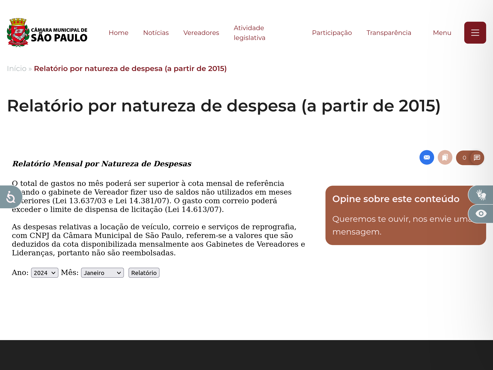
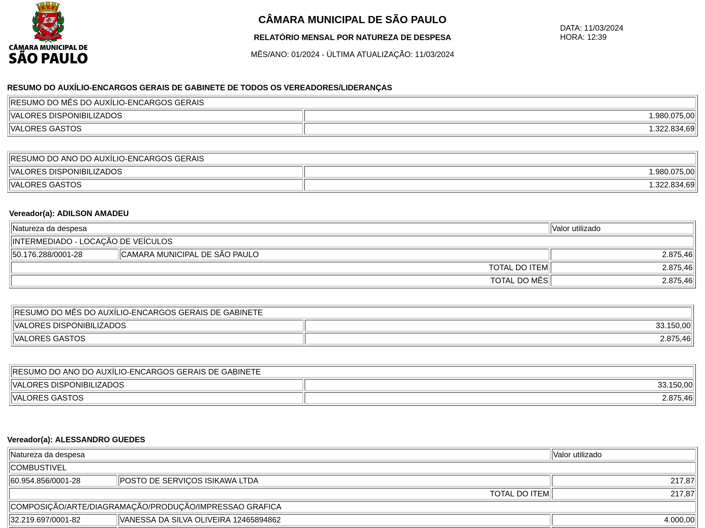
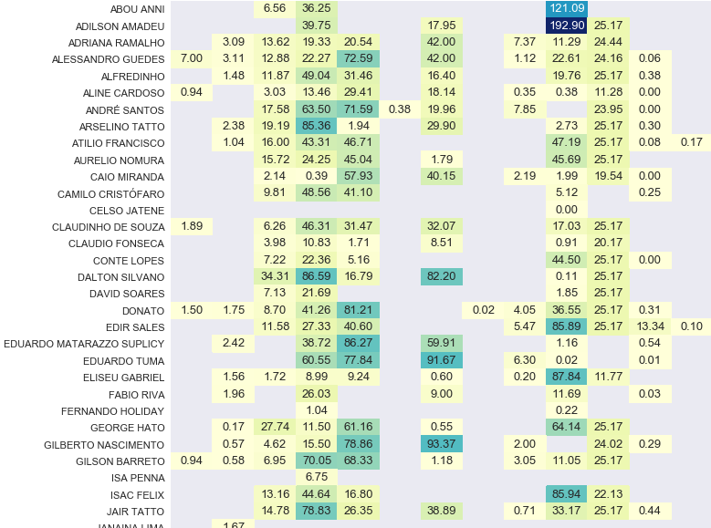
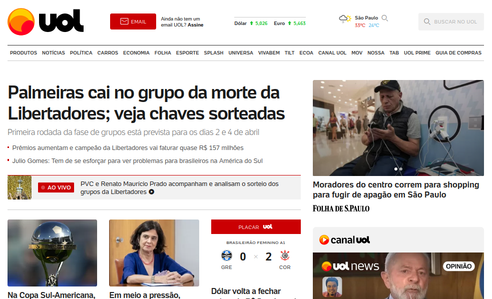


As aulas aqui apresentadas intregam o módulo "Web scraping com Python" do MBA em Jornalismo de Dados, do IDP. Mais informações [aqui](https://www.idp.edu.br/techschool/mba-jornalismo-de-dados/).


<!-- ++ -->

Começamos aqui o módulo de _web scraping_ (ou, em português, raspagem de dados). Trata-se de uma técnica de extração de informações dispostas em websites ou aplicações. Isso pode ser feito manualmente, por meio de sistemas específicos (como webscraper.io), ou a partir da criação de um script (em Python, R, Java ou outras linguagens) para esta finalidade.

No jornalismo, _web scraping_ tem sido fundamental para a elaboração de reportagens baseadas em dados que estão disponíveis na internet. Como a notícia sobre uso de verba de gabinete da Câmara de São Paulo para envio de cartões de aniversário ([link](https://g1.globo.com/sp/sao-paulo/noticia/tres-vereadores-usam-um-terco-de-toda-a-verba-de-correio-da-camara-de-sp.ghtml)).


A reportagem começou com a raspagem de dados de relatórios disponibilizados pela Câmara em https://www.saopaulo.sp.leg.br/relatorio-por-natureza-de-despesa-partir-de-2015/.





O script para raspar os dados é [este aqui](https://github.com/rodolfo-viana/ddj_stuff/blob/main/py/vereadores_sp_gastos_nfs.py). Com os dados baixados, foi feita uma análise com Pandas que constatou os gastos exorbitantes.



A análise na íntegra está [aqui](https://github.com/rodolfo-viana/ddj_stuff/blob/main/ipynb/2018-02-24-vereadores_correios.ipynb).




A primeira coisa que precisamos compreender é como funciona a internet:


De forma simples:

1. o usuário, via browser, faz uma solicitação ao servidor do site (request);
2. o servidor responde à solicitação (response) entregando ao browser arquivos `.html`, `.css`, `.js` etc.;
3. o browser renderiza esses arquivos e transforma no que conhecemos como website.

Este ponto inicial é importante porque, quando falamos em raspagem de dados, estamos falando de __capturar informações que estão dentro de tags de HTML, atributos de CSS__ etc.

Quando abrimos um site qualquer temos na tela diversos elementos: textos de diversos tamanhos, estilos e cores; imagens que podem ser fotos ou ilustrações; gráficos de toda sorte; ícones de redes sociais. 



Os elementos gráficos que vemos são códigos renderizados. São linhas de código (HTML, CSS, JavaScript etc.) que o navegador (Google Chrome, Firefox, Safari etc.) interpreta para apresentar ao usuário.

Por exemplo, o site do UOL é, na verdade, assim:

```html
[...]
<article aria-labelledby="ltxnjpes" class="headlineMain
section__grid__main__highlight__item">
  <a href="https://www.uol.com.br/esporte/futebol/ultimas-noticias/2024/03/18/
  libertadores-veja-como-ficaram-os-grupos-e-como-foi-o-sorteio.htm" 
  class="hyperlink headlineMain__link">
    <div>
      <h3 id="ltxnjpes" class="title__element headlineMain__title">Palmeiras 
        cai no grupo da morte da Libertadores; veja chaves sorteadas</h3>
    </div>
    <p class="standfirst headlineMain__standfirst">Primeira rodada da fase de 
        grupos está prevista para os dias 2 e 4 de abril</p>
  </a>
  <aside class="relatedList headlineMain__related-list">
    <ul class="relatedList__container relatedList__container--vertical">
      <li class="relatedList__container__item">
        <a href="https://www.uol.com.br/esporte/futebol/ultimas-noticias/2024/
        03/18/premios-aumentam-e-campeao-da-libertadores-vai-faturar-quase-r-
        150-mihoes.htm" title="Prêmios aumentam, e campeão da Libertadores vai 
        faturar quase R$ 157 milhões" class="hyperlink relatedList__related">
          <p class="title__element">Prêmios aumentam, e campeão da Libertadores 
            vai faturar quase R$ 157 milhões</p>
        </a>
      </li>
      <li class="relatedList__container__item">
        <a href="https://www.uol.com.br/esporte/colunas/julio-gomes/2024/03/18/tem-que-se-esrorcar-para-ver-problemas-para-brasileiros-na-america-do-
        sul.htm" title="Julio Gomes: Tem de se esforçar para ver problemas para 
        brasileiros na América do Sul" class="hyperlink relatedList__related">
          <p class="title__element">Julio Gomes: Tem de se esforçar para ver 
            problemas para brasileiros na América do Sul</p>
        </a>
      </li>
    </ul>
  </aside>
</article>
[...]
```

Este é só um trecho do código HTML do site, que o browser traduz em elementos gráficos.

Repare que a chamada "Palmeiras cai no grupo da morte da Libertadores; veja chaves sorteadas" está dentro de uma tag (`<h3>`) e duas classes (`class="title__element headlineMain__title"`). Essa tag e essas classes dizem para o navegador como o texto em questão deve ser interpretado.

Ou seja, se criarmos um script em Python para capturar a informação contida em `<h3 class="title__element headlineMain__title">`, teremos como resposta "Palmeiras cai no grupo da morte da Libertadores; veja chaves sorteadas".

Note também que as duas chamadas seguintes ("Prêmios aumentam, e campeão da Libertadores vai faturar quase R$ 157 milhões" e "Julio Gomes: Tem de se esforçar para ver problemas para brasileiros na América do Sul") estão, ambas, dentro de `<p class="title__element">` &mdash;que, por sua vez, estão dentro de `<li class="relatedList__container__item">`. Significa que, se numa raspagem, eu pedir ao meu código para capturar as informações dentro de todas as ocorrências de `<p class="title__element">`, terei essas duas chamadas como resultado.

Isso é raspagem de dados: __dizer ao script para visitar determinado site e trazer todos os dados "envelopados" por tags e atributos específicos__.



Se as informações que estamos buscando estão em tags de HTML e classes de CSS, precisamos compreender &mdash;ainda que superficialmente&mdash; como essas tags funcionam. __Não é necessário decorar HTML ou CSS, mas entender sua lógica.__

Uma tag de HTML vem dentro de `<` e `>`, e indica o que é o elemento: título, parágrafo, imagem, lista etc. Muitas requerem indicação de fim da tag, com uso de `/`. Por exemplo:

```html
<div>
    <h1>Lista de compras</h1>
    <p>Aqui estão os itens a serem comprados nesta semana:</p>
    <ul>
        <li>Arroz</li>
        <li>Feijão</li>
        <li>Óleo</li>
    </ul>
    <p>Em caso de dúvidas, acesse <a href="linkparaosite">este formulário</a></p>
</div>
```

No exemplo acima:

- `div` representa container para o conteúdo que segue
- `h1` significa heading 1, ou seja, cabeçalho, título. Traz o texto em letras grandes. Conforme o número aumenta (`h2`, `h3`, até `h6`), o tamanho da letra vai diminuindo
- `p` indica parágrafo
- `ul` representa que os elementos a seguir estão numa lista não ordenada ("ul" vem de _unordered list_)
- `li` indica item da lista
- `a` indica link

Então o exemplo acima é renderizado pelo browser assim:

<div style="border: 1px solid black; padding:10px;">
<div>
    <h1>Lista de compras</h1>
    <p>Aqui estão os itens a serem comprados nesta semana:</p>
    <ul>
        <li>Arroz</li>
        <li>Feijão</li>
        <li>Óleo</li>
    </ul>
    <p>Em caso de dúvidas, acesse <a href="linkparaosite">este formulário</a></p>
</div>
</div>

Portanto, tags de HTML indicam o que é o elemento: parágrafo, título, lista etc. Mas ele não é o único componente. Há ainda atributos de CSS.

CSS significa _cascading style sheet_, ou folha de estilo em cascata. Seus atributos, portanto, indicam o estilo de um elemento. Em suma: __tag de HTML mostra o que é o elemento, e atributo de CSS mostra como é o elemento__.

Um exemplo:

```html
<style>
    .verm{color:red;}
    .az{color:blue;}
</style>

<h1 class="verm">Título 1</h1>
<h1 class="az">Título 2</h1>
```

Repare que "Título 1" e "Título 2" são ambos `h1` &mdash;ou seja, são headings, títulos. Mas eles não são iguais: "Título 1" tem a classe `verm`, enquanto "Título 2" tem a classe `az`. Essas classes estão definidas na tag `style`: `verm` deixa o elemento vermelho; `az`, azul.

Com isso, apesar de ambos serem `h1`, são interpretados pelo browser assim:

<div style="border: 1px solid black; padding:10px;">
<style>
    .verm{color:red;}
    .az{color:blue;}
</style>

<h1 class="verm">Título 1</h1>
<h1 class="az">Título 2</h1>
</div>

É possível ainda usar mais de um atributo para o mesmo elemento. Vejamos outro exemplo a partir do mesmo código:

```html
<style>
    .verm{color:red;}
    .az{color:blue;}
    .mono{font-family:monospace;}
    .serif{font-family:serif;}
</style>

<h1 class="verm mono">Título 1</h1>
<h1 class="az serif">Título 2</h1>
```

Aqui, não apenas mudamos as cores de cada `h1`, como a família da fonte. Agora os elementos são interpretados assim:

<div style="border: 1px solid black; padding:10px;">
<style>
    .verm{color:red;}
    .az{color:blue;}
    .mono{font-family:monospace;}
    .serif{font-family:serif;}
</style>

<h1 class="verm mono">Título 1</h1>
<h1 class="az serif">Título 2</h1>
</div>


<!-- +++ -->

Conforme dito anteriormente, há diversas formas de se fazer web scraping, tanto com uso de linguagens como Python, R e JavaScript, como sem qualquer tipo de programação, com aplicações como webscraper.io. Neste curso, usaremos Python e algumas bibliotecas externas:

- [Requests](https://requests.readthedocs.io/en/latest/), para capturar o conteúdo de sites
- [BeautifulSoup](https://www.crummy.com/software/BeautifulSoup/bs4/doc/), para interpretar o conteúdo capturado por Requests

Vamos discorrer sobre essas bibliotecas nas próximas aulas. Por ora, é necessário instalá-las, apenas. No Prompt de Comando (Windows) ou Terminal (MacOS/Linux), digite:

```
python -m pip install requests beautifulsoup4
```

ou:

```
python3 -m pip install requests beautifulsoup4
```

As bibliotecas serão instaladas e poderão ser usadas nos scripts de web scraping.



Agora que vimos o que web scraping no contexto do jornalismo e entendemos a estrutura de um site como uma coleção de tags de HTML e atributos de CSS, podemos partir para a prática.

E a prática começa com __Requests__, uma biblioteca externa bastante popular para lidar com o trânsito de _request_ e _response_.


É Requests que vai até o servidor onde o site está hospedado, pega o conteúdo e traz para o Python. E ele faz isso de maneira bastante intuitiva. A primeira coisa que precisamos é importar a biblioteca.

```python
import requests
```

### Funções comuns

Com a biblioteca importada no script, podemos começar o trânsito de dados. Por exemplo, vamos supor que queremos importar o conteúdo do site do fictício Ministério dos Riachos Brasileiros, e cujo link é https://rodolfoviana.com.br/aulas/scraping-py/site_exemplo/.

```python
# Vamos salvar a url na variável `site`
site = 'https://rodolfoviana.com.br/aulas/scraping-py/site_exemplo/'

# A função `requests.get(url)` traz os dados para nosso script,
# mais especificamente para a variável `dados`
dados = requests.get(site)
```

As poucas linhas de código acima bastam para meu script ir até o site e baixar todo o conteúdo. Agora eu tenho o site todo salvo em `dados`. Com outras funções de Requests podemos ver o que temos na variável.

```python
# `status_code` mostra o status HTTP.
# 200 significa que a página existe e a conexão foi bem-sucedida.
# 401, que você não é autorizado a acessá-lo.
# 404, que não existe.
# Veja todos os códigos em https://developer.mozilla.org/pt-BR/docs/Web/HTTP/Status
print(dados.status_code)
```
```textfile
200
```

```python
# `headers` mostra os metadados que integram o 
# cabeçalho do site, como a última vez que o site 
# foi modificado, o nome do servidor etc.
print(dados.headers)
```
```textfile
{'Connection': 'keep-alive', 'Content-Length': '2051', 'Server': 'GitHub.com', 'Content-Type': 'text/html; charset=utf-8', 'Last-Modified': 'Tue, 19 Mar 2024 01:41:35 GMT', 'Access-Control-Allow-Origin': '*', 'Strict-Transport-Security': 'max-age=31556952', 'ETag': 'W/"65f8ed4f-223e"', 'expires': 'Fri, 22 Mar 2024 12:16:21 GMT', 'Cache-Control': 'max-age=600', 'Content-Encoding': 'gzip', 'x-proxy-cache': 'MISS', 'X-GitHub-Request-Id': '5C20:11DBDD:69BD4:79635:65FD743D', 'Accept-Ranges': 'bytes', 'Date': 'Fri, 22 Mar 2024 12:10:39 GMT', 'Via': '1.1 varnish', 'Age': '126', 'X-Served-By': 'cache-gru-sbgr1930050-GRU', 'X-Cache': 'HIT', 'X-Cache-Hits': '1', 'X-Timer': 'S1711109439.344515,VS0,VE1', 'Vary': 'Accept-Encoding', 'X-Fastly-Request-ID': 'e8dc5db9be4003348926e6fa23afba8b384efaae'}
```

```python
# `content` e `text` trazem o conteúdo do site,
# sendo `content` para ver o conteúdo em bytes
# e `text` para ver o conteúdo em unicode 
# (como normalmente lemos)
print(dados.content)
```
```textfile
b'<!DOCTYPE html>\n<html lang="en">\n\n<head>\n    <meta charset="UTF-8">\n    <meta name="viewport" content="width=device-width, initial-scale=1.0">\n    <title>Minist\xc3\xa9rio dos Riachos Brasileiros</title>\n    <link href="https://cdn.jsdelivr.net/npm/bootstrap@5.3.3/dist/css/bootstrap.min.css" rel="stylesheet"\n        integrity="sha384-QWTKZyjpPEjISv5WaRU9OFeRpok6YctnYmDr5pNlyT2bRjXh0JMhjY6hW+ALEwIH" crossorigin="anonymous">\n\n</head>\n\n<body>\n    <style>\n        #carouselExampleCaptions .carousel-item img {  \n          object-fit: cover;\n          object-position: center;\n          overflow: hidden;\n          height:50vh;\n          filter: brightness(40%)\n        }\n        </style>\n    <nav class="navbar bg-body-tertiary" data-bs-theme="dark">\n        <div class="container">\n        <div class="container-fluid">\n            <a class="navbar-brand" href="#">\n                \n                Minist\xc3\xa9rio dos Riachos Brasileiros\n            </a>\n        </div>\n    </div>\n    </nav>\n    <div id="carouselExampleCaptions" class="carousel slide">\n        <div class="carousel-indicators">\n          <button type="button" data-bs-target="#carouselExampleCaptions" data-bs-slide-to="0" class="active" aria-current="true" aria-label="Slide 1"></button>\n          <button type="button" data-bs-target="#carouselExampleCaptions" data-bs-slide-to="1" aria-label="Slide 2"></button>\n          <button type="button" data-bs-target="#carouselExampleCaptions" data-bs-slide-to="2" aria-label="Slide 3"></button>\n        </div>\n        <div class="carousel-inner">\n          <div class="carousel-item active">\n            \n            <div class="carousel-caption d-none d-md-block">\n              <h5>Comit\xc3\xaa participa de audi\xc3\xaancia na C\xc3\xa2mara</h5>\n            </div>\n          </div>\n          <div class="carousel-item">\n            \n            <div class="carousel-caption d-none d-md-block">\n              <h5>Ministra se re\xc3\xbane com representantes da sociedade civil</h5>\n            </div>\n          </div>\n          <div class="carousel-item">\n            \n            <div class="carousel-caption d-none d-md-block">\n              <h5>Projeto estipula multa e guilhotina para quem polui riachos</h5>\n            </div>\n          </div>\n        </div>\n        <button class="carousel-control-prev" type="button" data-bs-target="#carouselExampleCaptions" data-bs-slide="prev">\n          <span class="carousel-control-prev-icon" aria-hidden="true"></span>\n          <span class="visually-hidden">Previous</span>\n        </button>\n        <button class="carousel-control-next" type="button" data-bs-target="#carouselExampleCaptions" data-bs-slide="next">\n          <span class="carousel-control-next-icon" aria-hidden="true"></span>\n          <span class="visually-hidden">Next</span>\n        </button>\n      </div>\n      <h2 class="my-5 text-center">Agenda da Ministra</h2>\n\n    <div class="container">\n        <div class="card mb-3 text-bg-secondary">\n            <div class="card-body">\n                <h5 class="card-title">Entrevista para a CBN</h5>\n                <p class="card-text">Imprensa</p>\n            </div>\n            <ul class="list-group list-group-flush">\n                <li class="list-group-item">Gabinete da ministra</li>\n                <li class="list-group-item">12 de maio de 2024</li>\n                <li class="list-group-item">08:30</li>\n            </ul>\n        </div>\n        <div class="card mb-3 text-bg-secondary">\n            <div class="card-body">\n                <h5 class="card-title">Reuni\xc3\xa3o com secret\xc3\xa1rios</h5>\n                <p class="card-text">Expediente</p>\n            </div>\n            <ul class="list-group list-group-flush">\n                <li class="list-group-item">Gabinete da ministra</li>\n                <li class="list-group-item">12 de maio de 2024</li>\n                <li class="list-group-item">09:30</li>\n            </ul>\n        </div>\n        <div class="card mb-3 text-bg-secondary">\n            <div class="card-body">\n                <h5 class="card-title">Visita \xc3\xa0 comunidade do Riacho Branco</h5>\n               <p class="card-text">Evento p\xc3\xbablico</p>\n            </div>\n            <ul class="list-group list-group-flush">\n                <li class="list-group-item">Sede da ATRB</li>\n                <li class="list-group-item">12 de maio de 2024</li>\n                <li class="list-group-item">11:00</li>\n            </ul>\n        </div>\n        <div class="card mb-3 text-bg-secondary">\n            <div class="card-body">\n          <h5 class="card-title">Viagem a Bel\xc3\xa9m - PA</h5>\n                <p class="card-text">Expediente</p>\n            </div>\n            <ul class="list-group list-group-flush">\n                <li class="list-group-item">&nbsp;</li>\n                <li class="list-group-item">12 de maio de 2024</li>\n                <li class="list-group-item">13:00</li>\n            </ul>\n        </div>\n        <div class="card mb-3 text-bg-secondary">\n            <div class="card-body">\n                <h5 class="card-title">Reuni\xc3\xa3o com pescadores</h5>\n                <p class="card-text">Expediente</p>\n            </div>\n            <ul class="list-group list-group-flush">\n                <li class="list-group-item">Cooperativa de Pesca do Bel\xc3\xa9m do Par\xc3\xa1</li>\n                <li class="list-group-item">12 de maio de 2024</li>\n                <li class="list-group-item">15:00</li>\n            </ul>\n        </div>\n        <div class="card mb-3 text-bg-secondary">\n            <div class="card-body">\n                <h5 class="card-title">Retorno a Bras\xc3\xadlia</h5>\n                <p class="card-text">Expediente</p>\n            </div>\n            <ul class="list-group list-group-flush">\n                <li class="list-group-item">&nbsp;</li>\n                <li class="list-group-item">12 de maio de 2024</li>\n                <li class="list-group-item">17:00</li>\n            </ul>\n        </div>\n        <div class="card mb-3 text-bg-secondary">\n            <div class="card-body">\n                <h5 class="card-title">Entrevista \xc3\xa0 TV Senado</h5>\n                <p class="card-text">Imprensa</p>\n            </div>\n            <ul class="list-group list-group-flush">\n                <li class="list-group-item">Sede da TV Senado</li>\n                <li class="list-group-item">12 de maio de 2024</li>\n                <li class="list-group-item">18:30</li>\n            </ul>\n        </div>\n    </div>\n    <footer class="bd-footer py-2 py-md-2 mt-5 bg-body-tertiary" data-bs-theme="dark" style="color: white;">\n        <div class="container py-2 py-md-2 px-4 px-md-3">\n            <div class="row">\n                <div class="col-lg-6 mb-6">\n                    <a class="d-inline-flex align-items-center mb-2 link-dark text-decoration-none" href="/"\n                        aria-label="Bootstrap">\n                        \n                        <span class="mx-2 small" style="color: white;">Minist\xc3\xa9rio dos Riachos Brasileiros</span>\n                    </a>\n              </div>\n                <div class="col-lg-6 mb-6">\n                    <span class="small" style="color: white;">Mapa do site</span>\n                    <ul class="list-unstyled" >\n                        <li class="mb-2"><span class="small"><a href="#">In\xc3\xadcio</a></span></li>\n                        <li class="mb-2"><span class="small"><a href="#">Contato</a></span></li>\n                        <li class="mb-2"><span class="small"><a href="#">Dados abertos</a></span></li>\n                        <li class="mb-2"><span class="small"><a href="#">Resolu\xc3\xa7\xc3\xb5es</a></span></li>\n                    </ul>\n                </div>\n            </div>\n        </div>\n    </footer>\n\n\n    <script src="https://cdn.jsdelivr.net/npm/bootstrap@5.3.3/dist/js/bootstrap.bundle.min.js"\n        integrity="sha384-YvpcrYf0tY3lHB60NNkmXc5s9fDVZLESaAA55NDzOxhy9GkcIdslK1eN7N6jIeHz"\n        crossorigin="anonymous"></script>\n</body>\n\n</html>'
```

```python
print(dados.text)
```
```textfile
<!DOCTYPE html>
<html lang="en">

<head>
    <meta charset="UTF-8">
    <meta name="viewport" content="width=device-width, initial-scale=1.0">
    <title>Ministério dos Riachos Brasileiros</title>
    <link href="https://cdn.jsdelivr.net/npm/bootstrap@5.3.3/dist/css/bootstrap.min.css" rel="stylesheet"      
        integrity="sha384-QWTKZyjpPEjISv5WaRU9OFeRpok6YctnYmDr5pNlyT2bRjXh0JMhjY6hW+ALEwIH" crossorigin="anonymous">

</head>

<body>
    <style>
        #carouselExampleCaptions .carousel-item img {
          object-fit: cover;
          object-position: center;
          overflow: hidden;
          height:50vh;
          filter: brightness(40%)
        }
        </style>
    <nav class="navbar bg-body-tertiary" data-bs-theme="dark">
        <div class="container">
        <div class="container-fluid">
            <a class="navbar-brand" href="#">
                
                Ministério dos Riachos Brasileiros
            </a>
        </div>
    </div>
    </nav>
    <div id="carouselExampleCaptions" class="carousel slide">
        <div class="carousel-indicators">
          <button type="button" data-bs-target="#carouselExampleCaptions" data-bs-slide-to="0" class="active" aria-current="true" aria-label="Slide 1"></button>
          <button type="button" data-bs-target="#carouselExampleCaptions" data-bs-slide-to="1" aria-label="Slide 2"></button>
          <button type="button" data-bs-target="#carouselExampleCaptions" data-bs-slide-to="2" aria-label="Slide 3"></button>
        </div>
        <div class="carousel-inner">
          <div class="carousel-item active">
            
            <div class="carousel-caption d-none d-md-block">
              <h5>Comitê participa de audiência na Câmara</h5>
            </div>
          </div>
          <div class="carousel-item">
            
            <div class="carousel-caption d-none d-md-block">
              <h5>Ministra se reúne com representantes da sociedade civil</h5>
            </div>
          </div>
          <div class="carousel-item">
            
            <div class="carousel-caption d-none d-md-block">
              <h5>Projeto estipula multa e guilhotina para quem polui riachos</h5>
            </div>
          </div>
        </div>
        <button class="carousel-control-prev" type="button" data-bs-target="#carouselExampleCaptions" data-bs-slide="prev">
          <span class="carousel-control-prev-icon" aria-hidden="true"></span>
          <span class="visually-hidden">Previous</span>
        </button>
        <button class="carousel-control-next" type="button" data-bs-target="#carouselExampleCaptions" data-bs-slide="next">
          <span class="carousel-control-next-icon" aria-hidden="true"></span>
          <span class="visually-hidden">Next</span>
        </button>
      </div>
      <h2 class="my-5 text-center">Agenda da Ministra</h2>

    <div class="container">
        <div class="card mb-3 text-bg-secondary">
            <div class="card-body">
                <h5 class="card-title">Entrevista para a CBN</h5>
                <p class="card-text">Imprensa</p>
            </div>
            <ul class="list-group list-group-flush">
                <li class="list-group-item">Gabinete da ministra</li>
                <li class="list-group-item">12 de maio de 2024</li>
                <li class="list-group-item">08:30</li>
            </ul>
        </div>
        <div class="card mb-3 text-bg-secondary">
            <div class="card-body">
                <h5 class="card-title">Reunião com secretários</h5>
                <p class="card-text">Expediente</p>
            </div>
            <ul class="list-group list-group-flush">
                <li class="list-group-item">Gabinete da ministra</li>
                <li class="list-group-item">12 de maio de 2024</li>
                <li class="list-group-item">09:30</li>
            </ul>
        </div>
        <div class="card mb-3 text-bg-secondary">
            <div class="card-body">
                <h5 class="card-title">Visita à comunidade do Riacho Branco</h5>
                <p class="card-text">Evento público</p>
            </div>
            <ul class="list-group list-group-flush">
                <li class="list-group-item">Sede da ATRB</li>
                <li class="list-group-item">12 de maio de 2024</li>
                <li class="list-group-item">11:00</li>
            </ul>
        </div>
        <div class="card mb-3 text-bg-secondary">
            <div class="card-body">
                <h5 class="card-title">Viagem a Belém - PA</h5>
                <p class="card-text">Expediente</p>
            </div>
            <ul class="list-group list-group-flush">
                <li class="list-group-item">&nbsp;</li>
                <li class="list-group-item">12 de maio de 2024</li>
                <li class="list-group-item">13:00</li>
            </ul>
        </div>
        <div class="card mb-3 text-bg-secondary">
            <div class="card-body">
                <h5 class="card-title">Reunião com pescadores</h5>
                <p class="card-text">Expediente</p>
            </div>
            <ul class="list-group list-group-flush">
                <li class="list-group-item">Cooperativa de Pesca do Belém do Pará</li>
                <li class="list-group-item">12 de maio de 2024</li>
                <li class="list-group-item">15:00</li>
            </ul>
        </div>
        <div class="card mb-3 text-bg-secondary">
            <div class="card-body">
                <h5 class="card-title">Retorno a Brasília</h5>
                <p class="card-text">Expediente</p>
            </div>
            <ul class="list-group list-group-flush">
                <li class="list-group-item">&nbsp;</li>
                <li class="list-group-item">12 de maio de 2024</li>
                <li class="list-group-item">17:00</li>
            </ul>
        </div>
        <div class="card mb-3 text-bg-secondary">
            <div class="card-body">
                <h5 class="card-title">Entrevista à TV Senado</h5>
                <p class="card-text">Imprensa</p>
            </div>
            <ul class="list-group list-group-flush">
                <li class="list-group-item">Sede da TV Senado</li>
                <li class="list-group-item">12 de maio de 2024</li>
                <li class="list-group-item">18:30</li>
            </ul>
        </div>
    </div>
    <footer class="bd-footer py-2 py-md-2 mt-5 bg-body-tertiary" data-bs-theme="dark" style="color: white;">   
        <div class="container py-2 py-md-2 px-4 px-md-3">
            <div class="row">
                <div class="col-lg-6 mb-6">
                    <a class="d-inline-flex align-items-center mb-2 link-dark text-decoration-none" href="/"   
                        aria-label="Bootstrap">
                        
                        <span class="mx-2 small" style="color: white;">Ministério dos Riachos Brasileiros</span>
                    </a>
                </div>
                <div class="col-lg-6 mb-6">
                    <span class="small" style="color: white;">Mapa do site</span>
                    <ul class="list-unstyled" >
                        <li class="mb-2"><span class="small"><a href="#">Início</a></span></li>
                        <li class="mb-2"><span class="small"><a href="#">Contato</a></span></li>
                        <li class="mb-2"><span class="small"><a href="#">Dados abertos</a></span></li>
                        <li class="mb-2"><span class="small"><a href="#">Resoluções</a></span></li>
                    </ul>
                </div>
            </div>
        </div>
    </footer>


    <script src="https://cdn.jsdelivr.net/npm/bootstrap@5.3.3/dist/js/bootstrap.bundle.min.js"
        integrity="sha384-YvpcrYf0tY3lHB60NNkmXc5s9fDVZLESaAA55NDzOxhy9GkcIdslK1eN7N6jIeHz"
        crossorigin="anonymous"></script>
</body>

</html>
```

Observe que `text` traz o código-fonte inteiro do site! É essa nossa matéria-prima numa raspagem de dados; portanto, vamos salvar numa variável para uso posterior.

```python
codigo = dados.text
```



Agora que temos o código-fonte salvo na variável `codigo`, o passo seguinte é interpretar esse código, é "quebrar" cada tag de HTML e atributo de CSS para, enfim, encontrar os dados que desejamos. É aí que entra __Beautiful Soup__. Seu papel é reconhecer os elementos do código.

Vamos importar essa biblioteca.

```python
from bs4 import BeautifulSoup as bs
# Repare no trecho `as bs`. Significa que dei 
# à biblioteca o apelido de `bs` para não ter 
# de ficar digitando `BeautifulSoup` sempre
# que eu precisar usá-la
```

### Funções comuns

Com Beautiful Soup importado, preciso antes de tudo passar o conteúdo de `codigo` para que a biblioteca interprete.

```python
# Ao chamar `BeautifulSoup()`, tenho dois argumentos:
# 1. o primeiro é o que eu quero interpretar (no caso,
# o que está contido na variável `codigo`)
# 2. o segundo é o método para fazer a interpretação
# (no caso, `html.parser`, o interpretador mais
# básico de Beautiful Soup. Há outros, mas por ora
# vamos nos manter com este.)
cod_parseado = bs(codigo, 'html.parser')
```

Agora que codigo está interpretado e salvo na variável `cod_parseado`, temos todas as tags de HTML e atributos de CSS reconhecidos. Veja alguns exemplos:

```python
# `title` traz o título da página
print(cod_parseado.title)
```
```textfile
<title>Ministério dos Riachos Brasileiros</title>
```

```python
# `nav` traz tudo o que estiver contido na tag `nav`
print(cod_parseado.nav)
```
```textfile
<nav class="navbar bg-body-tertiary" data-bs-theme="dark">
<div class="container">
<div class="container-fluid">
<a class="navbar-brand" href="#">

                Ministério dos Riachos Brasileiros
            </a>
</div>
</div>
</nav>
```

```python
# `h2` traz a tag `h2`
print(cod_parseado.h2)
```
```textfile
<h2 class="my-5 text-center">Agenda da Ministra</h2>
```

Olhando o código-fonte, porém, notamos que as informações que buscamos estão dentro de `div.card` (ou seja, tag `div` com a classe `card`). E que há diversos `div.card`.

Há funções de Beautiful Soup que capturam as diversas menções a elementos.

```python
# Aqui, `find_all()` tem dois argumentos:
# 1. a tag de HTML,
# 2. a classe de CSS referente à tag de HTML
# que queremos.
# Com isso, não pegamos todos os `div`, mas
# somente aqueles com `card` como classe.
divs = cod_parseado.find_all('div', class_='card')

# O resultado de `find_all()` é uma lista
# com os elementos --neste caso, sete
# elementos; sete `div` com a classe `card`
print(len(divs))
print(divs)
```
```textfile
7
[<div class="card mb-3 text-bg-secondary">
<div class="card-body">
<h5 class="card-title">Entrevista para a CBN</h5>
<p class="card-text">Imprensa</p>
</div>
<ul class="list-group list-group-flush">
<li class="list-group-item">Gabinete da ministra</li>
<li class="list-group-item">12 de maio de 2024</li>
<li class="list-group-item">08:30</li>
</ul>
</div>, <div class="card mb-3 text-bg-secondary">
<div class="card-body">
<h5 class="card-title">Reunião com secretários</h5>
<p class="card-text">Expediente</p>
</div>
<ul class="list-group list-group-flush">
<li class="list-group-item">Gabinete da ministra</li>
<li class="list-group-item">12 de maio de 2024</li>
<li class="list-group-item">09:30</li>
</ul>
</div>, <div class="card mb-3 text-bg-secondary">
<div class="card-body">
<h5 class="card-title">Visita à comunidade do Riacho Branco</h5>
<p class="card-text">Evento público</p>
</div>
<ul class="list-group list-group-flush">
<li class="list-group-item">Sede da ATRB</li>
<li class="list-group-item">12 de maio de 2024</li>
<li class="list-group-item">11:00</li>
</ul>
</div>, <div class="card mb-3 text-bg-secondary">
<div class="card-body">
<h5 class="card-title">Viagem a Belém - PA</h5>
<p class="card-text">Expediente</p>
</div>
<ul class="list-group list-group-flush">
<li class="list-group-item"> </li>
<li class="list-group-item">12 de maio de 2024</li>
<li class="list-group-item">13:00</li>
</ul>
</div>, <div class="card mb-3 text-bg-secondary">
<div class="card-body">
<h5 class="card-title">Reunião com pescadores</h5>
<p class="card-text">Expediente</p>
</div>
<ul class="list-group list-group-flush">
<li class="list-group-item">Cooperativa de Pesca do Belém do Pará</li>
<li class="list-group-item">12 de maio de 2024</li>
<li class="list-group-item">15:00</li>
</ul>
</div>, <div class="card mb-3 text-bg-secondary">
<div class="card-body">
<h5 class="card-title">Retorno a Brasília</h5>
<p class="card-text">Expediente</p>
</div>
<ul class="list-group list-group-flush">
<li class="list-group-item"> </li>
<li class="list-group-item">12 de maio de 2024</li>
<li class="list-group-item">17:00</li>
</ul>
</div>, <div class="card mb-3 text-bg-secondary">
<div class="card-body">
<h5 class="card-title">Entrevista à TV Senado</h5>
<p class="card-text">Imprensa</p>
</div>
<ul class="list-group list-group-flush">
<li class="list-group-item">Sede da TV Senado</li>
<li class="list-group-item">12 de maio de 2024</li>
<li class="list-group-item">18:30</li>
</ul>
</div>]
```

Agora que temos os elementos que queremos separados numa lista, podemos selecionar o que queremos exatamente com laço `for`.

```python
for i in divs:
    # `text` pega somente o texto contido na tag, e não toda a tag
    evento = i.h5.text
    local = i.find_all('li')[0].text
    data = i.find_all('li')[1].text
    horario = i.find_all('li')[2].text
    
    print(f"Evento: {evento}")
    print(f"Local: {local}")
    print(f"Data: {data}")
    print(f"Horário: {horario}\n") # \n dá quebra de linha a mais
```
```textfile
Evento: Entrevista para a CBN
Local: Gabinete da ministra
Data: 12 de maio de 2024
Horário: 08:30

Evento: Reunião com secretários
Local: Gabinete da ministra
Data: 12 de maio de 2024
Horário: 09:30

Evento: Visita à comunidade do Riacho Branco
Local: Sede da ATRB
Data: 12 de maio de 2024
Horário: 11:00

Evento: Viagem a Belém - PA
Local:  
Data: 12 de maio de 2024
Horário: 13:00

Evento: Reunião com pescadores
Local: Cooperativa de Pesca do Belém do Pará
Data: 12 de maio de 2024
Horário: 15:00

Evento: Retorno a Brasília
Local:  
Data: 12 de maio de 2024
Horário: 17:00

Evento: Entrevista à TV Senado
Local: Sede da TV Senado
Data: 12 de maio de 2024
Horário: 18:30
```

Para nós, porém, não é interessante imprimir na tela com `print()`, mas sim salvar numa lista de dicionários para, porteriormente, trabalhar com Pandas.

```python
lista_eventos = list()
for i in divs:
    compromisso = {
        'evento': i.h5.text,
        'local': i.find_all('li')[0].text,
        'data': i.find_all('li')[1].text,
        'horario': i.find_all('li')[2].text
    }
    lista_eventos.append(compromisso)

print(lista_eventos)
```
```textfile
[{'evento': 'Entrevista para a CBN', 'local': 'Gabinete da ministra', 'data': '12 de maio de 2024', 'horario': '08:30'}, {'evento': 'Reunião com secretários', 'local': 'Gabinete da ministra', 'data': '12 de maio de 2024', 'horario': '09:30'}, {'evento': 'Visita à comunidade do Riacho Branco', 'local': 'Sede da ATRB', 'data': '12 de maio de 2024', 'horario': '11:00'}, {'evento': 'Viagem a Belém - PA', 'local': '\xa0', 'data': '12 de maio de 2024', 'horario': '13:00'}, {'evento': 'Reunião com pescadores', 'local': 'Cooperativa de Pesca do Belém do Pará', 'data': '12 de maio de 2024', 'horario': '15:00'}, {'evento': 'Retorno a Brasília', 'local': '\xa0', 'data': '12 de maio de 2024', 'horario': '17:00'}, {'evento': 'Entrevista à TV Senado', 'local': 'Sede da TV Senado', 'data': '12 de maio de 2024', 'horario': '18:30'}]
```

Agora, sim, podemos usar Pandas e começar nossas análises.

```python
import pandas as pd

df = pd.DataFrame(lista_eventos)
print(df)
```
```textfile
|   | evento                               | local                                 | data               | horario |
| - | ------------------------------------ | ------------------------------------- | ------------------ | ------- |
| 0 | Entrevista para a CBN                | Gabinete da ministra                  | 12 de maio de 2024 | 08:30   |
| 1 | Reunião com secretários              | Gabinete da ministra                  | 12 de maio de 2024 | 09:30   |
| 2 | Visita à comunidade do Riacho Branco | Sede da ATRB                          | 12 de maio de 2024 | 11:00   |
| 3 | Viagem a Belém - PA                  |                                       | 12 de maio de 2024 | 13:00   |
| 4 | Reunião com pescadores               | Cooperativa de Pesca do Belém do Pará | 12 de maio de 2024 | 15:00   |
| 5 | Retorno a Brasília                   |                                       | 12 de maio de 2024 | 17:00   |
| 6 | Entrevista à TV Senado               | Sede da TV Senado                     | 12 de maio de 2024 | 18:30   |
```




### Atividade 1

A URL http://cnes2.datasus.gov.br/Mod_Ind_Leitos_Listar.asp?VCod_Leito=03&VTipo_Leito=1&VListar=1&VEstado=00&VMun=&VComp= traz dados do Ministério da Saúde acerca de leitos cirúrgicos (cirurgia geral) existentes e dedicados ao SUS para todas as cidades de todos os estados do Brasil.

Raspe esta página e, num dataframe de Pandas, para cada hospital, retorne:

1. código CNES
2. nome do estabelecimento
3. total de leitos existentes
4. total de leitos para SUS
5. proporção de leitos para SUS &mdash;esta informação não está no site, mas pode ser calculada

### Atividade 2

O site do IMDb traz a lista dos melhores filmes brasileiros, segundo votação popular. A URL é esta: https://www.imdb.com/list/ls060310079/?sort=user_rating,desc&st_dt=&mode=detail&page=1.

Há diversas informações ali, como nome do filme, ano de lançamento, a nota, a sinopse etc. São mais de 90 filmes.

Crie um script para obter:

1. nome do filme
2. ano de lançamento
3. duração do filme
4. nota

Salve os dados num dataframe de Pandas.

