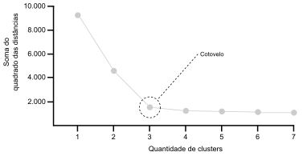


O texto apresentado é uma versão editada do meu trabalho de conclusão do MBA em Data Science e Analytics na USP-Esalq, sob orientação da Profª Drª Ana Julia Righetto.


## Introdução

Cada um dos 94 parlamentares da Assembleia Legislativa do Estado de São Paulo [Alesp] tem direito aos Auxílio-Encargos Gerais de Gabinete de Deputado e Auxílio-Hospedagem, referenciados conjuntamente como "verba de gabinete". Tal direito foi conferido pela resolução 783, artigo 11, de 1º de julho de 1997[^1], e se trata de um valor mensal devido pelo Estado aos deputados a fim de que eles possam cobrir despesas inerentes ao pleno exercício das atividades parlamentares. A resolução estipula o limite máximo da verba de gabinete em 1.250 unidades fiscais do Estado de São Paulo [Ufesp]. Em 2022, com o valor da Ufesp em R$ 31,97[^2], o limite mensal que poderia ser ressarcido por deputado foi de R$ 39.962,50.

Naquele ano, o valor total empenhado para custeio da verba de gabinete perfez R$ 26.652.243,51[^3]. O montante foi 24,43% maior que a soma em 2021, de R$ 21.419.316,88[^3], e menor do que o valor anotado na rubrica para 2023, de R$ 28.607.099,96[^3]. Caso este montante se cumpra neste ano, será a primeira vez que o valor ultrapassa R$ 28,5 milhões desde 2018.

Tais somas de recursos públicos são escrutinadas por órgãos de controle que, não raro, questionam sua finalidade. Um exemplo é o processo investigatório SEI 29.0001.0246360.2021-54[^4], que apura o pagamento por locação de imóveis pertencentes a aliados políticos do deputado Murilo Felix e nunca utilizados. Outro exemplo é a ação penal 0037174-14.2021.8.26.0000[^5], que aponta, entre outros elementos, o ressarcimento de despesas nunca efetuadas por parte do deputado Rogério Nogueira.

Com este contexto, este projeto busca ser um instrumento para avaliação de malversação de dinheiro público por meio de _unsupervised machine learning_. Seu objetivo não é afirmar peremptoriamente se determinada despesa é fraudulenta ou não; seu escopo é servir de ferramenta para uma observação inicial dos gastos, que podem ser analisados por meio de clusterização, onde se objetiva encontrar um grupo de despesas cujos valores são anômalos.

## Método

### Análise exploratória

A primeira etapa consistiu na captura dos dados a partir do Portal de Dados Abertos da Alesp[^6], onde estão disponíveis arquivos no formato `xml` que datam desde 2002 e contêm elementos que indicam o período de referência ("Ano", "Mês"), além de informações tanto do parlamentar ("Matrícula", "Deputado") quanto da despesa ("Fornecedor", "CNPJ", "Tipo", "Valor"). Para este trabalho, foram ignorados os nomes dos parlamentares a fim de desconsiderar eventuais vieses ideológicos. Dado o contexto temporal dos gastos, "Ano" e "Mês" foram usados tão somente para realizar a deflação dos valores até 31 de dezembro de 2022 seguindo o índice de preço ao consumidor amplo [IPCA][^7]. A temporalidade das despesas, portanto, foi descartada.

Foram inseridas neste estudo apenas as despesas relacionadas a alimentação e hospedagem compreendidas entre os anos de 2018 e 2022. Descartaram-se, ainda, fornecedores com menos de 20 despesas no quinquênio, haja vista a necessidade de se ter número significativo para a realização de clusterização.

### Algoritmo de K-Means

Implementou-se um algoritmo de clusterização por K-Means com a finalidade de processar esses registros. Em linhas gerais, K-Means é um algoritmo que particiona um conjunto de pontos de dados em clusters não sobrepostos, sendo pré-determinada a quantidade de clusters[^8]. Cada ponto de dado pertence ao cluster com a menor distância média entre ele e um centro (centroide).

Dado um conjunto de observações \\(x = \lbrace x_1, x_2, ..., x_n\rbrace \\), o algoritmo reparte as \\(n\\) observações em \\(k \(\geq n\)\\) conjuntos \\(S = \lbrace S_1, S_2, ..., S_k \rbrace\\) a fim de minimizar a soma dos quadrados dentro do cluster.

$$
\sum_{i = 1}^{k}\sum_{x \in S_i}{\Vert x - \mu_i \Vert}^2
$$

onde,

- \\(k\\): número de clusters
- \\(𝑆_𝑖\\): cluster \\(i\\)
- \\(𝑥\\): ponto de dado
- \\(\mu_i\\): média da distância dos pontos em \\(S_i\\)

Considerando que o conjunto de dados deste trabalho é univariado e o algoritmo aplicado visa encontrar anomalias, visualmente temos:

1. Os pontos são distribuídos conforme seus valores:<br>
2. Com a quantidade de clusters pré-determinada, são calculados os centroides a partir da minimização do quadrado das distâncias:<br>
3. Os pontos próximos aos centroides formam clusters:<br>
4. Os pontos que não se encontram nos clusters são considerados anomalias:<br>

A aplicação de K-Means, porém, impõe algumas necessidades a este trabalho, tais como determinação prévia da quantidade de clusters, um método de inicialização de centroides que considere mínimo global em vez de mínimo local, critério para convergência ideal dos centroides e validação dos resultados. Para aplacar tais limitações, foram utilizados, respectivamente, o método do cotovelo, o método K-Means++, a comparação do movimento de centroides entre iterações e validação por meio do método da silhueta e do índice de Davies-Bouldin.

#### Método do cotovelo

A quantidade de clusters a serem utilizados pelo algoritmo deve ser conhecida a priori. O método do cotovelo[^9] — _Elbow method_ — é uma forma de se obter esse número com base na iteração entre possíveis centros de clusters e a soma dos quadrados das distâncias entre eles e os pontos de dados.

O método opera sob a lógica de que, ao aumentar o número de agrupamentos, ocorrerá a diminuição das distâncias intracluster, haja vista a maior proximidade dos pontos em relação aos centroides de seus respectivos agrupamentos. Em determinado momento, o valor de tal diminuição se tornará marginal — traduzido de maneira visual em gráfico, uma linha teria inicialmente quedas acentuadas para, em seguida, se estabilizar na posição horizontal, formando um "cotovelo".



O ponto em que essa estabilização se torna perceptível representa uma estimativa do número ideal de clusters.

Considerando-se a mera observação de um gráfico para aferição de resultado sobre o número ideal de clusters, abdica-se de suporte estatístico para assegurar a robustez do
método do cotovelo. Schubert [^10] apresenta o método aplicado a conjuntos de dados com
clusters mais ou menos coesos visualmente, em que os resultados se mostram semelhantes
mesmo nos conjuntos uniformes ou quando os dados contêm uma única distribuição normal.
Entre os problemas associados ao gráfico do cotovelo estão a ausência de medição
significativa de ângulo e mudança de escala dos eixos, o que pode alterar a interpretação
humana de um "cotovelo".

Para mitigar tais problemas poder-se-ia utilizar um método menos subjetivo, como o critério de razão de variância — __Variance Ratio Criterion__ [VRC]. Enquanto o método do cotovelo se apoia na soma dos quadrados das distâncias entre cada ponto e o centroide do cluster, o VRC mede a razão entre a soma da dispersão entre os clusters e a soma da dispersão dentro dos clusters[^11]. Por termos um conjunto de dados que não aponta para uniformidade ou distribuição normal, optou-se pelo método do cotovelo.

#### K-Means++

A determinação do número de clusters, porém, não garante que o algoritmo encontre os melhores pontos para servirem de centroides. A determinação do número de clusters, porém, não garante que o algoritmo encontre os melhores pontos para servirem de centroides. Quando se utiliza a inicialização randômica, em que os centroides iniciais são escolhidos aleatoriamente dentro do cluster, é possível que sejam escolhidos pontos muito próximos uns dos outros. A alta sensibilidade da técnica de agrupamento pode levar a uma solução de mínimo local em vez de uma global, gerando partições que não sejam ideais[^12].

Para sobrepor tal limitação, este trabalho se utilizou do método de inicialização K-Means++[^13], em que o centroide passa por iterações, e é selecionado a partir da probabilidade de determinado ponto ser o melhor centroide com base na distância em relação aos outros pontos de dados. A mudança sucessiva entre centroides reduz as chances de o algoritmo K-Means convergir para uma solução abaixo do ideal.

Dado um conjunto de pontos \\(D\\) e um conjunto de centroides selecionados \\(C\\), a probabilidade de se escolher o ponto de dado \\(x\\) como próximo centroide é calculada por meio de

$$
P(x) = \frac{D(x)^2}{\sum_{x^{\prime} \in D}D(x^{\prime})^2}
$$

sendo, \\(D(x)\\): distância entre o ponto \\(x\\) e o centroide mais próximo em \\(C\\).

Com os centroides inicializados, cada ponto é atribuído ao centroide mais próximo. Pontos próximos ao centroide formam clusters. Considerando o ponto \\(x\\) e um conjunto de centroides \\(C\\), o rótulo do cluster \\(l\\) ao qual \\(x\\) pertence é computado por

$$
l(x) = \arg \min_{c \in C}\Vert x - c \Vert
$$

Em seguida, cada centroide é recalculado tomando a média da distância de todos os pontos a eles atribuídos,

$$
c_i = \frac{1}{\vert S_i \vert}\sum_{x \in S_i} x
$$

onde, \\(S_i\\): conjunto de todos os pontos atribuídos ao centroide \\(i\\).

A cada iteração de atualização de centroides é computada a inércia. Para conjunto univariado,

$$
\sum_{i=1}^{n}{\Vert {x_i} - {c_{l(x_i)}}\Vert}^2
$$

onde, \\(c\_{l(x_i)}\\): centroide do cluster para o qual \\(x_i\\) foi atribuído.

#### Critérios aprimorados para convergência

Além da inicialização por K-Means++, o algoritmo adota critérios de convergência avançados ao comparar o movimento dos centroides entre iterações. Sendo \\(C_t\\) o conjunto de centroides na iteração \\(t\\), o algoritmo converge se

$$
\max_{c \in C_t}\Vert c - c_{t - 1} \Vert < tol
$$

onde,

- \\(\Vert c - c\_{t - 1} \Vert\\) distância euclidiana
- \\(tol\\): tolerância especificada

#### Validação pelo método da silhueta

A validação dos resultados obtidos a partir da implementação dessas técnicas foi realizada, primeiro, pelo método da silhueta[^14] — _Silhouette method_. Esta técnica observa a similaridade de um ponto com seu cluster em comparação com outros clusters a partir de

$$
s_i = \frac{{b_i} - {a_i}}{\max({a_i},{b_i})}
$$

onde,

- \\(a_i\\): distância média de \\(i\\) para todos os outros pontos intra-agrupamento
- \\(b_i\\): a menor distância média de \\(i\\) para todos os pontos em agrupamentos diferentes

O método da silhueta retorna resultados no intervalo de -1 a 1. Se o valor for:

- próximo de -1: o ponto está agrupado de maneira errada;
- próximo de 0: o ponto está entre dois clusters, de forma que o agrupamento pode ser aprimorado;
- próximo de 1: o ponto está bem agrupado.

#### Validação pelo índice de Davies-Bouldin

Enquanto o método da silhueta faz comparação entre um ponto único e os agrupamentos, o índice de Davies-Bouldin[^15], segunda medida usada na validação dos resultados, observa a coesão do cluster, dada a lógica de que um agrupamento adequado é denso em si, ao passo que distante dos demais agrupamentos.

Melhor o agrupamento quanto mais próximo de 0 o índice é, resultado obtido por

$$
\frac{1}{k}\sum_{i=1}^{k}\max_{i \ne j}\bigg(\frac{{S_i}+{S_j}}{M_{ij}}\bigg)
$$

sendo,

- \\(k\\): número de clusters;
- \\(i\\),\\(j\\): clusters diferentes;
- \\(S_i\\), \\(S_j\\): dispersão interna dos clusters \\(i\\) e \\(j\\), respectivamente;
- \\(M\_{ij}\\): distância entre clusters \\(i\\) e \\(j\\)

## Resultados

Realizou-se uma análise exploratória para compreender os dados e sua dispersão. No quinquênio observado, foram 4.453 registros de despesas em 86 números únicos de CNPJ, totalizando R$ 1.784.601,08 após ajuste inflacionário. Cada despesa apresentou valor médio de R$ 400,76, porém com coeficiente de variação de 241,41%, indicando significativa dispersão dos dados em relação à média.

Notou-se ainda que a média é superior ao terceiro quartil. Isso denota inclinação de dados para valores mais baixos. O conjunto apresenta, assim, cauda à direita mais longa do que à esquerda, o que é corroborado pela assimetria de 5,21, enquanto a curtose de 32,67 demonstra pico acentuado em comparação à distribuição normal.

| Medida                      | Valor      |
| --------------------------- | ---------- |
| Contagem                    | 4.453      |
| Média (R$)                  | 400,763773 |
| Desvio-padrão (R$)          | 967,469752 |
| Mínimo (R$)                 | 6,49       |
| 1º Quartil (R$)             | 55,75      |
| 2º Quartil (R$)             | 123,14     |
| 3º Quartil (R$)             | 276,18     |
| Máximo (R$)                 | 10.250,41  |
| Coeficiente de variação (%) | 241,40648  |
| Assimetria                  | 5,21061    |
| Curtose                     | 32,66851   |

As despesas foram agrupadas por empresa, a fim de manter o comportamento dos gastos dentro da variabilidade de valores para cada CNPJ. A presente implementação do algoritmo de K-Means processou as informações para cada estabelecimento seguindo os seguintes parâmetros:

| Parâmetro                           | Valor                                       |
| ----------------------------------- | ------------------------------------------- |
| Número mínimo de clusters           | 2                                           |
| Número de clusters utilizados       | 2 a 10, selecionado pelo método do cotovelo |
| Máximo de iterações                 | 100                                         |
| Tolerância para convergência        | 0,0001                                      |
| Percentil para detecção de anomalia | 95                                          |

Como resultado foram obtidas 262 anomalias que somaram R$ 197.697,24 — 11,08% do valor total de despesas. Por anomalias entendem-se padrões em dados que não se ajustam à noção bem definida de comportamento normal[^16] — no contexto deste trabalho, anomalias são valores de despesas que não se enquadram nos agrupamentos criados pelo algoritmo. Por definição, não se pode tratar toda anomalia como fraude: há anomalias que se encontram no meio de todas as despesas de determinada empresa, não sendo os maiores valores no conjunto. Tais anomalias entre clusters são tratadas aqui como falsos positivos.

Dado o papel dos clusters neste algoritmo e a implementação de K-Means++, há grande variabilidade no número de clusters. No conjunto de 86 empresas, o número de clusters vai de 2 a 10. Validamos tais valores por meio do dois instrumentos supracitados:

1. Método da silhueta, cujos resultados aceitáveis devem estar entre 0,5 e 1 de uma escala que vai de -1 a 1;
2. Índice de Davies-Bouldin, com resultados ideais entre 0 a 0,5, numa escala que vai de 0 a 1.

A quantidade de clusters de cada CNPJ foi validada por meio dos dois instrumentos supracitados: o método da silhueta e o índice de Davies-Bouldin. Um resultado adequado para o primeiro deles estaria entre 0,5 e 1 de uma escala de -1 a 1; o segundo, de 0 a 0,5 na escala de 0 a 1.

Do conjunto de 86 empresas, todas apresentam resultados ideais para o método da silhueta (valores entre 0,577 e 0,918); 79 apresentaram resultados ideais para o índice de Davies-Bouldin (valores entre 0,166 e 0,489), enquanto sete apresentaram resultados abaixo do ideal (valores entre 0,508 e 0,573).

Com a clusterização das despesas, a detecção de anomalias segundo o algoritmo e a validação dos métodos aplicados, foi realizada uma análise final para considerar anomalias passíveis de inquirição dos órgãos de controle aquelas cujos valores são maiores que o maior valor de não anomalia do último cluster. Com isso, descartaram-se anomalias posicionadas entre clusters, e o resultado obtido foi de 46 anomalias em 32 empresas, com valor total de R$ 44.348,88.



<div style="overflow-x:auto;width:100%;">
<table style="font-size:0.85em;table-layout:auto;border-color:black;">
<thead>
<tr>
<th>CNPJ</th>
<th>Valor original (R$)</th>
<th>Valor corrigido (R$)</th>
<th>Quantidade de clusters para o CNPJ</th>
<th>Resultado do método da silhueta</th>
<th>Resultado do índice de Davies-Bouldin</th>
</tr>
</thead>
<tbody>
<tr>
<td>02.012.862/0001-60</td>
<td>9.525,39</td>
<td>9.584,44</td>
<td>6</td>
<td>0,5996</td>
<td>0,4816</td>
</tr>
<tr>
<td>03.071.465/0001-21</td>
<td>1.340,00</td>
<td>1.658,78</td>
<td>3</td>
<td>0,6767</td>
<td>0,4664</td>
</tr>
<tr>
<td>03.300.974/0049-23</td>
<td>229,12</td>
<td>298,95</td>
<td>2</td>
<td>0,6579</td>
<td>0,4856</td>
</tr>
<tr>
<td>08.402.977/0001-47</td>
<td>266,51</td>
<td>269,26</td>
<td>4</td>
<td>0,7556</td>
<td>0,3117</td>
</tr>
<tr>
<td>09.060.964/0106-77</td>
<td>360,91</td>
<td>448,74</td>
<td>6</td>
<td>0,6681</td>
<td>0,5129</td>
</tr>
<tr>
<td>09.060.964/0106-77</td>
<td>314,57</td>
<td>389,17</td>
<td>6</td>
<td>0,6681</td>
<td>0,5129</td>
</tr>
<tr>
<td>09.399.877/0001-71</td>
<td>1.398,26</td>
<td>1.788,63</td>
<td>4</td>
<td>0,6203</td>
<td>0,5162</td>
</tr>
<tr>
<td>09.438.123/0001-83</td>
<td>445,86</td>
<td>570,85</td>
<td>3</td>
<td>0,6277</td>
<td>0,5329</td>
</tr>
<tr>
<td>09.456.178/0001-16</td>
<td>229,75</td>
<td>285,66</td>
<td>4</td>
<td>0,6632</td>
<td>0,3914</td>
</tr>
<tr>
<td>09.456.550/0001-94</td>
<td>379,80</td>
<td>487,44</td>
<td>3</td>
<td>0,6776</td>
<td>0,4350</td>
</tr>
<tr>
<td>09.456.550/0001-94</td>
<td>354,59</td>
<td>453,99</td>
<td>3</td>
<td>0,6776</td>
<td>0,4350</td>
</tr>
<tr>
<td>09.456.704/0001-48</td>
<td>432,16</td>
<td>438,34</td>
<td>4</td>
<td>0,6629</td>
<td>0,4534</td>
</tr>
<tr>
<td>09.456.704/0001-48</td>
<td>326,36</td>
<td>405,21</td>
<td>4</td>
<td>0,6629</td>
<td>0,4534</td>
</tr>
<tr>
<td>09.456.714/0001-83</td>
<td>458,39</td>
<td>567,66</td>
<td>4</td>
<td>0,6824</td>
<td>0,4745</td>
</tr>
<tr>
<td>09.536.662/0001-55</td>
<td>403,31</td>
<td>407,22</td>
<td>3</td>
<td>0,7288</td>
<td>0,3667</td>
</tr>
<tr>
<td>11.384.785/0001-60</td>
<td>678,58</td>
<td>840,34</td>
<td>3</td>
<td>0,6506</td>
<td>0,4524</td>
</tr>
<tr>
<td>13.232.868/0001-69</td>
<td>1.360,75</td>
<td>1.683,45</td>
<td>3</td>
<td>0,6969</td>
<td>0,4445</td>
</tr>
<tr>
<td>13.232.868/0001-69</td>
<td>1.209,82</td>
<td>1.498,23</td>
<td>3</td>
<td>0,6969</td>
<td>0,4445</td>
</tr>
<tr>
<td>42.591.651/0612-82</td>
<td>110,60</td>
<td>134,45</td>
<td>6</td>
<td>0,6872</td>
<td>0,3487</td>
</tr>
<tr>
<td>42.591.651/0612-82</td>
<td>118,80</td>
<td>119,93</td>
<td>6</td>
<td>0,6872</td>
<td>0,3487</td>
</tr>
<tr>
<td>43.386.903/0001-65</td>
<td>1.361,20</td>
<td>1.361,20</td>
<td>2</td>
<td>0,9177</td>
<td>0,2157</td>
</tr>
<tr>
<td>43.386.903/0001-65</td>
<td>1.030,60</td>
<td>1.036,99</td>
<td>2</td>
<td>0,9177</td>
<td>0,2157</td>
</tr>
<tr>
<td>43.386.903/0001-65</td>
<td>249,27</td>
<td>308,69</td>
<td>2</td>
<td>0,9177</td>
<td>0,2157</td>
</tr>
<tr>
<td>44.993.632/0001-79</td>
<td>2.004,54</td>
<td>2.621,23</td>
<td>6</td>
<td>0,6270</td>
<td>0,4621</td>
</tr>
<tr>
<td>44.993.632/0001-79</td>
<td>1.700,39</td>
<td>2.218,63</td>
<td>6</td>
<td>0,6270</td>
<td>0,4621</td>
</tr>
<tr>
<td>44.993.632/0001-79</td>
<td>1.441,83</td>
<td>1.887,10</td>
<td>6</td>
<td>0,6270</td>
<td>0,4621</td>
</tr>
<tr>
<td>45.007.937/0001-27</td>
<td>1.189,20</td>
<td>1.556,45</td>
<td>5</td>
<td>0,7601</td>
<td>0,3129</td>
</tr>
<tr>
<td>47.079.637/0001-89</td>
<td>1.800,00</td>
<td>1.805,09</td>
<td>2</td>
<td>0,7795</td>
<td>0,4130</td>
</tr>
<tr>
<td>49.967.557/0001-95</td>
<td>1.395,16</td>
<td>1.777,74</td>
<td>4</td>
<td>0,7310</td>
<td>0,3074</td>
</tr>
<tr>
<td>50.244.235/0001-05</td>
<td>93,50</td>
<td>108,86</td>
<td>3</td>
<td>0,7979</td>
<td>0,2713</td>
</tr>
<tr>
<td>51.483.956/0001-22</td>
<td>140,59</td>
<td>184,01</td>
<td>3</td>
<td>0,6680</td>
<td>0,4331</td>
</tr>
<tr>
<td>54.867.247/0001-39</td>
<td>361,15</td>
<td>447,56</td>
<td>4</td>
<td>0,6375</td>
<td>0,4426</td>
</tr>
<tr>
<td>54.867.247/0001-39</td>
<td>336,96</td>
<td>359,06</td>
<td>4</td>
<td>0,6375</td>
<td>0,4426</td>
</tr>
<tr>
<td>54.867.247/0001-39</td>
<td>174,04</td>
<td>216,09</td>
<td>4</td>
<td>0,6375</td>
<td>0,4426</td>
</tr>
<tr>
<td>54.951.561/0001-03</td>
<td>236,00</td>
<td>239,37</td>
<td>8</td>
<td>0,6219</td>
<td>0,4354</td>
</tr>
<tr>
<td>56.007.859/0001-87</td>
<td>453,85</td>
<td>593,48</td>
<td>3</td>
<td>0,8057</td>
<td>0,3859</td>
</tr>
<tr>
<td>58.699.232/0001-60</td>
<td>168,16</td>
<td>218,54</td>
<td>5</td>
<td>0,6550</td>
<td>0,4581</td>
</tr>
<tr>
<td>61.084.018/0001-03</td>
<td>1.073,17</td>
<td>1.372,78</td>
<td>4</td>
<td>0,6369</td>
<td>0,4892</td>
</tr>
<tr>
<td>61.359.691/0001-09</td>
<td>180,10</td>
<td>181,82</td>
<td>5</td>
<td>0,5769</td>
<td>0,5270</td>
</tr>
<tr>
<td>61.563.557/0001-25</td>
<td>238,45</td>
<td>242,33</td>
<td>4</td>
<td>0,7763</td>
<td>0,3427</td>
</tr>
<tr>
<td>61.980.272/0012-42</td>
<td>172,88</td>
<td>219,43</td>
<td>3</td>
<td>0,7751</td>
<td>0,4507</td>
</tr>
<tr>
<td>65.684.037/0003-93</td>
<td>636,78</td>
<td>790,71</td>
<td>5</td>
<td>0,6320</td>
<td>0,4574</td>
</tr>
<tr>
<td>65.684.037/0003-93</td>
<td>513,97</td>
<td>647,51</td>
<td>5</td>
<td>0,6320</td>
<td>0,4574</td>
</tr>
<tr>
<td>65.684.037/0003-93</td>
<td>422,30</td>
<td>525,07</td>
<td>5</td>
<td>0,6320</td>
<td>0,4574</td>
</tr>
<tr>
<td>65.684.037/0003-93</td>
<td>399,87</td>
<td>495,19</td>
<td>5</td>
<td>0,6320</td>
<td>0,4574</td>
</tr>
<tr>
<td>66.728.858/0001-85</td>
<td>482,40</td>
<td>603,21</td>
<td>7</td>
<td>0,6492</td>
<td>0,4156</td>
</tr>
</tbody>
</table>
</div>


## Códigos comentados

### Algoritmo

```py
from typing import Tuple
import numpy as np


class KMeans:
    """
    k-means com critérios de convergência aprimorados.

    Atributos:
        k (int): Número de clusters.
        max_iters (int): Número máximo de iterações para o k-means.
        tol (float): Tolerância de convergência baseada no movimento do
            centroide.
        n_init (int): Número de vezes que o algoritmo será executado com
            diferentes seeds de centroides.
        threshold (int): Percentil para detecção de anomalias.
        centroids (np.ndarray): Centroides para os clusters.
    """

    def __init__(
        self,
        k: int = 2,
        max_iters: int = 100,
        tol: float = 1e-4,
        n_init: int = 30,
        threshold: int = 95,
        centroids: np.ndarray = None,
    ):
        """
        Inicialização com parâmetros especificados.
        """
        self.k = k
        self.max_iters = max_iters
        self.tol = tol
        self.n_init = n_init
        self.threshold = threshold
        self.centroids = centroids

    @staticmethod
    def _kpp_init(data: np.ndarray, k: int) -> np.ndarray:
        """
        Inicializa os centroides usando o método k-means++.

        Argumentos:
            data (np.ndarray): Dados de entrada.
            k (int): Número de centroides desejados.

        Retorna:
            centroids (np.ndarray): Centroides inicializados.
        """
        # seleciona ponto aleatório como centroide
        centroids = [data[np.random.choice(len(data))]]

        # itera sobre centroides restantes
        for _ in range(1, k):
            # calcula o quadrado da distância entre cada ponto e o
            # centroide mais próximo
            squared_dist = np.array(
                [np.min([np.linalg.norm(c - x) ** 2 for c in centroids]) for x in data]
            )
            # calcula a probabilidade de selecionar cada ponto de dado
            # como novo centroide
            probs = squared_dist / squared_dist.sum()
            # escolhe o ponto com maior probabilidade como novo
            # centroide
            centroid = data[np.argmax(probs)]
            # adiciona novo centroide à lista de centroides
            centroids.append(centroid)
        return np.array(centroids)

    def get_optimal_k(self, data: np.ndarray, k_max: int = 10) -> int:
        """
        Aplica método Elbow para obter o número de clusters ideal.

        Argumentos:
            data (np.ndarray): Dados usados no algoritmo K-Means.
            k_max (int): Número máximo de clusters. Valor-padrão: 10.

        Retorna:
            optimal_k (int): Número de clusters ideal.
        """
        # lista para armazenar inércia de cada k
        sum_sq = []
        # itera sobre intervalo de 1 a 10
        for k in range(1, k_max + 1):
            # ajusta o número de clusters para a iteração atual
            self.k = k
            # ajusta os dados ao algoritmo
            self.fit(data)
            # calcula a inércia
            inertia = np.sum(
                [
                    np.linalg.norm(data[i] - self.centroids[self.labels[i]]) ** 2
                    for i in range(len(data))
                ]
            )
            # adiciona a inércia à lista
            sum_sq.append(inertia)
        # calcula a diferença dos valores de inércia para encontrar o
        # cotovelo
        diffs = np.diff(sum_sq, 2)
        # escolhe k ideal a partir da menor diferença
        optimal_k = np.argmin(diffs) + 1
        return optimal_k

    def _single_run(self, data: np.ndarray) -> Tuple[np.ndarray, np.ndarray, float]:
        """
        Realiza execução única do algoritmo k-means.

        Argumentos:
            data (np.ndarray): Dados de entrada.

        Retorna:
            centroids (np.ndarray): Melhores centroides após a execução
                do k-means.
            labels (np.ndarray): Atribuições de cluster para cada ponto
                de dado.
            inertia (float): Distância total dos pontos de dados a
                partir de seus centroides atribuídos.
        """
        # inicializa centoides
        centroids = self._kpp_init(data, self.k)

        # itera sobre max_iters:
        for _ in range(self.max_iters):
            # calcula a distância entre cada ponto e cada centroide
            dist = np.linalg.norm(data[:, np.newaxis] - centroids, axis=2)
            # atribui cada ponto ao centroide mais próximo
            labels = np.argmin(dist, axis=1)
            # calcula os novos centroides com base na atribuição recente
            new_centroids = np.array(
                [data[labels == i].mean(axis=0) for i in range(self.k)]
            )
            # observa se a mudança no centroide está abaixo da
            # tolerância
            if np.all(np.abs(new_centroids - centroids) < self.tol):
                # interrompe a iteração
                break
            # sobrescreve lista de centroides
            centroids = new_centroids
        # calcula a inércia
        inertia = np.sum(
            [
                np.linalg.norm(data[i] - centroids[labels[i]]) ** 2
                for i in range(len(data))
            ]
        )
        return centroids, labels, inertia

    def fit(self, data: np.ndarray) -> None:
        """
        Ajusta o algoritmo k-means aos dados.

        Argumento:
            data (np.ndarray): Dados de entrada.
        """
        # atribui valor infinito à inércia mínima
        min_inertia = float("inf")
        # atribui None aos melhores centroides
        best_centroids = None
        # atribui None às melhores labels
        best_labels = None

        # itera sobre quantidade de execuções de K-Means
        for _ in range(self.n_init):
            # obtém valores de centroides, labels, inécia
            centroids, labels, inertia = self._single_run(data)
            # observa se a execução atual tem menor inércia
            if inertia < min_inertia:
                # atualiza inércia mínima
                min_inertia = inertia
                # atualiza melhores centroides
                best_centroids = centroids
                # atualiza melhores labels
                best_labels = labels

        # ajusta os valores de centroides para os melhores valores
        # encontrados
        self.centroids = best_centroids
        # ajusta os valores de labels para os melhores valores
        # encontrados
        self.labels = best_labels

    def detect(self, data: np.ndarray) -> np.ndarray:
        """
        Detecta anomalias nos dados com base na distância ao centroide
        mais próximo.

        Argumentos:
            data (np.ndarray): Dados de entrada.

        Retorna:
            anomalies (np.ndarray): Anomalias detectadas.
        """
        # calcula a distância entre cada ponto e o centroide mais
        # próximo
        dist = np.min(
            np.linalg.norm(data[:, np.newaxis] - self.centroids, axis=2), axis=1
        )
        # ajusta o limite com base no percentil inserido
        threshold = np.percentile(dist, self.threshold)
        # considera anomalias os pontos cujas distâncias são maiores que
        # o limite
        anomalies = data[dist > threshold]
        return anomalies

    def get_labels(self, data: np.ndarray) -> np.ndarray:
        """
        Atribui cada ponto de dado ao centroide mais próximo para
        determinar seu cluster.

        Argumento:
            data (np.ndarray): Conjunto de dados.

        Retorna:
            labels (np.ndarray): Array de labels de cluster
                correspondentes a cada ponto de dado.
        """
        # calcula a distância de cada ponto a cada centroide
        dist = np.linalg.norm(data[:, np.newaxis] - self.centroids, axis=2)
        # atribui cada ponto ao centroide mais próximo
        labels = np.argmin(dist, axis=1)
        return labels


class Score:
    """
    Cálculo de scoring para algoritmo de clusterização.
    """

    @staticmethod
    def silhouette(data: np.ndarray, labels: np.ndarray) -> float:
        """
        Calcula o score do método da silhueta.

        Argumentos:
            data (np.ndarray): Dados de entrada.
            labels (np.ndarray): Atribuições de cluster para cada ponto
                de dado.

        Retorna:
            float: valor do método da silhueta.
        """
        # obtém labels únicas
        unique_labels = np.unique(labels)
        # lista para armazenar valores do método da silhueta
        silhouette_vals = []
        # itera sobre pontos de dados
        for index, label in enumerate(labels):
            # obtém pontos que estão no mesmo cluster
            same_cluster = data[labels == label]
            # calcula a distância média a outros pontos no mesmo cluster
            a = np.mean(np.linalg.norm(same_cluster - data[index], axis=1))
            # extrai pontos de outros clusters
            other_clusters = [
                data[labels == other_label]
                for other_label in unique_labels
                if other_label != label
            ]
            # calcula a distância média para pontos em outros clusters
            b_vals = [
                np.mean(np.linalg.norm(cluster - data[index], axis=1))
                for cluster in other_clusters
            ]
            # obtém os menores valores
            b = min(b_vals)
            # calcula o valor da silhueta
            silhouette_vals.append((b - a) / max(a, b))
        # retorna a silhueta média para todos os pontos
        return np.mean(silhouette_vals)

    @staticmethod
    def daviesbouldin(data: np.ndarray, labels: np.ndarray) -> float:
        """
        Calcula o índice de Davies-Bouldin.

        Argumentos:
            data (np.ndarray): Dados de entrada.
            labels (np.ndarray): Atribuições de cluster para cada ponto
                de dado.

        Retorna:
            float: valor de Davies-Bouldin calculado.
        """
        # obtém labels únicas
        unique_labels = np.unique(labels)
        # calcula o centroide para cada cluster
        centroids = np.array(
            [data[labels == label].mean(axis=0) for label in unique_labels]
        )
        # calcula a distância média dentro de cada cluster
        avg_dist_within_cluster = np.array(
            [
                np.mean(
                    np.linalg.norm(data[labels == label] - centroids[label], axis=1)
                )
                for label in unique_labels
            ]
        )
        # calcula a distância entre centroides
        centroid_dist = np.linalg.norm(centroids[:, np.newaxis] - centroids, axis=2)
        # ajusta valores diagonais para infinito
        np.fill_diagonal(centroid_dist, float("inf"))
        # calcula a razão entre a soma das distâncias médias e a
        # distância entre centroides
        cluster_ratios = (
            avg_dist_within_cluster[:, np.newaxis] + avg_dist_within_cluster
        ) / centroid_dist
        # obtém a maior razão para cada cluster
        max_cluster_ratios = np.max(cluster_ratios, axis=1)
        # retorna a média das maiores razões
        return np.mean(max_cluster_ratios)
```

### Execução

```py
import os
import asyncio
import glob
from typing import List, Dict, Union
from itertools import groupby
import xml.etree.ElementTree as ET
import aiohttp
from aiolimiter import AsyncLimiter
import pandas as pd
import numpy as np
import sys

sys.path.insert(0, "..")
from src.kmeans import KMeans, Score


async def download_xml(year: int, semaphore: asyncio.Semaphore) -> None:
    """
    Realiza download assíncrono de xml para um único ano.

    Argumentos:
        year (int): Ano do arquivo xml.
        semaphore (asyncio.Semaphore): Controlador de acesso concorrente.
    """
    limiter = AsyncLimiter(1, 0.125)
    USER_AGENT = ""
    headers = {"User-Agent": USER_AGENT}
    DATA_DIR = os.path.join(os.getcwd(), "../data")
    if not os.path.exists(DATA_DIR):
        os.mkdir(DATA_DIR)
    url = f"https://www.al.sp.gov.br/repositorioDados/deputados/despesas_gabinetes_{str(year)}.xml"
    async with aiohttp.ClientSession(headers=headers) as session:
        await semaphore.acquire()
        async with limiter:
            async with session.get(url) as resp:
                content = await resp.read()
                semaphore.release()
                file = f"despesas_gabinetes_{str(year)}.xml"
                with open(os.path.join(DATA_DIR, file), "wb") as f:
                    f.write(content)


async def fetch_expenses(year_start: int, year_end: int) -> None:
    """
    Realiza download assíncrono de xml para um período.

    Argumentos:
        year_start (int): Início do período.
        year_end (int): Fim do período.
    """
    tasks = set()
    semaphore = asyncio.Semaphore(value=10)
    for i in range(int(year_start), int(year_end) + 1):
        task = asyncio.create_task(download_xml(i, semaphore))
        tasks.add(task)
    await asyncio.wait(tasks, return_when=asyncio.ALL_COMPLETED)


def parse_data(list_files: List[str]) -> List[Dict[str, Union[str, None]]]:
    """
    Interpreta dados dos arquivos xml e extrai informações relevantes.

    Argumentos:
        list_files (list): Lista dos caminhos para os arquivos xml.

    Retorna:
        data (list): Lista de dicionários de despesas.
    """
    data = list()
    for file in list_files:
        tree = ET.parse(file)
        xroot = tree.getroot()
        for child in xroot.iter("despesa"):
            cols = [elem.tag for elem in child]
            values = [elem.text for elem in child]
            data.append(dict(zip(cols, values)))
    return data


# executa `fetch_expenses` no período de 2013 a 2022
asyncio.run(fetch_expenses(2013, 2022))
# observa se há o diretório `data`
if os.path.exists(os.path.join(os.getcwd(), "../data")):
    # acessa diretório
    os.chdir("../data")
    # lista arquivos xml
    files = glob.glob("*.xml")
    # interpreta os arquivos
    load = parse_data(files)
    # armazena os dados na variável `despesas`
    despesas = pd.DataFrame.from_dict(load)
# leitura dos data de IPCA
ipca = pd.read_csv("../data/ipca.csv")
# conversão da variável Data para datetime
ipca["Data"] = pd.to_datetime(ipca["Data"])
# parseamento da data
despesas["Data"] = pd.to_datetime(
    despesas["Ano"].astype(str) + (despesas["Mes"].astype(str)).str.zfill(2) + "01"
)
# filtro da categoria de despesa
despesas = despesas[
    despesas["Tipo"] == "I - HOSPEDAGEM, ALIMENTAÇÃO E DESPESAS DE LOCOMOÇÃO"
]
# manutenção das colunas estritamente necessárias
despesas = despesas[["Data", "CNPJ", "Valor"]]
# filtro a partir de 2018
despesas = despesas[despesas["Data"].dt.year > 2017]
# junção das duas bases
data = pd.merge(left=despesas, right=ipca, on="Data", how="inner")
# ajuste para o valor de dezembro de 2022
data["Valor_ref"] = ipca[ipca["Data"] == "2022-12-01"]["Valor"].values[0]
# cálculo da deflação
data["Valor_corrigido"] = round(
    (data["Valor_ref"].astype(float) / data["Valor_y"].astype(float))
    * data["Valor_x"].astype(float),
    2,
)
# remoção de variáveis desnecessárias
data = data[["CNPJ", "Valor_corrigido"]]
# remoção de linhas com CNPJ nulos
data = data[data["CNPJ"].notnull()]
# filtro para CNPJs com apenas >= 20 entradas
data = data.groupby("CNPJ").filter(lambda x: len(x) >= 20)
# criação de listas para comportar os valores do método de silhueta e
# índice de Davies-Bouldin
sils, dbs = list(), list()
# inicialização do algoritmo de K-Means
kmeans = KMeans()
# organização dos dados
selecao_dados = sorted(zip(data["CNPJ"], data["Valor_corrigido"]), key=lambda x: x[0])
# lista vazia para resultados finais
resultados_lista = []

# iteração por CNPJ e coleção de despesas
for cnpj, grupo in groupby(selecao_dados, key=lambda x: x[0]):
    # lista vazia de centroides
    centroids_list = []
    # conversão para array
    values = np.array([item[1] for item in grupo])
    # obtenção do k ideal
    kmeans.k = kmeans.get_optimal_k(values.reshape(-1, 1))
    # ajuste de dados ao algoritmo
    kmeans.fit(values.reshape(-1, 1))
    # detecção de anomalias
    anomalies_kmeans = kmeans.detect(values.reshape(-1, 1))
    # cálculo do método de silhueta
    silhouette_score = Score.silhouette(
        values.reshape(-1, 1), kmeans.get_labels(values.reshape(-1, 1))
    )
    # cálculo do índice de Davies-Bouldin
    db_score = Score.daviesbouldin(
        values.reshape(-1, 1), kmeans.get_labels(values.reshape(-1, 1))
    )
    # obtenção de labels
    labels = kmeans.get_labels(values.reshape(-1, 1))
    # iteração sobre labels e valores
    for value, label in zip(values, labels):
        # adição de label no dicionário
        centroids_list.append({"centroid": kmeans.centroids[label][0]})
    # contador zerado
    centroid_idx = 0
    # iteração sobre despesas
    for value in values:
        # atribuição de 1 para anomalia, 0 para não anomalia
        is_anomaly = 1 if value in anomalies_kmeans else 0
        # adição de dicionário na lista final
        resultados_lista.append(
            {
                "CNPJ": cnpj,
                "Valor": value,
                "Anomalia": is_anomaly,
                "Centroide": centroids_list[centroid_idx]["centroid"],
                "Clusters": kmeans.k,
                "Silhueta": silhouette_score,
                "Davies_Bouldin": db_score,
            }
        )
        # incremento do contador
        centroid_idx += 1
        
# conversão dos resultados em dataframe
resultados = pd.DataFrame(resultados_lista)
# salvamento como csv
resultados.to_csv("../prd/resultado.csv", index=False, encoding="utf-8")
```

## Referências

[^1]: Assembleia Legislativa do Estado de São Paulo [Alesp]. 1997. Resolução n. 783, de 1° de julho de 1997. Altera a Resolução n° 776, de 14/10/1996, que implantou a nova estrutura administrativa, cria o Núcleo de Qualidade e institui a verba de gabinete. Disponível em: https://www.al.sp.gov.br/repositorio/legislacao/resolucao.alesp/1997/original-resolucao.alesp-783-01.07.1997.html. Acesso em: 19 março 2023.
[^2]: Secretaria da Fazenda e Planejamento do Governo do Estado de São Paulo. 2023. Índices. Disponível em: https://portal.fazenda.sp.gov.br/Paginas/Indices.aspx. Acesso em: 26 março 2023.
[^3]: Secretaria da Fazenda e Planejamento do Governo do Estado de São Paulo. 2023. Execução orçamentária e financeira. Disponível em: https://www.fazenda.sp.gov.br/sigeolei131/paginas/flexconsdespesa.aspx. Acesso em: 19 março 2023.
[^4]: Ministério Público de São Paulo. 2022. Sistema Eletrônico de Informações. Disponível em: https://www.mpsp.mp.br/sei-sistema-eletronico-de-informacoes Acesso em: 26 março 2023.
[^5]: Tribunal de Justiça do Estado de São Paulo. 2023. E-SAJ. Disponível em: https://esaj.tjsp.jus.br/esaj/portal.do?servico=190090 Acesso em: 24 setembro 2023.
[^6]: Assembleia Legislativa do Estado de São Paulo. 2023. Portal de Dados Abertos. Disponível em: https://www.al.sp.gov.br/dados-abertos/recurso/21 Acesso em: 26 março 2023.
[^7]: Instituto Brasileiro de Geografia e Estatística. IPCA. Disponível em: https://www.ibge.gov.br/estatisticas/economicas/precos-e-custos/9256-indice-nacional-de-precos-ao-consumidor-amplo.html?=&t=series-historicas Acesso em: 26 março 2023.
[^8]: MacQueen, J. 1967. Some methods for classification and analysis of multivariate observations. In: 5th Berkeley Symposium on Mathematical Statistics and Probability, 1967, Los Angeles, LA, Estados Unidos, Anais… p. 281-297.
[^9]: Joshi, K.D.; Nalwade, P.S. 2012. Modified K-Means for better initial cluster centres. International Journal of Computer Science and Mobile Computing 7: 219-223.
[^10]: Schubert, E. 2023. Stop using the elbow criterion for k-means and how to choose the number of clusters instead. SIGKDD Explorations Newsletter 25: 36-42.
[^11]: Caliński, T.; Harabasz, J. 1974. A dendrite method for cluster analysis. Communications in Statistics 3: 1-27.
[^12]: Morissette, L.; Chartier, S. 2013. The K-Means clustering technique: General considerations and implementation in Mathematica. Tutorials in Quantitative Methods for Psychology 9: 15-24.
[^13]: Arthur, D.; Vassilvitskii, S. 2007. K-Means++: The advantages of careful seeding. Proceedings of Annual ACM-SIAM Symposium on Discrete Algorithms: 1027-1035.
[^14]: Rousseeuw, P.J. 1987. Silhouettes: A graphical aid to the interpretation and validation of cluster analysis. Journal of Computational and Applied Mathematics 20: 53-65.
[^15]: Davies, D.L.; Bouldin, D.W. 1979. A cluster separation measure. IEEE Transactions on Pattern Analysis and Machine Intelligence 2: 224–227.
[^16]: Chandola, V; Banerjee, A.; Kumar, V. 2009. Anomaly detection: a survey. Association for Computing Machinery Computing Surveys 41: 1-58.
