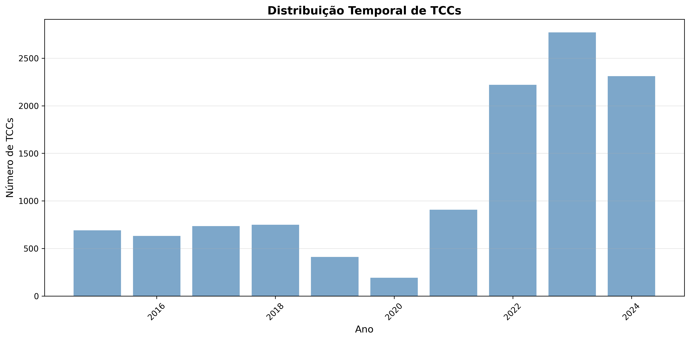

+++
title = "Análise automatizada de conteúdo de Bardin aplicada à produção acadêmica da Unesp"
description = "Versão editada de artigo escrito em coautoria com Júlia Canedo para a disciplina Aprendizado Profundo, do Prof. Dr. Denis Henrique Pinheiro Salvadeo, no curso de mestrado do Programa de Pós-Graduação em Ciência da Computação da Unesp"
date = "2025-11-22"
weight = 1

[taxonomies]
tags=["aprendizado de máquina", "processamento de linguagem natural", "unesp"]

[extra]
toc = true

+++

# Introdução

A análise sistemática da produção acadêmica institucional representa um desafio fundamental para a compreensão das tendências de pesquisa, áreas de interesse e evolução do conhecimento em universidades. No contexto da Universidade Estadual Paulista (Unesp), com múltiplos campi distribuídos pelo estado de São Paulo, essa tarefa torna-se ainda mais complexa devido ao volume e diversidade da produção científica.

O presente trabalho aborda a questão central: "O que os alunos de graduação da Unesp produziram nos últimos 10 anos?". Esta pergunta desdobra-se em questões específicas sobre preferências disciplinares, evolução temporal de tópicos de pesquisa, distribuição geográfica de áreas de interesse e padrões emergentes na produção acadêmica.

Para responder a essas questões, desenvolveu-se um sistema computacional que integra a metodologia clássica de Análise de Conteúdo proposta por Laurence Bardin[^1] com técnicas atuais de aprendizado profundo e processamento de linguagem natural (PLN). Esta abordagem híbrida permite manter o rigor metodológico da análise qualitativa tradicional, ao mesmo tempo em que viabiliza o processamento de grandes volumes de dados através de algoritmos automatizados.

O objetivo principal deste trabalho é desenvolver e validar o sistema aplicado à produção acadêmica da Unesp, especificamente os trabalhos de conclusão de curso (TCCs) produzidos entre 2015 e 2024.

De maneira específica, os autores buscam (a) implementar computacionalmente as três fases da metodologia de Bardin através de técnicas de PLN e aprendizado de máquina, (b) identificar e caracterizar os principais tópicos de pesquisa presentes nos TCCs através de modelagem automática de tópicos, (c) analisar a evolução temporal dos tópicos identificados, detectando tendências emergentes e declinantes, e (d) mapear a distribuição geográfica e disciplinar dos tópicos entre os diferentes campi e cursos.

# Revisão de Literatura

## Análise de Conteúdo de Bardin

A Análise de Conteúdo, conforme sistematizada por Laurence Bardin[^1], constitui-se como "um conjunto de técnicas de análise das comunicações visando obter por procedimentos sistemáticos e objetivos de descrição do conteúdo das mensagens indicadores (quantitativos ou não) que permitam a inferência de conhecimentos relativos às condições de produção/recepção (variáveis inferidas) dessas mensagens".

A metodologia estrutura-se em três fases fundamentais:

1. Pré-análise: Organização do material e sistematização das ideias iniciais. Inclui a leitura flutuante, escolha dos documentos, formulação de hipóteses e objetivos, e elaboração de indicadores.

2. Exploração do material: Aplicação sistemática das decisões tomadas na pré-análise. Consiste essencialmente em operações de codificação, decomposição ou enumeração, em função de regras previamente formuladas.

3. Tratamento dos resultados e interpretação: Os resultados brutos são tratados de maneira a serem significativos e válidos. Operações estatísticas simples ou complexas permitem estabelecer quadros de resultados, diagramas, figuras e modelos.

## _Topic Modeling_ e BERTopic

_Topic modeling_ refere-se a uma família de algoritmos de aprendizado de máquina não supervisionado destinados a descobrir estruturas temáticas latentes em grandes coleções de documentos[^2]. Tradicionalmente, métodos como _Latent Dirichlet Allocation_ (LDA) dominam o campo, modelando documentos como misturas probabilísticas de tópicos.

BERTopic, introduzido por Grootendorst[^3], representa uma evolução significativa nessa área, combinando embeddings de linguagem pré-treinados com técnicas de clustering para criar representações de tópicos mais coerentes e interpretáveis. O algoritmo segue uma pipeline modular:

1. Geração de Embeddings: Utilização de modelos de linguagem pré-treinados (BERT, Sentence-BERT) para criar representações vetoriais densas dos documentos.

2. Redução Dimensional: Aplicação de _Uniform Manifold Approximation and Projection_ (UMAP) para reduzir a dimensionalidade dos embeddings, preservando estruturas locais e globais[^4].

3. Clustering: Uso de _Hierarchical Density-Based Spatial Clustering of Applications with Noise_ (HDBSCAN) para identificar clusters de documentos semanticamente similares[^5].

4. Representação de Tópicos: Extração de palavras representativas através de _class-based TF-IDF_ (c-TF-IDF), uma variação do TF-IDF tradicional[^6] adaptada para contextos de clustering[^3].

## Processamento de Linguagem Natural em Português

O processamento de textos em português apresenta desafios específicos relacionados à morfologia rica da língua[^7], incluindo conjugações verbais complexas, concordância de gênero e número, e uso extensivo de clíticos. Para este trabalho, utilizou-se o modelo spaCy `pt_core_news_lg`, treinado especificamente para português brasileiro, oferecendo capacidades de tokenização, lematização, análise morfossintática e reconhecimento de entidades nomeadas[^8].

# Fundamentos Matemáticos dos Algoritmos

## Processamento Linguístico com spaCy

O spaCy implementa um pipeline de processamento linguístico baseado em redes neurais convolucionais (CNN). As principais operações realizadas são:

- **Tokenização:** Segmentação do texto em tokens utilizando regras linguísticas específicas do português e padrões de expressões regulares. Cada documento \\(D\\) é transformado em uma sequência de tokens \\(T = \{t\_1, t\_2, ..., t\_n\}\\).

- **Lematização:** Redução de cada token à sua forma canônica (lema) através de um modelo estatístico treinado. Para cada token \\(t\_i\\), a lematização mapeia \\(\text{lemma}(t\_i) = l\_i\\), onde \\(l\_i\\) representa a forma base da palavra, removendo flexões verbais, plurais e outras variações morfológicas.

- **Part-of-Speech (POS) Tagging:** O spaCy utiliza uma rede neural convolucional para classificar cada token em categorias gramaticais. A probabilidade de um token \\(t\_i\\) pertencer à classe POS \\(c\_j\\) é calculada através de \\(P(c\_j \mid t\_i) = \text{softmax}(\mathbf{W} \cdot \text{CNN}(t\_i) + \mathbf{b})\_j\\), onde \\(\mathbf{W}\\) são os pesos da camada de classificação, \\(\text{CNN}(t\_i)\\) é a representação vetorial do token, e \\(\mathbf{b}\\) é o vetor de bias.

## Term Frequency-Inverse Document Frequency (TF-IDF)

O TF-IDF é uma medida estatística que avalia a importância de um termo em um documento dentro de um corpus. É calculado como o produto de duas componentes:

**Frequência do Termo (TF):**

\\[
  \text{TF}(t, d) = \frac{f\_{t,d}}{\sum\_{t' \in d} f\_{t',d}}
\\]

onde \\(f\_{t,d}\\) é a frequência bruta do termo \\(t\\) no documento \\(d\\).

**Frequência Inversa de Documento (IDF):**

\\[
  \text{IDF}(t, D) = \log\left(\frac{N}{\mid\{d \in D : t \in d\}\mid}\right)
\\]

onde \\(N\\) é o número total de documentos e \\(\mid\{d \in D : t \in d\}\mid\\) é o número de documentos contendo o termo \\(t\\).

O TF-IDF final, é, portanto, obtido com \\(\text{TF-IDF}(t, d, D) = \text{TF}(t, d) \times \text{IDF}(t, D)\\). Esta métrica penaliza termos muito frequentes (como stopwords) e valoriza termos distintivos de documentos específicos.

## Embeddings Semânticos (Sentence-Transformers)

O modelo `paraphrase-multilingual-mpnet-base-v2` utiliza uma arquitetura transformer[^9] com mean pooling para gerar representações vetoriais densas de sentenças. Para uma sequência de entrada \\(\mathbf{X} = [\mathbf{x}_1, ..., \mathbf{x}\_n]\\), o mecanismo de atenção multi-cabeças calcula:

\\[
  \text{Attention}(\mathbf{Q}, \mathbf{K}, \mathbf{V}) = \text{softmax}\left(\frac{\mathbf{Q}\mathbf{K}^T}{\sqrt{d\_k}}\right)\mathbf{V}
\\]

onde \\(\mathbf{Q}\\) (queries), \\(\mathbf{K}\\) (keys) e \\(\mathbf{V}\\) (values) são projeções lineares da entrada, e \\(d\_k\\) é a dimensão das keys.

A representação final do documento é obtida pela média das representações de todos os tokens,

\\[
  \mathbf{e}\_d = \frac{1}{n}\sum\_{i=1}^{n} \mathbf{h}\_i
\\]

onde \\(\mathbf{h}\_i\\) é a representação contextualizada do token \\(i\\) na última camada do transformer, e \\(\mathbf{e}\_d \in \mathbb{R}^{384}\\) é o embedding final do documento.

# Metodologia

## Arquitetura do Sistema

O sistema desenvolvido implementa uma arquitetura modular baseada em pipeline, organizada em cinco estágios distintos que correspondem às fases da metodologia de Bardin adaptadas ao contexto computacional:



stateDiagram-v2
    [*] --> Coleta
    
    Coleta: Coleta de dados
    state Coleta {
        [*] --> CriaDB
        CriaDB --> Pagina
        Pagina --> ExtraiMeta
        ExtraiMeta --> Normaliza
        Normaliza --> SalvaDB
        Normaliza --> SalvaJSON
        SalvaDB --> [*]
        SalvaJSON --> [*]
        
        CriaDB: Cria database vazio
        Pagina: Requisição HTTP com paginação e retry
        ExtraiMeta: Extrai metadados JSON da API
        Normaliza: Normaliza valores
        SalvaDB: Salva metadados no database relacional
        SalvaJSON: Salva backup de metadados em JSON
    }
    
    Coleta --> Preprocessamento
    
    Preprocessamento: Pré-processamento
    state Preprocessamento {
        [*] --> CarregaDB
        CarregaDB --> DetectaLingua
        DetectaLingua --> FiltraPortugues
        FiltraPortugues --> LimpezaTexto
        LimpezaTexto --> Vetorizacao
        Vetorizacao --> SalvaCorpus
        SalvaCorpus --> [*]
        
        CarregaDB: Carrega TCCs do database
        DetectaLingua: Detecta idioma com confiança
        FiltraPortugues: Filtra apenas português
        LimpezaTexto: Tokenização + Lematização + Remoção de stopwords
        Vetorizacao: Cria matriz TF-IDF (unigramas, bigramas, trigramas)
        SalvaCorpus: Salva corpus processado + vetorizador
    }
    
    Preprocessamento --> PreAnalise
    
    PreAnalise: FASE 1 BARDIN - Pré-análise
    state PreAnalise {
        [*] --> CarregaCorpus1
        CarregaCorpus1 --> EstatisticasDesc
        EstatisticasDesc --> AnaliseTemp
        EstatisticasDesc --> AnaliseGeo
        EstatisticasDesc --> AnaliseLex
        AnaliseTemp --> GeraViz1
        AnaliseGeo --> GeraViz1
        AnaliseLex --> GeraViz1
        GeraViz1 --> GeraRelat1
        GeraRelat1 --> [*]
        
        CarregaCorpus1: Carrega corpus processado
        EstatisticasDesc: Calcula estatísticas descritivas
        AnaliseTemp: Distribuição temporal por ano/curso
        AnaliseGeo: Distribuição por campus e curso
        AnaliseLex: Frequência de palavras e vocabulário
        GeraViz1: Gera visualizações
        GeraRelat1: Gera relatório textual de pré-análise
    }
    
    PreAnalise --> TopicModeling
    
    TopicModeling: FASE 2 BARDIN - Exploração do Material
    state TopicModeling {
        [*] --> CarregaCorpus2
        CarregaCorpus2 --> GeraEmbeddings
        GeraEmbeddings --> ReducaoDim
        ReducaoDim --> Clustering
        Clustering --> ExtraiTopicos
        ExtraiTopicos --> AtribuiTopicos
        AtribuiTopicos --> GeraViz2
        GeraViz2 --> SalvaModelo
        SalvaModelo --> [*]
        
        CarregaCorpus2: Carrega corpus processado
        GeraEmbeddings: Gera embeddings semânticos dos documentos
        ReducaoDim: Redução dimensional com UMAP (5D, cosine)
        Clustering: Clustering hierárquico com HDBSCAN
        ExtraiTopicos: Extrai palavras-chave com c-TF-IDF
        AtribuiTopicos: Atribui tópico a cada documento
        GeraViz2: Gera visualizações
        SalvaModelo: Salva modelo + corpus com tópicos
    }
    
    TopicModeling --> Interpretacao
    
    Interpretacao: FASE 3 BARDIN - Interpretação
    state Interpretacao {
        [*] --> CarregaTopicos
        CarregaTopicos --> AnaliseTemporal
        CarregaTopicos --> AnaliseGeografica
        CarregaTopicos --> AnaliseCurso
        AnaliseTemporal --> IdentTendencias
        IdentTendencias --> TestaSignificancia
        AnaliseGeografica --> TestaSignificancia
        AnaliseCurso --> SinteseInterpret
        TestaSignificancia --> SinteseInterpret
        SinteseInterpret --> GeraViz3
        GeraViz3 --> GeraRelat3
        GeraRelat3 --> [*]
        
        CarregaTopicos: Carrega corpus com tópicos + modelo
        AnaliseTemporal: Agrupa por ano + tópico
        IdentTendencias: Regressão linear (emergentes/declinantes)
        AnaliseGeografica: Matriz contingência campus×tópico
        TestaSignificancia: Teste chi-square de independência
        AnaliseCurso: Análise de tópicos por curso específico
        SinteseInterpret: Cruza análises temporais + geográficas
        GeraViz3: Gera visualizações
        GeraRelat3: Gera relatório interpretativo final
    }
    
    Interpretacao --> [*]


## Coleta de Dados

A coleta de dados foi realizada através da API do repositório institucional da Unesp, implementando-se um cliente HTTP com tratamento de erros e retry automático. Utilizamos exclusivamente os resumos dos trabalhos. Os parâmetros de busca incluíram:

- **Tipo de documento:** "Trabalho de conclusão de curso"
- **Idioma:** Português (por)
- **Período:** 2015-2024
- **Campos extraídos:** UUID, handle, título, resumo, data de publicação, campus, curso, autores, orientadores, palavras-chave

<figure style="width:85%; height:auto; max-width:85%; display:block; margin: 0 auto;">
  
  <figcaption style="margin-top: 1px; font-size: 0.8em; color: #555; line-height:1.5;">Distribuição temporal dos TCCs coletados
  </figcaption>
</figure>

O processo resultou na coleta de 13.213 documentos, armazenados em banco de dados SQLite com esquema normalizado para garantir integridade referencial. Destes, 13.112 possuem resumos e títulos em português, e puderam ser utilizados neste estudo.

# Referências

[^1]: BARDIN, L. *Análise de conteúdo*. São Paulo: Edições 70, 2016.

[^2]: BLEI, D. M.; NG, A. Y.; JORDAN, M. I. "Latent Dirichlet Allocation". *Journal of Machine Learning Research*, vol. 3, 993-1022, 2003.

[^3]: GROOTENDORST, M. "BERTopic: Neural topic modeling with a class-based TF-IDF procedure". 10.48550/arXiv.2203.05794, 2022.

[^4]: McINNES, L.; HEALY, J.; MELVILLE, J. "UMAP: Uniform Manifold Approximation and Projection for Dimension Reduction". arXiv preprint arXiv:1802.03426, 2018.

[^5]: CAMPELLO, R. J. G. B.; MOULAVI, D.; SANDER, J. "Density-Based Clustering Based on Hierarchical Density Estimates". In: *Advances in Knowledge Discovery and Data Mining. PAKDD 2013. Lecture Notes in Computer Science*, vol. 7819. Berlim, Heidelberg: Springer, 2013.

[^6]: SALTON, G.; BUCKLEY, C. "Term-weighting approaches in automatic text retrieval". *Information Processing & Management*, vol. 24, no. 5, pp. 513-523, 1988.

[^7]: AIRES, R. V. X. *Implementação, adaptação, combinação e avaliação de etiquetadores para o português do Brasil*. Dissertação (Mestrado). Universidade de São Paulo, São Carlos, 2000.

[^8]: HONNIBAL, M.; MONTANI, I.; VAN LANDEGHEM, S.; BOYD, A. "spaCy: Industrial-strength Natural Language Processing in Python". Zenodo. https://doi.org/10.5281/zenodo.1212303, 2020.

[^9]: VASWANI, A.; SHAZEER, N.; PARMAR, N.; USZKOREIT, J.; JONES, L.; GOMEZ, A. N.; KAISER, Ł.; POLOSUKHIN, I. "Attention is all you need". In: *Advances in Neural Information Processing Systems (NeurIPS)*, vol. 30, pp. 5998-6008, 2017.