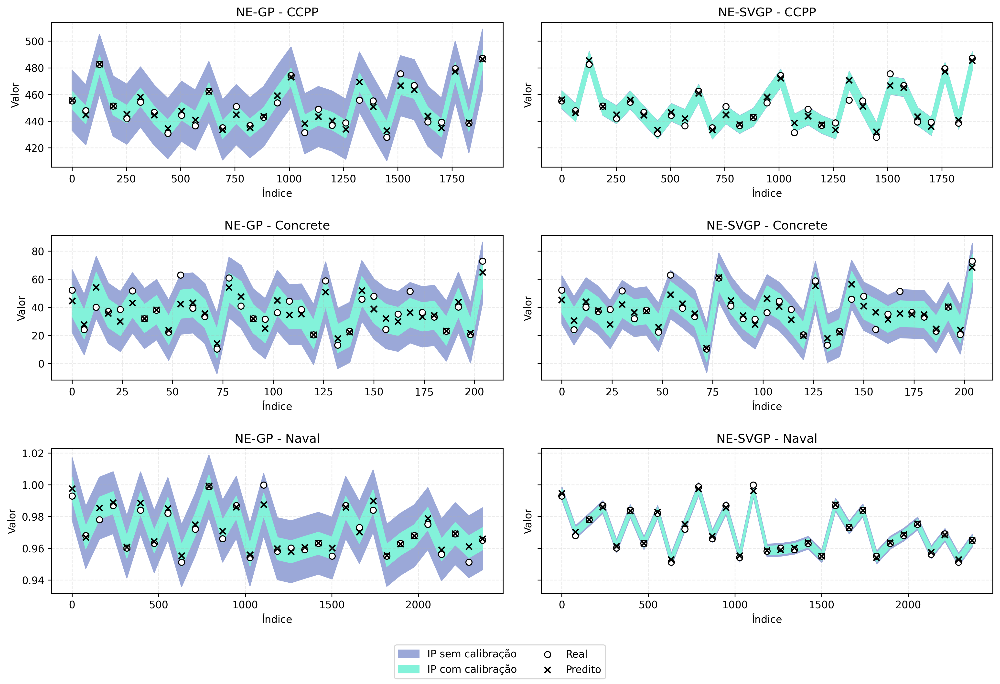

+++
title = "Uncertainty quantification with Gaussian processes and conformal prediction"
description = "Edited version of an article written for the Artificial Neural Networks course, by Prof. Dr. Lucas Ribas, in the master's program of the Computer Science Graduate Program at Unesp"
date = "2025-06-09"
weight = 1

[taxonomies]
tags=["machine learning", "gaussian processes", "neural networks"]

[extra]
toc = true

+++

# Introduction

In regression problems, machine learning models are generally capable of presenting rigorous point predictions; however, they often neglect the quantification of uncertainty inherent to such predictions[^1] [^2]. This limitation is particularly critical in real applications, where not only prediction accuracy, but also reliability and uncertainty quantification are crucial for informed decision-making[^3].

In this scenario, models based on Gaussian processes (GP) stand out as a robust approach[^4]. They are capable of providing not only point predictions, but also complete probability distributions for predictions[^5], allowing them to capture both epistemic and aleatoric uncertainty. Epistemic uncertainty refers to uncertainty in the model due to lack of data or knowledge, which can be reduced with more observations, while aleatoric uncertainty is inherent to the data generation process and cannot be reduced, representing the natural noise of the system[^6].

Gaussian processes assign probabilistic distribution to functions, so that any finite subset of sample points obeys a multivariate Gaussian distribution[^5]. They thus become suitable for constructing prediction intervals, as they delimit the expected range for the true value with a specific probability[^4].

In practice, however, intervals extracted directly from a GP may not deliver the desired nominal coverage[^7]. It is in this context that conformal prediction presents itself as a complementary approach[^8] [^9]. It is a statistical technique that allows calibrating prediction intervals to guarantee theoretical coverage properties, regardless of the underlying data distribution or model adequacy[^10] [^11].

A model configuration that integrates GP and conformal prediction becomes a promising approach for constructing intervals that are simultaneously informative and reliable. In this work, we investigate this configuration: we implement the Neural-Enhanced Gaussian Process (NE-GP) and the Neural-Enhanced Stochastic Variational Gaussian Process (NE-SVGP). For each of these models, we compare the performance of prediction intervals before and after applying the conformal method, in terms of coverage and interval width.

# Methodology

The implementation of the models proposed in this work follows a hybrid architecture that combines neural networks with Gaussian processes, creating the NE-GP and NE-SVGP models. This approach uses the PyTorch and GPyTorch libraries to implement a two-stage architecture: neural feature extraction followed by Gaussian probabilistic modeling.

The hybrid architecture consists of two main integrated components: a feature extractor based on multilayer perceptron (MLP) that transforms input data into higher-level representations, and a GP that operates on these extracted features to provide interval predictions. The MLP is structured with three fully connected layers: an input layer that receives the original data features, two hidden layers with 64 neurons each, applying ReLU activation functions and dropout of 0.1 for regularization, and an output layer with 32 neurons that produces the refined features.

The subsequent GP operates on these extracted features (\\(\mathbf{z}\\)), using a radial basis function to model correlations in the transformed feature space. The choice of the Radial Basis Function kernel is due to its ability to capture smooth non-linear relationships between variables, being suitable for most regression problems. Other options like periodic or Matérn kernels could be used to capture specific patterns like seasonality or different degrees of smoothness.

Joint training simultaneously optimizes the MLP parameters (\\(\mathbf{W}\_i, \mathbf{b}\_i\\)) and GP hyperparameters (\\(\boldsymbol{\theta}\_{GP}\\)) through gradient descent

\\[
\begin{aligned}
\mathcal{L}(\mathbf{W}, \mathbf{b}, \boldsymbol{\theta}\_{GP}) &= -\log p(\mathbf{y}\mid\text{MLP}(\mathbf{X}), \boldsymbol{\theta}\_{GP}) \\\\
\boldsymbol{\phi}\_{t+1} &= \boldsymbol{\phi}\_t - \eta \nabla_{\boldsymbol{\phi}} \mathcal{L}(\boldsymbol{\phi}\_t),
\end{aligned}
\\]

where \\(\boldsymbol{\phi} = \\{\mathbf{W}, \mathbf{b}, \boldsymbol{\theta}\_{GP}\\}\\) represents all trainable parameters of the hybrid model.

This hybrid architecture combines the power of neural networks in extracting complex features with the precision of GPs in uncertainty quantification.

## Exact Gaussian Processes

A GP is a family of random variables such that any finite subset follows a multivariate Gaussian distribution[^4] [^5]. This property guarantees exactness to Bayesian inference without the need to resort to numerical approximations &mdash; differs, for example, from Bayesian neural networks, which need Monte Carlo sampling or variational methods.

Formally, a GP is specified by its mean function \\(m(\mathbf{x})\\) and covariance function \\(k(\mathbf{x}, \mathbf{x'})\\), where

\\[
\begin{aligned}
m(\mathbf{x}) &= \mathbb{E}[f(\mathbf{x})] \\\\
k(\mathbf{x}, \mathbf{x'}) &= \mathbb{E}[(f(\mathbf{x}) - m(\mathbf{x}))(f(\mathbf{x'}) - m(\mathbf{x'}))]
\end{aligned}
\\]

Thus, we have \\(f(\mathbf{x}) \sim \mathcal{GP}(m, k)\\) to indicate that function \\(f\\) follows a GP with mean function \\(m\\) and covariance function \\(k\\).

In the regression problem, given a training sample \\(\mathcal{D} = \{(\mathbf{x}\_i, y\_i)\}\_{i=1}^{n}\\) and assuming homoscedastic Gaussian noise \\(y\_i = f(\mathbf{x}\_i) + \varepsilon\_i\\), where \\(\varepsilon\_i \sim \mathcal{N}(0, \sigma^2)\\), the posterior for a new point \\(\mathbf{x}\_*\\) is Gaussian with parameters 

\\[
\begin{aligned}
\mu(\mathbf{x}\_\*) &= \mathbf{k}\_\*^\top(\mathbf{K} + \sigma^2\mathbf{I})^{-1}\mathbf{y} \\\\
\sigma^2(\mathbf{x}\_\*) &= k(\mathbf{x}\_\*, \mathbf{x}\_\*) - \mathbf{k}\_\*^\top(\mathbf{K} + \sigma^2\mathbf{I})^{-1}\mathbf{k}\_\*
\end{aligned}
\\]

where \\(\mathbf{K}\\) is the covariance matrix between training points and \\(\mathbf{k}\_\*\\) contains the covariances between \\(\mathbf{x}\_\*\\) and each \\(\mathbf{x}\_i\\).

In this work, to obtain smooth and isotropic sample functions, we use the radial basis function for covariance calculation, defined as

\\[
k(\mathbf{x}, \mathbf{x'}) = \sigma_f^2 \exp\left(-\frac{||\mathbf{x} - \mathbf{x'}||^2}{{{2l^2}}}\right)
\\]

where \\(\sigma_f^2\\) is the signal variance and \\(l\\) is the length scale, which controls function smoothness. These hyperparameters are optimized by maximizing the marginal log-likelihood of the training data. The marginal log-likelihood is obtained by integrating over the latent function \\(f\\), resulting in 

\\[
\log p(\mathbf{y}|\mathbf{X}, \boldsymbol{\theta}) = -\frac{1}{2}\mathbf{y}^\top(\mathbf{K} + \sigma^2\mathbf{I})^{-1}\mathbf{y} - \frac{1}{2}\log|\mathbf{K} + \sigma^2\mathbf{I}| - \frac{n}{2}\log(2\pi)
\\]

where \\(\boldsymbol{\theta}\\) are the kernel hyperparameters. This optimization balances data fitting with model complexity.

{{ video(file="/assets/GP.mp4",
         autoplay="true",
         loop="true",
         muted="true") }}

## Stochastic Variational Gaussian Process

An important limitation of exact GP is that it requires computational complexity of \\(\mathcal{O}(n^3)\\) for training and \\(\mathcal{O}(n^2)\\) for prediction, where \\(n\\) is the number of training points. Stochastic Variational Gaussian Process (SVGP) reduces these costs to \\(\mathcal{O}(nm^{2}+m^{3})\\) and \\(\mathcal{O}(m^{2})\\), respectively, by introducing a set of \\(m\\) inducing points at \\(\mathbf Z=\{\mathbf z_{j}\}_{j=1}^{m}\\), with \\(m\ll n\\)[^12] [^13] [^14] [^15]. These inducing points are latent variables that summarize information from the complete training set.

In this model, we approximate the posterior distribution \\(p(\mathbf{f} \mid \mathcal{D})\\) by a variational distribution \\(q(\mathbf{f})\\), that is,

\\[
q(\mathbf{f}, \mathbf{u}) = p(\mathbf{f} \mid \mathbf{u})q(\mathbf{u}),
\\]

where \\(\mathbf{f}\\) are the function values at training points, \\(\mathbf{u}\\) are the function values at inducing points, \\(p(\mathbf{f} \mid \mathbf{u})\\) is the GP conditional distribution, and \\(q(\mathbf{u})\\) is a Gaussian variational distribution with parameters to be optimized.

Optimization is performed by minimizing the Kullback-Leibler divergence between the variational distribution and the true posterior distribution. The divergence between two continuous distributions with densities \\(p\\) and \\(q\\) is defined as 

\\[
D_{\mathrm{KL}}(P \mid Q) = \int p(x)\,\ln\!\biggl(\frac{p(x)}{q(x)}\biggr)\,\mathrm{d}x
\\] 

Intuitively, \\(D_{\mathrm{KL}}(P \mid Q)\\) measures the excess information required to represent samples from \\(P\\) using an optimal code based on \\(Q\\) instead of an optimal code for \\(P\\) itself. This divergence is always non-negative and is zero only when, for almost all \\(x\\), we have \\(p(x)=q(x)\\).

The task of minimizing the divergence is equivalent to maximizing a lower bound on the evidence (ELBO, _Evidence Lower Bound_).

Prediction for a new point \\(\mathbf{x}_\*\\) is given by

\\[
\begin{aligned}
q(f(\mathbf{x}\_\*)) &= \int p(f(\mathbf{x}\_\*) \mid \mathbf{u})q(\mathbf{u})d\mathbf{u} \\\\
&= \mathcal{N}(f(\mathbf{x}\_\*) \mid \mu_q(\mathbf{x}\_\*), \sigma_q^2(\mathbf{x}\_\*)),
\end{aligned}
\\]

where 

\\[
\begin{aligned}
\mu_q(\mathbf{x}\_\*) &= \mathbf{k}\_{\*z}\mathbf{K}_{zz}^{-1}\boldsymbol{\mu}\_u \\\\
\sigma_q^2(\mathbf{x}\_\*) &= k(\mathbf{x}\_\*, \mathbf{x}\_\*) - \mathbf{k}\_\{\*z}\mathbf{K}\_{zz}^{-1}(\mathbf{K}\_{zz} - \mathbf{S}\_u)\mathbf{K}\_{zz}^{-1}\mathbf{k}\_{z\*}
\end{aligned}
\\]

where \\(\mathbf{k}\_{\*z}\\) is the vector of covariances between \\(\mathbf{x}\_\*\\) and the inducing points, \\(\mathbf{K}\_{zz}\\) is the covariance matrix between inducing points, and \\(\boldsymbol{\mu}\_u\\) and \\(\mathbf{S}\_u\\) are the parameters of the variational distribution \\(q(\mathbf{u}) = \mathcal{N}(\boldsymbol{\mu}\_u, \mathbf{S}\_u)\\).

In this work, inspired by underfitting and numerical instability bottlenecks[^16], we use extensions to the standard SVGP, such as adaptive selection of inducing points based on data distribution, joint optimization of inducing points and kernel hyperparameters, use of mini-batches during training to improve computational efficiency, and implementation of numerical stability techniques, such as Cholesky decomposition[^17] &mdash; that is, factorization of a symmetric and positive definite matrix \\(A\\) into \\(A = LL^\top\\), where \\(L\\) is a lower triangular matrix with positive diagonal elements &mdash; for computing matrix inverses.

These improvements allow SVGP to retain the probabilistic interpretation of the classical GP, scale to datasets with hundreds of thousands of samples, and produce prediction intervals that combine statistical validity and competitive width.

## Conformal Prediction

Given the probabilistic nature of GP-based models, prediction intervals can be derived directly from the posterior distribution. For a confidence level \\(1-\alpha\\), the prediction interval for a new point \\(\mathbf{x}\_\*\\) is:

\\[
PI\_{1-\alpha}(\mathbf{x}\_\*) = [\mu(\mathbf{x}\_\*) - z\_{1-\alpha/2} \cdot \sigma(\mathbf{x}\_\*), \mu(\mathbf{x}\_\*) + z\_{1-\alpha/2} \cdot \sigma(\mathbf{x}\_\*)]
\\]

where \\(z\_{1-\alpha/2}\\) is the \\(1-\alpha/2\\) quantile of the standard normal distribution.

This prediction interval has a Bayesian interpretation: assuming the model and its hyperparameters are correct, the interval contains the true value with probability \\(1-\alpha\\). However, in practice, these assumptions may not be valid, leading to intervals that do not achieve the desired nominal coverage. Conformal prediction[^9] [^10] is a statistical approach that allows calibrating prediction intervals to guarantee theoretical coverage properties, regardless of the underlying data distribution or model adequacy. The central idea is to use a calibration set to determine how much prediction intervals should be contracted to achieve the desired coverage.

In this work, we implement a variant of conformal prediction known as inductive conformal prediction[^18], which uses a separate validation set for calibration. Additionally, we make use of a natural non-conformity score, given by

\\[
s\_i = \max\\{y\_i - l(\mathbf{x}\_i), u(\mathbf{x}\_i) - y\_i, 0\\}
\\]

chosen for its simplicity and interpretability: it is the normalized absolute error between prediction and true value; it measures how much the true value is outside the original prediction interval.

An important theoretical property of conformal prediction is that, under the assumption of data exchangeability, conformal prediction intervals guarantee marginal coverage of at least \\(1-\alpha\\) on the test set[^7]. This means that, on average, at least a fraction \\(1-\alpha\\) of intervals will contain the true values, regardless of model adequacy or data distribution.

{{ video(file="/assets/ConformalGPComparison.mp4",
         autoplay="true",
         loop="true",
         muted="true") }}

## Test Execution

We evaluated the models on three public datasets widely used in regression problems: _Combined Cycle Power Plant_[^19] (CCPP), which contains information from a combined cycle power plant, with the objective of predicting net electrical power; _Concrete Compressive Strength_[^20] (Concrete), which contains values for different concrete mixtures, with the objective of predicting compressive strength; and _Condition Based Maintenance of Naval Propulsion Plants_[^21] (Naval), which contains measurements from a naval propulsion plant, with the objective of predicting the compressor decay state coefficient.

| Datasets | Dimensionality | Samples | \\(y\\) Skewness | \\(y\\) Kurtosis |
| ---: | :---: | :---: | :---: | :---: |
| CCPP | 5 | 9,568 | 0.31 | 1.95 |
| Concrete | 9 | 1,030 | 0.42 | 2.69 |
| Naval | 18 | 11,934 | 0.00 | 1.80 |

These datasets were chosen for representing a variety of domains and characteristics, allowing comprehensive evaluation of models in different contexts. To evaluate the performance of prediction intervals, we used coverage, mean prediction interval width (MPIW) and performance as metrics.

Coverage is the fraction of test points for which the true value is contained in the prediction interval. Formally, for a test set with \\(n\\) points, coverage is

\\[
\text{Coverage} = \frac{1}{n}\sum\_{i=1}^{n}\mathbf{1}\\{y\_i \in PI(\mathbf{x}\_i)\\}
\\]

where \\(\mathbf{1}\\{\cdot\\}\\) is the indicator function. A good prediction interval should have coverage close to the nominal confidence level (\\(1-\alpha\\)).
    
MPIW, the mean prediction interval width, is obtained through

\\[
\text{MPIW} = \frac{1}{n}\sum\_{i=1}^{n}(u(\mathbf{x}\_i) - l(\mathbf{x}\_i))
\\]

where \\(l(\mathbf{x}\_i)\\) and \\(u(\mathbf{x}\_i)\\) are the lower and upper bounds of the prediction interval for \\(\mathbf{x}\_i\\). A good prediction interval should be as narrow as possible, conditional on achieving the desired coverage.
    
To evaluate point prediction accuracy, we used the coefficient of determination \\(R^2\\), which measures the proportion of variance in the dependent variable that is predictable from the independent variables. Higher \\(R^2\\) values indicate better predictive performance.

In addition to these main metrics, we also calculated secondary metrics for more detailed analysis, such as the difference between conformal coverage and raw coverage, the difference between conformal mean interval width and raw mean interval width, the fraction of test points for which the true value is below the lower bound or above the upper bound of the prediction interval, the ratio between conformal mean interval width and raw mean interval width, and the ratio between coverage difference and width difference, which measures conformal calibration efficiency.

To ensure result robustness, each dataset was trained using five distinct seeds for up to 200 epochs, with the possibility of early stopping if the loss function showed no improvement for 10 consecutive epochs, using a minimum delta of \\(1 \times 10^{-6}\\) to consider a significant improvement.

# Results

The results show interesting patterns in model behavior. First, we observe that raw prediction intervals generally have coverages significantly higher than the nominal level of 90%.

<table>
  <thead>
    <tr>
      <th rowspan="2">Model</th>
      <th rowspan="2">Dataset</th>
      <th colspan="2">Coverage (%)</th>
      <th colspan="2">MPIW</th>
      <th rowspan="2">R²</th>
    </tr>
    <tr>
      <th>Raw</th>
      <th>Conformal</th>
      <th>Raw</th>
      <th>Conformal</th>
    </tr>
  </thead>
  <tbody>
    <!-- NE-GP block -->
    <tr>
      <td rowspan="3">NE-GP</td>
      <td style="text-align:right;">CCPP</td>
      <td style="text-align:center;">99.89</td>
      <td style="text-align:center;">90.13</td>
      <td style="text-align:center;">2.64</td>
      <td style="text-align:center;">0.76</td>
      <td style="text-align:center;">0.941</td>
    </tr>
    <tr>
      <td style="text-align:right;">Concrete</td>
      <td style="text-align:center;">99.03</td>
      <td style="text-align:center;">91.55</td>
      <td style="text-align:center;">2.72</td>
      <td style="text-align:center;">1.47</td>
      <td style="text-align:center;">0.796</td>
    </tr>
    <tr>
      <td style="text-align:right;">Naval</td>
      <td style="text-align:center;">100.00</td>
      <td style="text-align:center;">89.38</td>
      <td style="text-align:center;">2.66</td>
      <td style="text-align:center;">0.83</td>
      <td style="text-align:center;">0.933</td>
    </tr>
    <!-- NE-SVGP block -->
    <tr>
      <td rowspan="3">NE-SVGP</td>
      <td style="text-align:right;">CCPP</td>
      <td style="text-align:center;">90.93</td>
      <td style="text-align:center;">90.13</td>
      <td style="text-align:center;">0.76</td>
      <td style="text-align:center;">0.75</td>
      <td style="text-align:center;">0.945</td>
    </tr>
    <tr>
      <td style="text-align:right;">Concrete</td>
      <td style="text-align:center;">98.83</td>
      <td style="text-align:center;">90.87</td>
      <td style="text-align:center;">2.14</td>
      <td style="text-align:center;">1.18</td>
      <td style="text-align:center;">0.877</td>
    </tr>
    <tr>
      <td style="text-align:right;">Naval</td>
      <td style="text-align:center;">96.65</td>
      <td style="text-align:center;">90.26</td>
      <td style="text-align:center;">0.52</td>
      <td style="text-align:center;">0.39</td>
      <td style="text-align:center;">0.984</td>
    </tr>
  </tbody>
</table>

The table shows that, in the case of NE-GP, raw prediction coverages vary from 99.03% to 100.00%, while for NE-SVGP they vary from 90.93% to 98.83%. This indicates that raw prediction intervals are frequently overly conservative, resulting in higher than necessary coverage.

After applying the conformal method, coverages are consistently adjusted to values close to 90%, which is the desired nominal coverage level. This result confirms the effectiveness of conformal prediction in calibrating prediction intervals to achieve desired coverage, regardless of model or dataset.

The figure, with results from executions on seed 42, illustrates the trade-off between coverage and interval width. With NE-GP, across all datasets, conformal calibration reduces coverage to approximately 90%, while also reducing interval width. The effect is particularly pronounced in the CCPP dataset, where mean width is reduced from 2.64 to 0.76, a reduction of 71.2%, while coverage goes from 99.89% to 90.13%.

Similarly, for NE-SVGP, we observe a similar pattern, but with some notable differences. In particular, raw intervals are generally already narrower compared to the NE-GP model, and the proportional reduction in width after conformal calibration is smaller. For example, in the CCPP dataset, mean width is reduced from 0.76 to 0.75, a reduction of only 1.3%, while coverage goes from 90.93% to 90.13%.

Regarding performance, we see that NE-SVGP significantly outperforms NE-GP on the Naval (0.984 vs. 0.933) and Concrete (0.877 vs. 0.796) datasets, in addition to showing slightly superior performance on the CCPP dataset (0.945 vs. 0.941).

In addition to these metrics, results can also be evaluated by the percentage of errors that, after conformal prediction, are distributed between the lower and upper bounds; by the ratio between conformal mean interval width and raw mean interval width, where smaller values indicate a more significant reduction after applying the conformal method; by the reduction in excess coverage, which measures conformal prediction efficiency by quantifying the gain obtained per unit of width reduction; and by calibration error, that is, the absolute difference between achieved coverage and the nominal level of 90%.

<table>
  <thead>
    <tr>
      <th rowspan="2">Model</th>
      <th rowspan="2">Dataset</th>
      <th colspan="2">Errors (%)</th>
      <th rowspan="2">Width Ratio</th>
      <th rowspan="2">Excess Coverage Reduction</th>
      <th colspan="2">Calibration Error</th>
    </tr>
    <tr>
      <th>Lower</th>
      <th>Upper</th>
      <th>Raw</th>
      <th>Conformal</th>
    </tr>
  </thead>
  <tbody>
    <!-- NE-GP block -->
    <tr>
      <td rowspan="3">NE-GP</td>
      <td style="text-align:right;">CCPP</td>
      <td style="text-align:center;">4.22</td>
      <td style="text-align:center;">5.65</td>
      <td style="text-align:center;">0.289</td>
      <td style="text-align:center;">0.052</td>
      <td style="text-align:center;">0.099</td>
      <td style="text-align:center;">0.002</td>
    </tr>
    <tr>
      <td style="text-align:right;">Concrete</td>
      <td style="text-align:center;">4.27</td>
      <td style="text-align:center;">4.17</td>
      <td style="text-align:center;">0.541</td>
      <td style="text-align:center;">0.060</td>
      <td style="text-align:center;">0.090</td>
      <td style="text-align:center;">0.020</td>
    </tr>
    <tr>
      <td style="text-align:right;">Naval</td>
      <td style="text-align:center;">7.63</td>
      <td style="text-align:center;">2.98</td>
      <td style="text-align:center;">0.310</td>
      <td style="text-align:center;">0.058</td>
      <td style="text-align:center;">0.100</td>
      <td style="text-align:center;">0.008</td>
    </tr>
    <!-- NE-SVGP block -->
    <tr>
      <td rowspan="3">NE-SVGP</td>
      <td style="text-align:right;">CCPP</td>
      <td style="text-align:center;">4.25</td>
      <td style="text-align:center;">5.62</td>
      <td style="text-align:center;">0.976</td>
      <td style="text-align:center;">0.339</td>
      <td style="text-align:center;">0.009</td>
      <td style="text-align:center;">0.005</td>
    </tr>
    <tr>
      <td style="text-align:right;">Concrete</td>
      <td style="text-align:center;">3.69</td>
      <td style="text-align:center;">5.44</td>
      <td style="text-align:center;">0.551</td>
      <td style="text-align:center;">0.083</td>
      <td style="text-align:center;">0.088</td>
      <td style="text-align:center;">0.020</td>
    </tr>
    <tr>
      <td style="text-align:right;">Naval</td>
      <td style="text-align:center;">8.35</td>
      <td style="text-align:center;">1.38</td>
      <td style="text-align:center;">0.750</td>
      <td style="text-align:center;">0.553</td>
      <td style="text-align:center;">0.066</td>
      <td style="text-align:center;">0.006</td>
    </tr>
  </tbody>
</table>

The table reveals interesting patterns in error distribution and conformal calibration effectiveness. For NE-GP, we observe a relatively balanced error distribution between lower and upper bounds in the CCPP (4.22% lower vs. 5.65% upper) and Concrete (4.27% lower vs. 4.17% upper) datasets, while the Naval dataset shows notable asymmetry with 7.63% of errors at the lower bound against only 2.98% at the upper bound.

The width ratio confirms conformal calibration effectiveness in significantly reducing interval width. For NE-GP, we observe substantial reductions: CCPP with a ratio of 0.289 (71.1% reduction), Concrete with 0.541 (45.9% reduction) and Naval with 0.310 (69.0% reduction). NE-SVGP shows distinct behavior, with a more modest reduction in CCPP (ratio of 0.976, only 2.4%) but significant reductions in Concrete (0.551, 44.9% reduction) and Naval (0.750, 25.0% reduction).

Calibration error demonstrates conformal prediction superiority. For NE-GP, raw calibration errors vary from 0.090 to 0.100, being consistently reduced to values close to zero after conformal calibration (0.002 to 0.020). NE-SVGP already shows smaller raw calibration errors (0.009 to 0.088), but still benefits from conformal calibration, achieving final errors of 0.005 to 0.020.

# Conclusion

This work investigated in depth the integration of Gaussian processes enhanced by neural networks with conformal prediction as a strategy for calibrating prediction intervals. The results obtained on three datasets of diverse nature show that conformation provides substantial gains both in statistical reliability and informational efficiency.

Before calibration, raw intervals exhibited coverages much higher than the nominal level of 90%, reaching 100% in NE-GP for the Naval dataset and 99.89% in CCPP. This excess coverage, while seeming desirable at first glance, reveals excessively wide and therefore not very useful intervals in practice. The application of conformal prediction systematically adjusted coverage to values very close to 90%, confirming, in practice, the theoretical guarantees of the method: marginal coverage converges to the defined level regardless of model fit or data distribution.

The efficiency of this adjustment was directly reflected in the mean width of intervals. In the most expressive scenario, CCPP with NE-GP suffered a 71.2% reduction in width after calibration, from 2.64 to 0.76 units, without compromising the required hit rate. Even in NE-SVGP, where initial widths were already smaller due to the sparse variational nature of the model, additional reduction was observed that, although more modest in CCPP (1.3%), reached considerable values in Concrete (44.9%) and Naval (25%).

These findings highlight a central point: conformal calibration not only corrects coverage, but also tends to remove statistical redundancy, compressing intervals to the limit necessary to preserve the confidence level. In other words, it transforms superabundant uncertainty into useful information.

The contrast between the two evaluated models provides additional observations. NE-SVGP, thanks to the use of inducing points and variational optimization, achieved superior predictive performance in terms of \\(R^2\\), reaching 0.984 in the Naval dataset, and produced narrower raw intervals than NE-GP. Even so, it did not dispense with calibration: small coverage violations or asymmetries in error distribution were corrected after conformation.

For NE-GP, dependence on calibration was even more explicit, given the model's tendency to overestimate uncertainty in domains with high noise or feature imbalance. Therefore, conformal prediction proved to be a robust complement to both paradigms: it acts as a "second line of defense" against model specification defects and failures in homoscedastic noise assumptions or independent and identically distributed distributions.

Despite these successes, some limitations deserve attention. First, the natural extension of this work involves explicit incorporation of heteroscedasticity, either through local variational GPs or hybrid models that learn conditional output variance. Second, although SVGP scales better than exact GP, datasets with millions of samples may require hierarchical partitioning that preserves conformal prediction guarantees.

Furthermore, the investigation was restricted to regression tasks. Since the theoretical structure of conformal is loss function agnostic, there is fertile ground for exploring ordinal classifications, anomaly detection, and interval prediction in time series, where exchangeability assumptions need to be revisited.

# References

[^1]: GAL, Y. *Uncertainty in deep learning*. Thesis (PhD) — University of Cambridge, Cambridge, 2016.

[^2]: KULESHOV, V.; FENNER, N.; ERMON, S. Accurate uncertainties for deep learning using calibrated regression. In: *International Conference on Machine Learning*, 35., 2018, p. 2796–2804.

[^3]: HÜLLERMEIER, E.; WAEGEMAN, W. Aleatoric and epistemic uncertainty in machine learning: an introduction to concepts and methods. *Machine Learning*, v. 110, n. 3, p. 457–506, 2021.

[^4]: RASMUSSEN, C. E.; WILLIAMS, C. K. I. *Gaussian processes for machine learning*. Cambridge, MA: MIT Press, 2005.

[^5]: MURPHY, K. P. *Machine learning: a probabilistic perspective*. Cambridge, MA: MIT Press, 2012.

[^6]: KENDALL, A.; GAL, Y. What uncertainties do we need in Bayesian deep learning for computer vision? In: *Proceedings of the 31st Annual Conference on Neural Information Processing Systems (NIPS'17)*, Long Beach, CA, USA, p. 5580–5590, 2017.

[^7]: ANGELOPOULOS, A. N.; BATES, S. A gentle introduction to conformal prediction and distribution-free uncertainty quantification. *arXiv preprint arXiv:2107.07511*, 2022.

[^8]: BALASUBRAMANIAN, V.; HO, S.-S.; VOVK, V. *Conformal prediction for reliable machine learning: theory, adaptations and applications*. 1. ed. San Francisco: Morgan Kaufmann Publishers Inc., 2014.

[^9]: VOVK, V.; GAMMERMAN, A.; SHAFER, G. *Algorithmic learning in a random world*. New York, NY: Springer, 2005.

[^10]: SHAFER, G.; VOVK, V. A tutorial on conformal prediction. *The Journal of Machine Learning Research*, v. 9, p. 371–421, 2008.

[^11]: LEI, J.; G'S ELL, M.; RINALDO, A.; TIBSHIRANI, R. J.; WASSERMAN, L. Distribution-free predictive inference for regression. *Journal of the American Statistical Association*, v. 113, n. 523, p. 1094–1111, 2018.

[^12]: QUINONERO-CANDELA, J.; RASMUSSEN, C. E. A unifying view of sparse approximate Gaussian process regression. *Journal of Machine Learning Research*, v. 6, n. 65, p. 1939–1959, 2005.

[^13]: SNELSON, E.; GHAMRAMANI, Z. Sparse Gaussian processes using pseudo-inputs. In: *Advances in Neural Information Processing Systems*, v. 18, p. 1257–1264, 2005. MIT Press.

[^14]: TITSIAS, M. Variational learning of inducing variables in sparse Gaussian processes. In: *Proceedings of the Twelfth International Conference on Artificial Intelligence and Statistics*, 5., Clearwater, FL: PMLR, p. 567–574, 2009.

[^15]: HENSMAN, J.; FUSI, N.; LAWRENCE, N. D. Gaussian processes for big data. In: *Proceedings of the Twenty-Ninth Conference on Uncertainty in Artificial Intelligence*, Bellevue, WA; Arlington, VA: AUAI Press, p. 282–290, 2013.

[^16]: DEWOLF, N.; DE BAETS, B.; WAEGEMAN, W. Valid prediction intervals for regression problems. *Artificial Intelligence Review*, v. 56, n. 1, p. 577–613, 2023.

[^17]: GOLUB, G. H.; VAN LOAN, C. F. *Matrix computations*. 4. ed. Baltimore, MD: Johns Hopkins University Press, 2013.

[^18]: PAPADOPOULOS, H.; PROEDROU, K.; VOVK, V.; GAMMERMAN, A. Inductive confidence machines for regression. In: *Machine Learning: ECML 2002*, Berlin; Heidelberg: Springer Berlin Heidelberg, p. 345–356, 2002.

[^19]: TFEKCI, P.; KAYA, H. Combined cycle power plant. UCI Machine Learning Repository, 2014.

[^20]: YEH, I.-C. Concrete compressive strength. UCI Machine Learning Repository, 1998.

[^21]: CORADDU, A.; ONETO, L.; GHIO, A.; SAVIO, S.; ANGIUTA, D.; FIGARI, M. Condition based maintenance of naval propulsion plants. UCI Machine Learning Repository, 2014.
