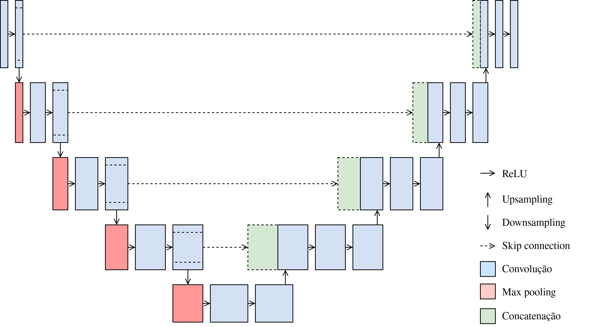

+++
title = "Análise comparativa de arquiteturas U-Net para segmentação de pólipo em colonoscopia"
description = "Versão editada de artigo escrito para a disciplina Aprendizado Profundo, do Prof. Dr. Denis Henrique Pinheiro Salvadeo, no curso de mestrado do Programa de Pós-Graduação em Ciência da Computação da Unesp"
date = "2025-11-13"
weight = 1

[taxonomies]
tags=["aprendizado de máquina", "u-net", "redes neurais", "medicina"]

[extra]
toc = true

+++

# Introdução

O câncer colorretal é um dos tumores mais prevalentes no mundo, correspondendo a cerca de 10\% dos casos e mais de 930 mil mortes anuais[^1]. A progressão de pólipos adenomatosos para carcinoma costuma levar entre 10 e 15 anos, oferecendo uma janela ampla para prevenção via detecção e remoção precoce[^2]; contudo, a taxa de detecção durante a realização de colonoscopias varia amplamente, sobretudo por diferenças de morfologia dos pólipos[^3].

Neste contexto, a ciência de dados, particularmente o aprendizado de máquina, muito tem a oferecer. A segmentação de pólipos pode ser tratada como um problema de classificação pixel a pixel. Tal trabalho é desafiador devido à heterogeneidade morfológica das lesões, baixo contraste entre tecido do pólipo e mucosa adjacente, e condições de iluminação variáveis na endoscopia; entretanto, avanços em redes neurais convolucionais têm impulsionado melhorias significativas na precisão de segmentação, superando métodos tradicionais baseados em atributos manuais[^4] [^5].

Neste cenário, U-Net se estabelece como o estado-da-arte para tal tarefa através de um esquema codificador-decodificador com *skip connections*[^6].

Suas limitações, porém, motivaram variantes que visam melhorar a fusão de representações e a seletividade de características. Este trabalho realiza comparações sistemáticas sob condições experimentais controladas, comparando cinco arquiteturas na segmentação de pólipos usando o conjunto Kvasir-SEG[^7].

# Trabalhos Relacionados

A segmentação automatizada de pólipos evoluiu significativamente desde métodos clássicos até arquiteturas profundas especializadas. Abordagens iniciais baseavam-se em características manuais e técnicas tradicionais de visão computacional. Bernal et al.[^3] propuseram mapas WM-DOVA combinando informação de intensidade e forma, enquanto Tajbakhsh et al.[^5] empregaram redes convolucionais rasas com características contextuais para detecção em vídeos de colonoscopia.

A introdução de redes totalmente convolucionais (FCN)[^8] revolucionou a segmentação semântica ao eliminar camadas densas finais e permitir predições pixel a pixel. Brandão et al.[^4] adaptaram FCNs para segmentação de pólipos, demonstrando superioridade sobre métodos tradicionais mas ainda enfrentando dificuldades com bordas imprecisas e variações morfológicas. A arquitetura U-Net[^6], com seu paradigma codificador-decodificador e *skip connections*, tornou-se referência para segmentação biomédica ao preservar informação espacial em múltiplas escalas.

Diversas extensões da U-Net têm sido propostas para segmentação de pólipos. Zhou et al.[^9] introduziram conexões densas aninhadas para reduzir lacunas semânticas, enquanto Oktay et al.[^10] incorporaram mecanismos de atenção espacial. Jha et al.[^11] propuseram DoubleU-Net, combinando dois caminhos codificador-decodificador com blocos ASPP (*Atrous Spatial Pyramid Pooling*), alcançando Dice score de 82,3\% no Kvasir-SEG.

Abordagens recentes exploram mecanismos sofisticados de atenção e agregação multi-escala. Fan et al.[^12] desenvolveram PraNet com atenção reversa paralela, reportando 89,8\% de Dice no Kvasir-SEG. Fang et al.[^13] propuseram agregação seletiva de características com restrições de área-fronteira, enquanto Zhang et al.[^14] introduziram seleção adaptativa de contexto para lidar com variabilidade morfológica. Srivastava et al.[^15] propuseram MSRF-Net com fusão residual multi-escala.

Trabalhos mais recentes investigam *transformers* para segmentação médica. Valanarasu et al.[^16] introduziram Medical Transformer com atenção axial, demonstrando competitividade com CNNs. Huang et al.[^17] propuseram HarDNet-MSEG, alcançando Dice superior a 90\% com 86 FPS, equilibrando precisão e eficiência computacional.

Apesar dos avanços, comparações diretas são dificultadas por variações metodológicas: diferentes particionamentos de dados, estratégias de augmentação, funções de perda e hiperparâmetros. Muitos trabalhos reportam resultados em múltiplos conjuntos mas carecem de análise estatística rigorosa. Este estudo aborda essas lacunas através de comparação sistemática de cinco arquiteturas U-Net fundamentais sob condições experimentais controladas, com múltiplas sementes para análise de variância, fornecendo *benchmark* reproduzível para o domínio.

# Referências

[^1]: World Health Organization, "Colorectal cancer", https://www.who.int/news-room/fact-sheets/detail/colorectal-cancer, Jul. 2023, online. Acessado em 25 de setembro de 2025.

[^2]: D. A. Corley, C. D. Jensen, A. R. Marks, W. K. Zhao, J. K. Lee, C. A. Doubeni, A. G. Zauber, J. de Boer, B. H. Fireman, J. E. Schottinger, and T. R. Levin, "Adenoma detection rate and risk of colorectal cancer and death", *The New England Journal of Medicine*, vol. 370, no. 14, pp. 1298–1306, 2014.

[^3]: J. Bernal, F. J. Sánchez, G. Fernández-Esparrach, D. Gil, C. Rodríguez, and F. Vilariño, "WM-DOVA maps for accurate polyp highlighting in colonoscopy: Validation vs. saliency maps from physicians", *Computerized Medical Imaging and Graphics*, vol. 43, pp. 99–111, 2015.

[^4]: P. Brandão, E. Mazomenos, G. Ciuti, R. Caliò, F. Bianchi, A. Menciassi, P. Dario, A. Koulaouzidis, A. Arezzo, and D. Stoyanov, "Fully convolutional neural networks for polyp segmentation in colonoscopy", in *Medical Imaging 2017: Computer-Aided Diagnosis, ser. Proceedings of SPIE*, vol. 10134, Orlando, FL, USA, 2017.

[^5]: N. Tajbakhsh, S. R. Gurudu, and J. Liang, "Automated polyp detection in colonoscopy videos using shape and context information", *IEEE Transactions on Medical Imaging*, vol. 35, no. 2, pp. 630–644, 2016.

[^6]: O. Ronneberger, P. Fischer, and T. Brox, "U-net: Convolutional networks for biomedical image segmentation", in *Medical Image Computing and Computer-Assisted Intervention - MICCAI 2015, ser. Lecture Notes in Computer Science*, vol. 9351. Cham: Springer, 2015, pp. 234–241.

[^7]: D. Jha, P. H. Smedsrud, M. A. Riegler, P. Halvorsen, T. de Lange, D. Johansen, and H. D. Johansen, "Kvasir-SEG: A segmented polyp dataset", in *MultiMedia Modeling (MMM 2020), Proceedings, Part II, ser. Lecture Notes in Computer Science*, vol. 11962. Cham: Springer, 2020, pp. 451–462.

[^8]: E. Shelhamer, J. Long, and T. Darrell, "Fully convolutional networks for semantic segmentation", *IEEE Transactions on Pattern Analysis and Machine Intelligence*, vol. 39, no. 4, pp. 640–651. 2017.

[^9]: Z. Zhou, M. M. Rahman Siddiquee, N. Tajbakhsh, and J. Liang, "Unet++: A nested u-net architecture for medical image segmentation", in *4th International Workshop, DLMIA 2018, and 8th International Workshop, ML-CDS 2018, Held in Conjunction with MICCAI 2018*, vol. 11045, 2018, pp. 3–11.

[^10]: O. Oktay, J. Schlemper, L. L. Folgoc, M. Lee, M. Heinrich, K. Misawa, K. Mori, S. McDonagh, N. Y. Hammerla, B. Kainz et al., "Attention u-net: Learning where to look for the pancreas", arXiv preprint arXiv:1804.03999, 2018.

[^11]: D. Jha, P. H. Smedsrud, M. A. Riegler, H. D. Johansen, T. de Lange, P. Halvorsen, and D. Johansen, "DoubleU-Net: A deep convolutional neural network for medical image segmentation", in *2020 IEEE 33rd International Symposium on Computer-Based Medical Systems (CBMS)*. IEEE, 2020, pp. 558–564.

[^12]: D.-P. Fan, G.-P. Ji, T. Zhou, G. Chen, H. Fu, J. Shen, and L. Shao, "PraNet: Parallel reverse attention network for polyp segmentation", in *Medical Image Computing and Computer-Assisted Intervention – MICCAI 2020*. Springer International Publishing, 2020, pp. 263–273.

[^13]: Y. Fang, C. Chen, Y. Yuan, and K.-y. Tong, "Selective feature aggregation network with area-boundary constraints for polyp segmentation", in *Medical Image Computing and Computer-Assisted Intervention – MICCAI 2019*. Springer International Publishing, 2019, pp. 302–310.

[^14]: R. Zhang, G. Li, Z. Li, S. Cui, D. Qian, and Y. Yu, "Adaptive context selection for polyp segmentation", in *Medical Image Computing and Computer-Assisted Intervention – MICCAI 2020*. Springer International Publishing, 2020, pp. 253–262.

[^15]: A. Srivastava, D. Jha, S. Chanda, U. Pal, H. D. Johansen, D. Johansen, M. A. Riegler, S. Ali, and P. Halvorsen, "MSRF-Net: A multi-scale residual fusion network for biomedical image segmentation", *IEEE Journal of Biomedical and Health Informatics*, vol. 26, no. 5, pp. 2252–2263, 2022.

[^16]: J. M. J. Valanarasu, P. Oza, I. Hacihaliloglu, and V. M. Patel, "Medical transformer: Gated axial-attention for medical image segmentation", in *Medical Image Computing and Computer-Assisted Intervention – MICCAI 2021*. Springer International Publishing, 2021, pp. 36–46.

[^17]: C.-H. Huang, H.-Y. Wu, and Y.-L. Lin, "HarDNet-MSEG: A simple encoder-decoder polyp segmentation neural network that achieves over 0.9 mean dice and 86 fps", arXiv preprint arXiv:2101.07172, 2021.